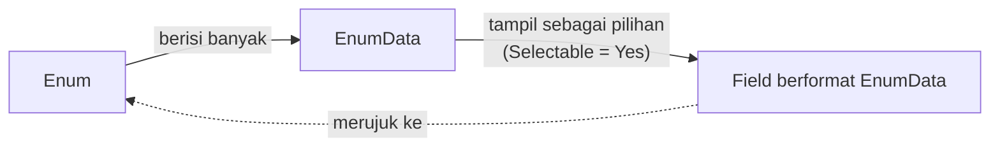
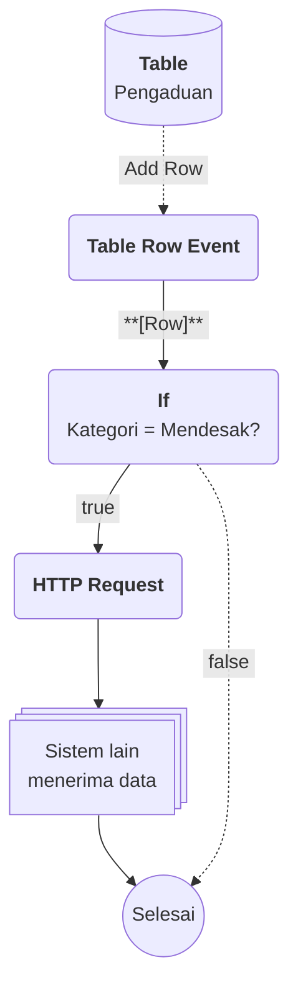

# Apa itu Enum?

>**note** Enum merupakan salah satu komponen dalam modul [[Docs/Modul Data/Pengenalan|Data]] di Phoenix.

Enum adalah komponen yang dapat digunakan sebagai deret data atau yang sering dikenal dengan *Master Data*. Data ini berfungsi sebagai pilihan, menu, opsi, ataupun kategori. Setiap Enum memiliki banyak [[Docs/Tipe Data/EnumData|EnumData]] di dalamnya.

Dengan Enum, Anda mengelola daftar pilihan di satu tempat saja. Field di komponen lain tinggal merujuk ke Enum tersebut, sehingga pilihan selalu seragam dan perubahan cukup dilakukan satu kali.

## Mengapa Menggunakan Enum?

- **Satu sumber pilihan.** Daftar opsi, menu, atau kategori dikelola di satu komponen dan dipakai ulang oleh banyak field.
- **Pilihan yang seragam.** [[^field|Name]] tidak boleh sama di dalam satu Enum, sehingga tidak ada pilihan ganda yang membingungkan.
- **Kontrol per baris.** Anda menentukan EnumData mana yang tampil sebagai pilihan dengan kolom [[^field|Selectable]].
- **Value fleksibel.** Kolom [[^field|Value]] mengikuti [[^field|Format]] yang Anda pilih pada konfigurasi Enum.
- **Siap terhubung.** Enum dapat dihubungkan dengan [[Docs/Event/Apa itu Event|Event]] dan logika di [[Docs/Modul Logic/Flow/Apa itu Flow|Flow]] sehingga perubahan pilihan dapat memicu otomasi.

## Konsep Utama

| Istilah | Penjelasan |
| --- | --- |
| [[Docs/Tipe Data/EnumData\|EnumData]] | Satu baris data di dalam Enum yang berisi Name, Description, Value, dan Selectable. |
| [[#Membaca Baris EnumData\|Selectable]] | Penanda apakah sebuah EnumData tampil sebagai pilihan pada field berformat EnumData. |
| [[#Konfigurasi Enum\|Format]] | Format data yang menentukan bentuk kolom Value pada setiap baris. |
| [[#Konfigurasi Enum\|Header]] | Header untuk Format yang membutuhkan tipe data pendamping. |
| [[Docs/Modul Data/Enum/Konfigurasi Tegas\|Strict On Selected]] | Atribut penting Enum yang mengatur ketegasan pilihan. Selengkapnya lihat [[Docs/Modul Data/Enum/Konfigurasi Tegas]]. |

## Cara Kerja Enum

Enum menyimpan banyak EnumData, lalu field berformat EnumData di komponen lain menampilkan EnumData tersebut sebagai daftar pilihan.

Hanya EnumData dengan [[^field|Selectable]] bernilai [[^value/boolean/true]] yang tampil pada daftar pilihan. EnumData dengan nilai [[^value/boolean/false]] tidak tampil sebagai pilihan di field, tetapi tetap dapat dipakai di tempat lain.

## Konfigurasi Enum

Setiap Enum memiliki atribut berikut:

| Atribut | Penjelasan |
| --- | --- |
| [[^field\|Name]] | Nama Enum. |
| [[^field\|Description]] | Keterangan singkat tentang kegunaan Enum. |
| [[^field\|Format]] | Format data untuk kolom Value pada setiap baris. Format dapat diubah setelah Enum dibuat (lihat [[#Mengubah Enum]]). |
| [[^field\|Header]] | Header untuk Format dengan tipe data yang membutuhkan header. Bernilai N/A jika Format tidak membutuhkannya. |
| [[^field\|Strict On Selected]] | Pengaturan ketegasan pilihan. Selengkapnya lihat [[Docs/Modul Data/Enum/Konfigurasi Tegas]]. |

Pasangan tipe data Format dan Header:

| Tipe data Format | Tipe data Header |
| --- | --- |
| [[Docs/Tipe Data/EnumData\|EnumData]] | [[Docs/Tipe Data/Enum\|Enum]] |
| [[Docs/Tipe Data/Column\|Column]] | [[Docs/Tipe Data/Table\|Table]] |
| [[Docs/Tipe Data/Row\|Row]] | [[Docs/Tipe Data/Table\|Table]] |
| [[Docs/Tipe Data/TableData\|TableData]] | [[Docs/Tipe Data/Column\|Column]] |
| [[Docs/Tipe Data/Node\|Node]] | [[Docs/Tipe Data/Tree\|Tree]] |
| Lainnya | N/A |

<!--
  * [TODO] Mohon konfirmasi cara mengisi Header (daftar pilihan atau cara lain) dan apakah field Format/Header/Strict On Selected juga tampil pada dialog Create dengan susunan yang sama seperti dialog Update.
    Jawaban : Ya
  * [TODO] Mohon konfirmasi apakah Name pada Enum itu sendiri wajib diisi atau harus unik. Pada halaman ini hanya aturan Name EnumData yang ditulis.
    Jawaban : Name pada enum memiliki aturan sama seperti dengan komponen lain, yaitu tidak boleh memiliki nama yang sama di folder yang sama (dan sejenis)
-->

## Membuat Enum

![[Docs/Modul Data/Enum/add-enum.png]]
1. Buka folder tempat Enum akan ditempatkan di [[Docs/Antarmuka#Area Manajemen Folder]]
2. Klik kanan > [[^field/add|Add]] > [[^field|Data]] > [[^field/enum|Enum]]
3. Isi [[^field|Name]] dan [[^field|Description]]
4. Pilih [[^field|Format]] dan atur [[^field|Strict On Selected]] sesuai kebutuhan
5. Klik [[^button|Create]]

>**success** Enum berhasil dibuat
> Enum yang baru dibuat belum memiliki data. Tambahkan [[Docs/Tipe Data/EnumData]] di [[#Mengelola EnumData]].

## Mengubah Enum

1. Buka halaman kerja Enum
2. Klik [[^button/edit|Edit]]
3. Ubah [[^field|Name]], [[^field|Description]], [[^field|Format]], atau [[^field|Strict On Selected]]
4. Klik [[^button|Update]]

>**warning** Mengubah Format
> Format masih dapat diubah meskipun Enum sudah memiliki [[Docs/Tipe Data/EnumData]]. Phoenix menampilkan peringatan terlebih dahulu, dan Anda perlu mengisi [[^field|Force Update]] untuk melanjutkan. Hasilnya dapat berupa*loss safe* (akan mencoba nilai dikonversi ke Format baru, jika gagal akan muncul peringatan yang sama), *force* (paksa, nilai yang tidak dapat dikonversi bisa hilang). Mohon periksa Value yang sudah ada sebelum melanjutkan.

## Menyegarkan Enum

Klik [[^button/refresh|Refresh]] untuk memuat ulang tampilan halaman kerja Enum.

## Menghapus Enum

1. Buka folder yang berisi Enum di [[Docs/Antarmuka#Area Manajemen Folder]]
2. Klik kanan Enum > [[^button/delete|Delete]]
3. Konfirmasi dengan klik [[^button|Delete]]

>**warning** Dampak Menghapus Enum
> Seluruh [[Docs/Tipe Data/EnumData]] di dalam Enum ikut hilang. Sebelum menghapus, hapus terlebih dahulu relasi dari komponen lain yang menggunakan Enum ini, misalnya field berformat [[Docs/Tipe Data/EnumData]] dan [[Docs/Modul Logic/Flow/Apa itu Flow|Flow]].

## Antarmuka Enum

![[Docs/Modul Data/Enum/halaman-kerja-enum.png]]

Halaman kerja Enum terdiri dari bilah navigasi di bagian atas dan tabel EnumData di bagian bawah.

<!--
  * [DONE] Penempatan gambar: `halaman-kerja-enum.png` (screenshot halaman kerja). Anotasi yang disarankan: (1) judul Enum, (2) tombol Edit, Merge, Event, Refresh, (3) kolom pencarian, (4) tabel EnumData, (5) kolom Action, (6) Add Row, (7) pagination. Gunakan penamaan Enum generik pada gambar, bukan nama kasus pribadi.
  * [DONE] Dialog Update Enum dapat diberi gambar tambahan `dialog-update-enum.png` di bagian Mengubah Enum, dengan penanda untuk Name, Description, Format, Header, dan Strict On Selected.
-->

### Bilah navigasi Enum terdiri dari:

| Tombol | Fungsi |
| --- | --- |
| Judul Enum | Menampilkan ikon Enum dan [[^field\|Header Name]]. |
| [[^button/edit\|Edit]] | Mengubah atribut Enum (lihat [[#Mengubah Enum]]). |
| [[^button/merge\|Merge]] | Menggabungkan data. Selengkapnya lihat [[Docs/Modul Data/Enum/Merge]]. |
| [[^button/event\|Event]] | Menghubungkan Event dari Enum. Selengkapnya lihat [[Docs/Modul Data/Enum/Event]]. |
| [[^button/refresh\|Refresh]] | Memuat ulang tampilan halaman kerja. |
| [[^field\|Search Enum Data...]] | Mencari EnumData di dalam Enum. |

### Membaca Baris EnumData

| Kolom | Penjelasan |
| --- | --- |
| [[^field\|Name]] | Nama EnumData. Tidak boleh sama dengan EnumData lain di dalam Enum yang sama. |
| [[^field\|Description]] | Keterangan EnumData. |
| [[^field\|Value]] | Nilai EnumData. Bentuknya mengikuti [[^field\|Format]] pada konfigurasi Enum. |
| [[^field\|Selectable]] | Menentukan apakah EnumData tampil sebagai pilihan pada field. Hanya berlaku untuk field. |
| [[^field\|Action]] | Berisi tombol [[^button/save\|Save]] dan [[^button/delete\|Delete]] untuk baris tersebut. |

>**note** Tampilan Value Mengikuti Format
> Tampilan kolom Value dapat berbeda untuk setiap Format. Pada Format Password, misalnya, Value tersamarkan dan dapat ditampilkan dengan ikon mata.

### Interaksi Antarmuka Enum

| Fungsi | Aksi |
| --- | --- |
| Menambah baris | Klik [[^button/add\|Add Row]] pada bagian bawah tabel atau pada bilah di bawahnya. |
| Menampilkan Value tersamarkan | Klik ikon mata pada kolom Value (pada Format yang menyamarkan nilai). |
| Mengubah Selectable | Klik toggle pada kolom Selectable. |
| Berpindah halaman | Gunakan [[^button\|Prev]], [[^button\|Next]], atau isi nomor halaman lalu klik [[^button\|Go]]. |

<!--
  * [TODO] Mohon konfirmasi fungsi ikon mata (menampilkan/menyembunyikan Value) dan apakah berlaku untuk Format selain Password.
    Jawaban : Abaikan, itu hanya format.
  * [TODO] Mohon konfirmasi arti label kecil di atas header kolom Value (pada screenshot tertulis "abc"): apakah penanda tipe data Format. Saat ini belum dijelaskan di halaman.
    Jawaban : Iya itu icon tipedata
  * [TODO] Mohon konfirmasi teks pagination "Show 50 of 1 items, on page" (apakah 50 = batas per halaman dan 1 = total item) serta fungsi tombol Go, Prev, dan Next. Susunan kalimatnya mungkin perlu dicek.
    Jawaban : Iya itu batas item per halaman
  * [TODO] Add Row tampil di dua tempat pada screenshot (di bawah baris terakhir dan di bilah bawah). Mohon konfirmasi apakah fungsinya sama.
    Jawaban : Iya sama
  * [TODO] Mohon konfirmasi perbedaan tampilan desktop dan mobile jika ada.
    Jawaban : Tidak ada yang signifikan
-->

## Mengelola EnumData

### Menambahkan EnumData

1. Buka halaman kerja Enum
2. Klik [[^button/add|Add Row]]
3. Isi [[^field|Name]], [[^field|Description]], dan [[^field|Value]]
4. Atur [[^field|Selectable]]
5. Klik [[^button/save|Save]]

>**note** [[^field|Name]] Harus Unik
> Name tidak boleh sama dengan EnumData lain di dalam Enum yang sama.

### Mengubah EnumData

1. Ubah isian pada baris yang diinginkan
2. Klik [[^button/save|Save]] pada kolom [[^field|Action]]

### Menghapus EnumData

1. Klik [[^button/delete|Delete]] pada kolom [[^field|Action]] di baris yang diinginkan
2. Konfirmasi dengan klik [[^button|Delete]]

>**warning** Dampak Menghapus EnumData
> [[Docs/Tipe Data/EnumData]] yang dihapus hilang dari Enum dan tidak tampil lagi sebagai pilihan. Jika hanya ingin menyembunyikannya dari field, ubah [[^field|Selectable]] menjadi [[^value/boolean/false]] alih-alih menghapus.

<!--
  * [TODO] Mohon konfirmasi apakah menghapus EnumData meminta konfirmasi dengan tombol Delete (mengikuti pola Variable) dan dampaknya pada data yang sudah memakai EnumData tersebut.
    Jawaban : Iya
  * [TODO] Mohon konfirmasi kondisi tombol Save (pada screenshot tampak abu-abu): apakah baru aktif setelah ada perubahan pada baris.
    Jawaban : Iya
-->

## Contoh Penggunaan

**Kategori pengaduan yang seragam dan memicu tindak lanjut otomatis**

Tim layanan pelanggan menerima pengaduan dari banyak orang. Agar laporan mudah dikelompokkan dan yang mendesak segera ditangani, kategori pengaduan disimpan sebagai Master Data di Enum, lalu dipakai ulang di form dan tabel pengaduan.

**Komponen yang terlibat**

| Komponen | Peran |
| --- | --- |
| [[^field/enum\|Kategori Pengaduan]] | Menyimpan daftar kategori sebagai EnumData. |
| [[^field/table\|Pengaduan]] | Menyimpan data pengaduan dengan field kategori berformat EnumData. |
| [[^field/flow\|Tindak Lanjut Pengaduan]] | Menjalankan otomasi ketika pengaduan baru masuk. |

**Alur di Flow**

| Langkah | Flow Block | Peran dalam alur | Hasil |
| --- | --- | --- | --- |
| 1 | [[Docs/Modul Logic/Flow/Flow Block/Event/Pengenalan\|Table Row Event]] | Aktif ketika pengaduan baru ditambahkan. | Baris pengaduan diteruskan ke alur. |
| 2 | [[Docs/Modul Logic/Flow/Flow Block/Pengenalan\|Branch]] | Memeriksa apakah kategori pengaduan adalah yang mendesak. | Alur terbagi menjadi jalur true dan false. |
| 3 | [[Docs/Modul Logic/Flow/Flow Block/Modular/Pengenalan\|HTTP Request]] | Mengirim data pengaduan ke sistem lain. | Sistem lain menerima data. |

**Hasil yang dirasakan**

- Petugas memilih kategori dari daftar yang seragam, tanpa mengetik ulang dan tanpa salah ejaan.
- Pengaduan mendesak langsung diteruskan ke sistem lain tanpa menunggu dicek manual.
- Menambah atau menonaktifkan kategori cukup dilakukan di Enum, dan semua field yang merujuk ikut diperbarui.

**Ide skenario lain**

| Jenis nilai | Contoh integrasi |
| --- | --- |
| Status pesanan | Menjadi kolom pengelompokan pada [[Docs/Modul Interface/Kanban/Apa itu Kanban\|Kanban]] dan pemicu notifikasi di [[Docs/Modul Logic/Flow/Apa itu Flow\|Flow]]. |
| Kategori produk | Menjadi pilihan di [[Docs/Modul Interface/Form/Apa itu Form\|Form]] input produk dan penyaring pada [[Docs/Modul Interface/Table View/Apa itu Table View\|Table View]]. |
| Tingkat prioritas | Menjadi dasar percabangan alur penanganan di [[Docs/Modul Logic/Flow/Apa itu Flow\|Flow]]. |
| Wilayah layanan | Menjadi pilihan seragam di berbagai Table sehingga laporan antarwilayah konsisten. |

Dengan satu daftar yang terhubung ke data dan logika, Enum membuat pilihan yang sama dapat dipakai konsisten di seluruh Phoenix.

## Praktik Terbaik

- **Pilih Format sejak awal.** Mengubah [[^field|Format]] setelah ada [[Docs/Tipe Data/EnumData]] memerlukan [[^field|Force Update]] dan berisiko kehilangan nilai.
- **Beri [[^field|Name]] yang jelas dan konsisten.** [[^field|Name]] harus unik di dalam Enum dan menjadi label yang dilihat pengguna pada pilihan.
- **Gunakan [[^field|Selectable]], bukan Delete,** untuk menyembunyikan pilihan lama dari field tanpa kehilangan datanya.
- **Bersihkan relasi sebelum menghapus Enum.** Lepas field dan komponen lain yang memakai Enum agar tidak ada yang terputus.
- **Satu Enum untuk satu tema pilihan.** Pisahkan daftar yang berbeda maksud, misalnya status dan kategori, agar mudah dirawat.

## Batasan dan Catatan

- Name [[Docs/Tipe Data/EnumData]] harus unik di dalam satu Enum.
- [[^field|Selectable]] hanya memengaruhi daftar pilihan pada field. [[Docs/Tipe Data/EnumData]] dengan Selectable [[^value/boolean/false]] tetap dapat dipakai di tempat lain.
- [[^field|Format]] dapat diubah, tetapi harus melalui [[^field|Force Update]] dengan hasil *loss safe* atau *force*.
- Menghapus Enum menghilangkan seluruh [[Docs/Tipe Data/EnumData]] di dalamnya, dan relasi dari komponen lain harus dihapus terlebih dahulu.
- Header hanya dipakai oleh [[^field|Format]] dengan tipe data [[Docs/Tipe Data/EnumData]], [[Docs/Tipe Data/Column]], [[Docs/Tipe Data/Row]], [[Docs/Tipe Data/TableData]], dan [[Docs/Tipe Data/Node]].
  
## TL:DR

- Enum adalah komponen *Master Data* di modul [[Docs/Modul Data/Pengenalan|Data]] untuk pilihan, menu, opsi, atau kategori.
- Setiap Enum berisi banyak [[Docs/Tipe Data/EnumData|EnumData]] dengan [[^field|Name]] unik.
- Field berformat [[Docs/Tipe Data/EnumData]] hanya menampilkan baris dengan [[^field|Selectable]] bernilai [[^value/boolean/true]].
- Value mengikuti [[^field|Format]] Enum, dan [[^field|Header]] dipakai untuk [[^field|Format]] tertentu.
- Kelola Enum lewat [[^button/edit|Edit]], [[^button/refresh|Refresh]], dan hapus dari [[Docs/Antarmuka#Area Manajemen Folder]], serta kelola baris dengan [[^button/add|Add Row]].
- Hati-hati saat mengubah [[^field|Format]] dan menghapus Enum karena dapat menghilangkan data.

## FAQ : Pertanyaan yang Sering Diajukan

> **faq**
> **Apa bedanya Enum dengan EnumData?**
> Enum adalah komponen yang menyimpan daftar, sedangkan [[Docs/Tipe Data/EnumData]] adalah setiap baris di dalamnya.
> **Mengapa pilihan saya tidak muncul di field?**
> Pastikan Selectable pada [[Docs/Tipe Data/EnumData]] bernilai [[^value/boolean/true]]. Hanya [[Docs/Tipe Data/EnumData]] dengan [[^field|Selectable]] bernilai [[^value/boolean/true]] yang tampil sebagai pilihan.
> **Apakah EnumData dengan Selectable No masih bisa dipakai?**
> Bisa. [[^field|Selectable]] hanya memengaruhi daftar pilihan pada field, bukan pemakaian di tempat lain.
> **Bolehkah dua EnumData memiliki Name yang sama?**
> Tidak, selama keduanya berada di Enum yang sama.
> **Mengapa Enum saya tidak bisa dihapus?**
> Hapus terlebih dahulu relasi dari komponen lain yang masih memakai Enum tersebut, lalu ulangi penghapusan.

