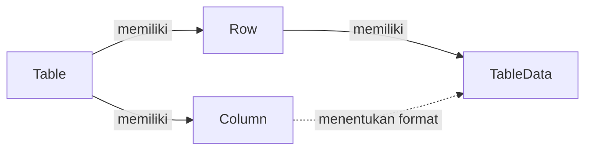
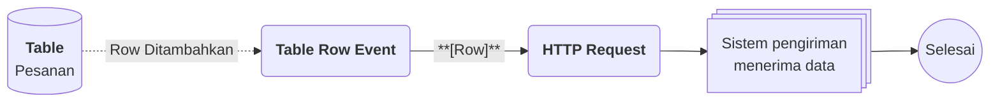

# Apa itu Table?

>**note** Table merupakan salah satu komponen dalam modul [[Docs/Modul Data/Pengenalan|Data]] di Phoenix.

Table adalah komponen penyimpan data yang dapat digunakan untuk menyimpan data secara kompleks, baik data transaksional maupun data generik.

Anda menyusun beberapa [[Docs/Tipe Data/Column|Column]] yang masing-masing memiliki format berbeda, lalu mengisi datanya melalui [[Docs/Tipe Data/Row|Row]]. Setiap Row memiliki [[Docs/Tipe Data/TableData|TableData]] sesuai kolom yang tersedia. [[Docs/Tipe Data/Expression|Expression]] juga dapat berfungsi langsung pada komponen ini.

## Mengapa Menggunakan Table?

- **Satu tempat untuk data kompleks.** Data transaksional dan data generik dapat disimpan dengan struktur yang sama.
- **Format sesuai jenis data.** Setiap Column memiliki format sendiri sehingga isian setiap kolom konsisten.
- **Mudah dikenali saat dipilih.** Alias menampilkan nilai kolom pilihan Anda pada field berformat Row, sehingga Row tidak hanya dikenali lewat angka ID.
- **Expression langsung berfungsi.** [[Docs/Tipe Data/Expression|Expression]] dapat digunakan langsung pada Table.
- **Siap terhubung ke komponen lain.** Fungsi [[^button/merge|Merge]], [[^button/publish|Publish]], dan [[^button/event|Event]] membuat data Table dapat digabungkan, dipublikasikan, dan dihubungkan ke logika otomasi.

## Konsep Utama

| Istilah                                                | Penjelasan                                                                                        |
| ------------------------------------------------------ | ------------------------------------------------------------------------------------------------- |
| [[Docs/Tipe Data/Column|Column]]                       | Kolom pada Table. Setiap Column memiliki Name, Format, dan Description.                           |
| [[Docs/Tipe Data/Row|Row]]                             | Baris pada Table yang menampung satu rangkaian data.                                              |
| [[Docs/Tipe Data/TableData|TableData]]                 | Isi sel dari sebuah Row, mengikuti Column yang tersedia.                                          |
| [[Docs/Tipe Data/Expression]]               | Tipe Data untuk melakukan perhitungan dengan fungsi yang disediakan, Tipe Data ini dapat langsung digunakan pada komponen Table.                                       |
| [[Docs/Tipe Data/Column#Alias|Alias]]                  | Column pilihan yang nilainya tampil pada field berformat Row dengan pola `ID - Alias Value`.      |

## Cara Kerja Table

Table menyimpan data dalam struktur Column, Row, dan TableData: Column menentukan kolom beserta formatnya, Row menjadi baris data, dan TableData menjadi isi setiap sel.

## Membuat Table

![[Docs/Modul Data/Table/add-table.png]]

1. Buka folder tempat Table akan ditempatkan di [[Docs/Antarmuka#Area Manajemen Folder]]
2. Klik kanan > [[^field/add|Add]] > [[^field|Data]] > [[^field/table|Table]]
3. Periksa [[^field|Directory]] yang terisi otomatis sesuai folder yang Anda klik kanan, atau pilih folder lain. Biarkan kosong untuk letak _root_.
4. Isi [[^field|Name]] dan [[^field|Description]]
5. Pada bagian [[^field|Column]], isi [[^field|Name]], pilih Format, dan isi Description untuk setiap Column
6. Klik [[^button/add|Add Column]] jika Anda membutuhkan Column tambahan
7. Isi kolom dengan sesuai (lihat [[#Mengisi Column]])
8. Pilih satu Column sebagai Alias dengan mengklik ikon bintang pada kolom [[^field|Alias]]
9. Klik [[^button|Create]]

Anda juga dapat membuat Table dari file dengan mengklik [[^button/upload|Upload]] di pojok kanan atas dialog. Selengkapnya lihat [[Docs/Modul Data/Table/Upload]].

Beberapa aturan penting:

- Table minimal memiliki satu Column.
- Setiap Table harus memiliki satu Alias. Pilih salah satu Column sebagai Alias.
- Pada field berformat Row, nilai ditampilkan dengan pola `ID - Alias Value`. Contoh: jika Alias adalah Column Nama dan Row dengan ID 1 bernilai "Kopi Arabika", field menampilkan `1 - Kopi Arabika`.

>**success** Table berhasil dibuat
> Table yang baru dibuat belum memiliki data. Tambahkan Row di [[#Mengelola Data Table]].

### Mengisi Column

Bagian [[^field|Column]] pada dialog [[^field|Create New Table]] berupa tabel dengan kolom berikut:

| Elemen                      | Fungsi                                                                                                        |
| -------------------------- | ------------------------------------------------------------------------------------------------------------- |
| [[^field|Index]]           | Nomor urut Column.                                                                                            |
| [[^field|Name]]            | Nama Column.                                                                                                  |
| [[^field|Format]]          | Format data Column. Pilih lewat [[^field|Select Data Format...]]. Selengkapnya lihat [[Docs/Tipe Data/Column]]. |
| [[^field|Header]]          | Header yang dibutuhkan oleh Format tertentu. Bernilai [[^field|N/A]] (*not applicable*) jika Format tidak membutuhkannya. Contoh: Format bertipe [[Docs/Tipe Data/EnumData|EnumData]] membutuhkan Header [[Docs/Tipe Data/Enum|Enum]], dan Format bertipe [[Docs/Tipe Data/Node|Node]] membutuhkan Header [[Docs/Tipe Data/Tree|Tree]]. |
| [[^field|Description]]     | Penjelasan singkat tentang isi Column.                                                                        |
| [[^field|Alias]]           | Penanda Column yang dipilih sebagai Alias. Hanya satu Column yang dapat dipilih.                              |
| [[^field|Action]]          | Berisi tombol [[^button/delete|Delete]] untuk menghapus Column dari dialog.                                  |

## Mengubah Table

1. Buka halaman kerja Table
2. Klik [[^button/edit|Edit]]
3. Perbarui isian yang diperlukan, termasuk Column, Format, atau Alias
4. Klik [[^button|Update]]

>**warning** Perubahan Column dapat menyebabkan data hilang
> Jika perubahan berisiko menghilangkan data pada Row yang sudah ada, Phoenix menampilkan peringatan. Anda tetap dapat melanjutkan dengan *force update*, tetapi data yang terdampak akan hilang.

## Menyegarkan Table

Klik [[^button/refresh|Refresh]] untuk memuat ulang tampilan.

## Menghapus Table

1. Buka folder yang berisi Table
2. Klik kanan Table, pilih [[^button/delete|Delete]]
3. Konfirmasi dengan [[^button|Delete]]

>**warning** Seluruh data Table ikut terhapus
> Menghapus Table menghapus seluruh [[Docs/Tipe Data/Column|Column]], [[Docs/Tipe Data/Row|Row]], dan [[Docs/Tipe Data/TableData|TableData]] di dalamnya. Komponen atau [[Docs/Modul Logic/Flow/Apa itu Flow|Flow]] yang menggunakan Table ini, termasuk [[Docs/Event/Menghubungkan Event|Event]] yang sudah terhubung dan field berformat Row yang merujuk ke Table ini, tidak lagi dapat mengambil datanya.

## Antarmuka Table

Halaman kerja Table terdiri dari bilah navigasi di bagian atas dan tabel data di bagian bawah.

![[Docs/Modul Data/Table/halaman-kerja-table.png]]
Tabel data memiliki dua kolom tambahan di luar Column yang Anda buat: [[^field|ID]] di bagian awal (terisi otomatis) dan [[^field|Action]] di bagian akhir. Ikon kecil pada header setiap Column menunjukkan format Column tersebut.

### Bilah navigasi Table terdiri dari:

| Tombol                                         | Fungsi                                                                                                   |
| ---------------------------------------------- | -------------------------------------------------------------------------------------------------------- |
| [[^button/edit|Edit]]                          | Mengubah atribut Table, termasuk Column. Lihat [[#Mengubah Table]].                                      |
| [[^button/merge|Merge]]                        | Menggabungkan data Table. Penjelasan lengkap di [[Docs/Modul Data/Table/TableData Merge]].                         |
| [[^button/publish|Publish]]                    | Mengatur publikasi Table. Penjelasan lengkap di [[Docs/Modul Data/Table/Publish]].                       |
| [[^button/event|Event]]                        | Menghubungkan Table dengan [[Docs/Event/Apa itu Event|Event]]. Penjelasan lengkap di [[Docs/Modul Data/Table/Event]]. |
| [[^button/refresh|Refresh]]                    | Memuat ulang tampilan halaman kerja.                                                                     |
| [[^field|Search Table Data...]]                | Mencari data pada Table.                                                                                 |

### Tombol pada tabel data

| Tombol                                | Fungsi                                                         |
| ------------------------------------- | -------------------------------------------------------------- |
| [[^button/add|Add Row]]               | Menambahkan Row baru. Tersedia di bawah baris terakhir dan di bagian bawah halaman, keduanya berfungsi sama. |
| [[^button/save|Save]]                 | Menyimpan perubahan pada Row. Aktif hanya ketika ada perubahan. |
| [[^button/delete|Delete]]             | Menghapus Row.                                                 |

### Interaksi Antarmuka Table

| Fungsi                          | Aksi                                                                                       |
| ------------------------------- | ------------------------------------------------------------------------------------------ |
| Melihat Column di sisi kanan    | Scroll horizontal pada bagian bawah tabel data.                                            |
| Berpindah halaman data          | Klik [[^button/left|Prev]] atau [[^button/right|Next]], atau isi nomor halaman lalu klik [[^button/empty|Go]]. |
| Mencari data                    | Ketik pada [[^field|Search Table Data...]].                                                |
| Membaca informasi jumlah data   | Lihat [[^field|Show 50 of 2 items, on page]] di bagian bawah halaman. Pada contoh tampilan, angka 50 adalah batas data per halaman dan angka 2 adalah jumlah seluruh data. |

## Mengelola Data Table

Halaman kerja Table adalah untuk mengelola [[Docs/Tipe Data/Row]]. Setiap [[Docs/Tipe Data/Row]] memiliki [[Docs/Tipe Data/TableData|TableData]] sesuai [[Docs/Tipe Data/Column]] yang tersedia. Cara mengisi [[Docs/Tipe Data/TableData]] berbeda untuk setiap Format. Selengkapnya lihat [[Docs/Tipe Data/TableData#Mengisi TableData]].

### Menambahkan Row

1. Buka halaman kerja Table
2. Klik [[^button/add|Add Row]]
3. Isi data pada setiap Column
4. Klik [[^button/save|Save]]

Anda dapat klik [[^button/delete|Cancel]] untuk membatalkan penambahan Row.

### Mengubah Row

1. Ubah isian pada Row yang diinginkan
2. Klik [[^button/save|Save]] pada kolom [[^field|Action]]

Anda dapat klik [[^button/x|Cancel]] untuk membatalkan perubahan Row.

### Menghapus Row

1. Klik [[^button/delete|Delete]] pada kolom [[^field|Action]] Row yang diinginkan
2. Konfirmasi dengan [[^button|Delete]]

>**warning** Row yang dihapus tidak dapat dikembalikan
> Menghapus Row juga menghapus seluruh TableData di dalamnya. Pastikan Row tersebut tidak lagi dibutuhkan oleh komponen atau Flow lain.

## Mengatur Table

Pelajari fitur pendukung Table di halaman berikut:

- [[Docs/Modul Data/Table/Upload|Upload]]: membuat Table dari file.
- [[Docs/Modul Data/Table/Mengisi TableData|Mengisi TableData]]: cara mengisi data sesuai Format Column.
- [[Docs/Modul Data/Table/TableData Merge|Merge]]: menggabungkan data Table.
- [[Docs/Modul Data/Table/Publish|Publish]]: mengatur publikasi Table.
- [[Docs/Modul Data/Table/Event|Event]]: menghubungkan Table dengan [[Docs/Event/Apa itu Event|Event]].
- [[Docs/Tipe Data/Column|Column]], [[Docs/Tipe Data/Row|Row]], dan [[Docs/Tipe Data/TableData|TableData]]: memahami isi Table lebih dalam.

## Contoh Penggunaan

**Mencatat pesanan pelanggan dan meneruskannya ke sistem lain**

Tim penjualan mencatat pesanan yang masuk dan ingin pesanan tersebut otomatis diteruskan ke sistem pengiriman, tanpa menyalin data satu per satu. Table menyimpan setiap pesanan dengan format kolom yang konsisten, lalu [[Docs/Event/Apa itu Event|Event]] dari Table memicu [[Docs/Modul Logic/Flow/Apa itu Flow|Flow]] untuk mengirim data ke sistem tersebut.

**Komponen yang terlibat**

| Komponen                         | Peran                                                                          |
| -------------------------------- | ------------------------------------------------------------------------------ |
| [[^field/table|Pesanan]]         | Menyimpan setiap pesanan sebagai Row, dengan Column seperti Nama Pelanggan dan Jumlah. |
| [[^field/flow|Kirim Pesanan]]    | Menjalankan logika pengiriman data saat ada Row baru.                          |

**Alur di Flow**

| Langkah | Flow Block                                                                              | Peran dalam alur                                  | Hasil                                    |
| ------- | --------------------------------------------------------------------------------------- | ------------------------------------------------- | ---------------------------------------- |
| 1       | [[Docs/Modul Logic/Flow/Flow Block/Event/Table Row Event|Table Row Event]]                   | Terpicu saat Row baru ditambahkan pada Table.     | Data Row siap diteruskan.                |
| 2       | [[Docs/Modul Logic/Flow/Flow Block/Modular/HTTP Request|HTTP Request]]                    | Mengirim data Row ke sistem pengiriman.           | Sistem pengiriman menerima pesanan.      |

**Hasil yang dirasakan**

- Pesanan cukup dicatat sekali di Table, lalu diteruskan otomatis ke sistem lain.
- Format kolom yang konsisten mengurangi kesalahan data saat dikirim.
- Tim dapat memilih pesanan lewat field berformat Row dengan pola `ID - Alias Value`, sehingga lebih mudah dikenali.

**Ide skenario lain**

| Jenis nilai          | Contoh integrasi                                                                          |
| -------------------- | ----------------------------------------------------------------------------------------- |
| Data generik         | Daftar produk atau pelanggan yang dirujuk oleh komponen lain lewat field berformat Row.   |
| Data transaksional   | Catatan stok masuk dan keluar yang memicu pemberitahuan lewat Flow saat stok menipis.     |
| Data publikasi       | Daftar harga atau jadwal yang dipublikasikan lewat [[Docs/Modul Data/Table/Publish|Publish]]. |

Dengan satu Table sebagai sumber data, pencatatan, pemilihan data, dan otomasi dapat berjalan dari data yang sama.

## Praktik Terbaik

- **Rancang Column sebelum mengisi Row.** Tentukan Name dan Format setiap Column agar data konsisten sejak awal.
- **Pilih Format sesuai jenis data.** Format yang tepat membuat isian lebih rapi dan mudah diproses komponen lain.
- **Pilih Alias yang mudah dikenali.** Gunakan Column yang paling mewakili Row, misalnya nama, karena nilainya tampil pada field berformat Row.
- **Isi Description pada Column.** Penjelasan singkat membantu anggota lain memahami isi setiap Column.
- **Periksa dampaknya sebelum mengubah Column.** Perubahan Column pada Table yang sudah berisi Row dapat menghilangkan data.

## Batasan dan Catatan

- Table yang baru dibuat belum memiliki Row, dan minimal memiliki satu Column.
- Setiap Table harus memiliki satu Alias. Alias yang dipilih tampil pada field berformat Row dengan pola `ID - Alias Value`.
- ID dan Action adalah kolom tambahan pada halaman kerja, bukan Column yang Anda buat. ID terisi otomatis.
- Perubahan Column lewat [[^button/edit|Edit]] dapat menyebabkan data hilang. Phoenix menampilkan peringatan, dan Anda dapat melanjutkan dengan *force update*.
- Penggunaan [[^button/merge|Merge]], [[^button/event|Event]], dan [[^button/publish|Publish]] bergantung pada Function Access di [[Docs/Modul Developer/Workspace/Apa itu Workspace|Workspace]].
- Row yang dihapus tidak dapat dikembalikan.

## TL:DR

- Table adalah komponen di modul [[Docs/Modul Data/Pengenalan|Data]] untuk menyimpan data transaksional maupun generik.
- Table terdiri dari [[Docs/Tipe Data/Column|Column]], [[Docs/Tipe Data/Row|Row]], dan [[Docs/Tipe Data/TableData|TableData]].
- Saat membuat Table, Anda wajib memilih satu Alias dan membuat minimal satu Column.
- Halaman kerja menambahkan kolom ID di awal dan Action di akhir.
- Merge, Publish, dan Event memiliki halaman penjelasan masing-masing.
- Hati-hati saat mengubah Column dan saat menghapus Table atau Row karena data dapat hilang.

## FAQ : Pertanyaan yang Sering Diajukan

> **faq**
> **Apakah Table baru langsung berisi data?**
> Tidak. Row pada Table yang baru dibuat masih kosong. Klik [[^button/add|Add Row]] di halaman kerja.
> **Mengapa saya harus memilih Alias?**
> Alias menentukan nilai [[Docs/Tipe Data/Column]] yang tampil pada field berformat [[Docs/Tipe Data/Row]] dengan pola `ID - Alias Value`, sehingga Row mudah dikenali.
> **Bisakah lebih dari satu Column dijadikan Alias?**
> Tidak. Pilih salah satu Column sebagai Alias.
> **Bisakah Column diubah setelah Table dibuat?**
> Bisa, lewat [[^button/edit|Edit]]. Jika perubahan berisiko menghilangkan data, Phoenix menampilkan peringatan dan Anda dapat melanjutkan dengan *force update*.
> **Dari mana kolom ID dan Action berasal?**
> Keduanya kolom tambahan pada halaman kerja Table, ID di bagian awal (terisi otomatis) dan Action di bagian akhir.
> **Di mana saya bisa mempelajari fungsi Merge, Publish, dan Event?**
> Lihat [[Docs/Modul Data/Table/TableData Merge|Merge]], [[Docs/Modul Data/Table/Publish|Publish]], dan [[Docs/Modul Data/Table/Event|Event]].

