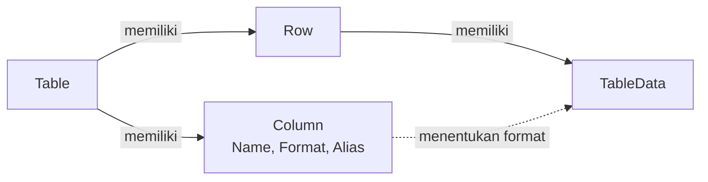

---
status: draft
title: Apa itu Table?
description: Pengenalan komponen Table di modul Data Phoenix untuk menyimpan data transaksional maupun generik dalam Column, Row, dan TableData.
---

# Apa itu Table?

>**note** _Table_ merupakan salah satu komponen dalam modul [[Docs/Modul Data/Pengenalan|Data]] di Phoenix.

Table adalah komponen penyimpan data yang dapat digunakan untuk menyimpan data secara kompleks, baik data transaksional maupun data generik.

Anda menyusun beberapa [[Docs/Tipe Data/Column|Column]] yang masing-masing memiliki format berbeda, lalu mengisi datanya melalui [[Docs/Tipe Data/Row|Row]]. Setiap Row memiliki [[Docs/Tipe Data/TableData|TableData]] sesuai kolom yang tersedia. [[Docs/Tipe Data/Expression|Expression]] juga dapat berfungsi langsung pada komponen ini.

## Mengapa Menggunakan Table?

- **Satu tempat untuk data kompleks.** Data transaksional dan data generik dapat disimpan dengan struktur yang sama.
- **Format sesuai jenis data.** Setiap Column memiliki format sendiri sehingga isian setiap kolom konsisten.
- **Mudah dikenali saat dipilih.** Alias menampilkan nilai kolom pilihan Anda pada field berformat Row, sehingga Row tidak hanya dikenali lewat angka ID.
- **Expression langsung berfungsi.** [[Docs/Tipe Data/Expression|Expression]] dapat digunakan langsung pada Table.
- **Siap terhubung ke komponen lain.** Fungsi [[^button/merge|Merge]], [[^button/publish|Publish]], dan [[^button/event|Event]] membuat data Table dapat digabungkan, dipublikasikan, dan dihubungkan ke logika otomasi.

## Konsep Utama

| Istilah                                                | Penjelasan                                                                                        |
| ------------------------------------------------------ | ------------------------------------------------------------------------------------------------- |
| [[Docs/Tipe Data/Column\|Column]]                       | Kolom pada Table. Setiap Column memiliki Name, Format, dan Description.                           |
| [[Docs/Tipe Data/Row\|Row]]                             | Baris pada Table yang menampung satu rangkaian data.                                              |
| [[Docs/Tipe Data/TableData\|TableData]]                 | Isi sel dari sebuah Row, mengikuti Column yang tersedia.                                          |
| [[Docs/Tipe Data/Expression\|Expression]]               | Ekspresi yang dapat langsung berfungsi pada komponen Table.                                       |
| [[Docs/Tipe Data/Column#Alias\|Alias]]                  | Column pilihan yang nilainya tampil pada field berformat Row dengan pola `ID - Alias Value`.      |

## Cara Kerja Table

Table menyimpan data dalam struktur Column, Row, dan TableData: Column menentukan kolom beserta formatnya, Row menjadi baris data, dan TableData menjadi isi setiap sel.

<!--
  * [TODO] Nama Column dan nilai pada contoh Alias ("Nama", "Kopi Arabika") adalah penamaan generik buatan saya. Silakan sesuaikan dengan contoh yang Anda inginkan.
  * [TODO] Konfirmasi path anchor [[Docs/Tipe Data/Column#Alias|Alias]] (usulan: bagian Alias di halaman tipe data Column) dan apakah penjelasan Alias lebih tepat di halaman Column.
-->

## Membuat Table

![[Docs/Modul Data/Table/modal-add-table.png]]
1. Buka folder tempat Table akan ditempatkan di [[Docs/Antarmuka#Area Manajemen Folder]]
2. Klik kanan > [[^field/add|Add]] > [[^field|Data]] > [[^field/table|Table]]
3. Periksa atau pilih folder pada [[^field|Directory]], biarkan kosong untuk letak _root_.
4. Isi [[^field|Name]] dan [[^field|Description]]
5. Pada bagian [[^field|Column]], isi [[^field|Name]], pilih Format, dan isi Description untuk setiap Column
6. Klik [[^button/add|Add Column]] jika Anda membutuhkan Column tambahan
7. Isi kolom dengan sesuai (lihat [[#Mengisi Column]])
8. Pilih satu Column sebagai Alias dengan mengklik ikon bintang pada kolom [[^field|Alias]]
9. Klik [[^button|Create]]

Beberapa aturan penting:

- Setiap Table harus memiliki satu Alias. Pilih salah satu Column sebagai Alias.
- Pada field berformat Row, nilai ditampilkan dengan pola `ID - Alias Value`. Contoh: jika Alias adalah Column Nama dan Row dengan ID 1 bernilai "Kopi Arabika", field menampilkan `1 - Kopi Arabika`.

>**success** Table berhasil dibuat
> Table yang baru dibuat belum memiliki data. Tambahkan Row di [[#Mengelola Data Table]].

>**warning** Beberapa aturan penting

### Mengisi Column

Bagian [[^field|Column]] pada dialog [[^field|Create New Table]] berupa tabel dengan kolom berikut:

| Kolom                      | Fungsi                                                                                                        |
| -------------------------- | ------------------------------------------------------------------------------------------------------------- |
| [[^field\|Index]]           | Nomor urut Column.                                                                                            |
| [[^field\|Name]]            | Nama Column.                                                                                                  |
| [[^field\|Format]]          | Format data Column. Pilih lewat [[^field\|Select Data Format]]. Selengkapnya lihat [[Docs/Tipe Data/Column]]. |
| [[^field\|Header]]          | Informasi header Column. Pada Column yang baru ditambahkan, tampil [[^field\|N/A]].                           |
| [[^field\|Description]]     | Penjelasan singkat tentang isi Column.                                                                        |
| [[^field\|Alias]]           | Penanda Column yang dipilih sebagai Alias. Hanya satu Column yang dapat dipilih.                              |
| [[^field\|Action]]          | Berisi tombol [[^button/delete\|Delete]] untuk menghapus Column dari dialog.                                  |

<!--
  * [TODO] Fungsi tombol [[^button/upload|Upload]] di pojok kanan atas dialog Create New Table belum dijelaskan. Dugaan saya untuk membuat Table dari file. Mohon konfirmasi, lalu tentukan apakah perlu subhalaman.
  * [TODO] Arti kolom Header (nilai N/A) belum jelas, mohon dijelaskan: kapan nilainya berubah dan apa fungsinya.
  * [TODO] Konfirmasi apakah Directory otomatis terisi dari folder yang dibuka saat klik kanan, dan jalur menu Add > Data > Table.
  * [TODO] Konfirmasi apakah Column minimal harus berjumlah dua (dialog awal menampilkan dua baris Column) dan apakah Alias wajib dipilih sebelum Create.
-->

## Mengubah Table

1. Buka halaman kerja Table
2. Klik [[^button/edit|Edit]]
3. Perbarui isian yang diperlukan
4. Klik [[^button|Update]]

<!--
  * [TODO] Konfirmasi apa saja yang dapat diubah lewat Edit (hanya Name dan Description, atau juga Column, Format, dan Alias), dan dampaknya terhadap data Row yang sudah ada.
-->

## Menyegarkan Table

Klik [[^button/refresh|Refresh]] untuk memuat ulang tampilan.

## Menghapus Table

1. Buka folder yang berisi Table
2. Klik kanan Table, pilih [[^button/delete|Delete]]
3. Konfirmasi dengan [[^button|Delete]]

>**warning** Seluruh data Table ikut terhapus
> Menghapus Table menghapus seluruh Column, Row, dan TableData di dalamnya. Komponen atau Flow yang menggunakan Table ini, termasuk [[Docs/Event/Menghubungkan Event|Event]] yang sudah terhubung dan field berformat Row yang merujuk ke Table ini, tidak lagi dapat mengambil datanya.

<!--
  * [TODO] Konfirmasi dampak penghapusan Table (apakah dapat dikembalikan, apa yang terjadi pada Flow Block dan field berformat Row yang merujuk ke Table).
-->

## Antarmuka Table

Halaman kerja Table terdiri dari bilah navigasi di bagian atas dan tabel data di bagian bawah.

![[Docs/Modul Data/Table/halaman-kerja-table.png]]

Tabel data memiliki dua kolom tambahan di luar Column yang Anda buat: **ID** di bagian awal dan **Action** di bagian akhir. Ikon kecil pada header setiap Column menunjukkan format Column tersebut.

<!--
  * [TODO] Penempatan gambar halaman-kerja-table.png. Sarankan anotasi bernomor: (1) judul Table, (2) tombol bilah navigasi, (3) kolom pencarian, (4) kolom ID dan header Column, (5) kolom Action (Save dan Delete), (6) tombol Add Row, (7) informasi jumlah data dan navigasi halaman.
  * [TODO] Teks pada screenshot (nama Table, isi Row, dan nama Column) adalah kasus pribadi dan tidak disebut di dokumentasi. Silakan ganti dengan gambar yang memakai penamaan generik.
  * [TODO] Kolom ketiga pada screenshot tidak menampilkan nama Column pada header (hanya ikon format). Mohon cek apakah itu hanya terpotong atau memang tampilan untuk nama kosong.
-->

### Bilah navigasi Table terdiri dari:

| Tombol                                         | Fungsi                                                                                                   |
| ---------------------------------------------- | -------------------------------------------------------------------------------------------------------- |
| [[^button/edit\|Edit]]                          | Mengubah atribut Table. Lihat [[#Mengubah Table]].                                                       |
| [[^button/merge\|Merge]]                        | Menggabungkan data Table. Penjelasan lengkap di [[Docs/Modul Data/Table/Merge]].                         |
| [[^button/publish\|Publish]]                    | Mengatur publikasi Table. Penjelasan lengkap di [[Docs/Modul Data/Table/Publish]].                       |
| [[^button/event\|Event]]                        | Menghubungkan Table dengan [[Docs/Event/Apa itu Event\|Event]]. Penjelasan lengkap di [[Docs/Modul Data/Table/Event]]. |
| [[^button/refresh\|Refresh]]                    | Memuat ulang tampilan halaman kerja.                                                                     |
| [[^field\|Search Table Data...]]                | Mencari data pada Table.                                                                                 |

> **note** Detail Merge, Publish, dan Event
> Merge, Publish, dan Event dijelaskan pada halaman masing-masing.

### Tombol pada tabel data

| Tombol                                | Fungsi                                                         |
| ------------------------------------- | -------------------------------------------------------------- |
| [[^button/add\|Add Row]]               | Menambahkan Row baru. Tersedia di bawah baris terakhir dan di bagian bawah halaman. |
| [[^button/save\|Save]]                 | Menyimpan perubahan pada Row.                                  |
| [[^button/delete\|Delete]]             | Menghapus Row.                                                 |

### Interaksi Antarmuka Table

| Fungsi                          | Aksi                                                                                       |
| ------------------------------- | ------------------------------------------------------------------------------------------ |
| Melihat Column di sisi kanan    | Scroll horizontal pada bagian bawah tabel data.                                            |
| Berpindah halaman data          | Klik [[^button\|Prev]] atau [[^button\|Next]], atau isi nomor halaman lalu klik [[^button\|Go]]. |
| Mencari data                    | Ketik pada [[^field\|Search Table Data...]].                                                |

<!--
  * [TODO] Konfirmasi arti informasi di bagian bawah halaman ("Show 50 of 2 items, on page"), terutama makna angka 50 (batas data per halaman?).
  * [TODO] Konfirmasi perilaku tombol Save (tampak nonaktif sebelum ada perubahan) dan apakah dua tombol Add Row berfungsi sama.
  * [TODO] Konfirmasi perbedaan tampilan desktop dan mobile pada bilah navigasi (misalnya tombol berubah menjadi ikon saja).
  * [TODO] Konfirmasi apakah ID terisi otomatis, dan apakah kolom pencarian mencari di semua Column.
-->

## Mengelola Data Table

Isi Table dikelola per Row di halaman kerja. Setiap Row memiliki [[Docs/Tipe Data/TableData|TableData]] sesuai Column yang tersedia.

### Menambahkan Row

1. Buka halaman kerja Table
2. Klik [[^button/add|Add Row]]
3. Isi data pada setiap Column
4. Klik [[^button/save|Save]]

### Mengubah Row

1. Ubah isian pada Row yang diinginkan
2. Klik [[^button/save|Save]] pada kolom [[^field|Action]]

### Menghapus Row

1. Klik [[^button/delete|Delete]] pada kolom [[^field|Action]] Row yang diinginkan
2. Konfirmasi dengan [[^button|Delete]]

>**warning** Row yang dihapus tidak dapat dikembalikan
> Menghapus Row juga menghapus seluruh TableData di dalamnya. Pastikan Row tersebut tidak lagi dibutuhkan oleh komponen atau Flow lain.

<!--
  * [TODO] Konfirmasi apakah ada dialog konfirmasi saat menghapus Row dan apakah Row yang dihapus benar-benar tidak dapat dikembalikan.
  * [TODO] Pengelolaan isian per Format (misalnya cara mengisi Column berformat File atau Row) mungkin perlu subhalaman tersendiri.
-->

## Mengatur Table

Pelajari fitur pendukung Table di halaman berikut:

- [[Docs/Modul Data/Table/Merge|Merge]]: menggabungkan data Table.
- [[Docs/Modul Data/Table/Publish|Publish]]: mengatur publikasi Table.
- [[Docs/Modul Data/Table/Event|Event]]: menghubungkan Table dengan [[Docs/Event/Apa itu Event|Event]].
- [[Docs/Tipe Data/Column|Column]], [[Docs/Tipe Data/Row|Row]], dan [[Docs/Tipe Data/TableData|TableData]]: memahami isi Table lebih dalam.

<!--
  * [TODO] Halaman baru yang diusulkan (belum ada): Docs/Modul Data/Table/Merge (fungsi Merge), Docs/Modul Data/Table/Publish (konfigurasi publikasi), Docs/Modul Data/Table/Event (menghubungkan Event dari Table). Mohon konfirmasi path-nya, khususnya apakah halaman Event cukup mengarah ke Docs/Event/Menghubungkan Event.
-->

## Contoh Penggunaan

**Mencatat pesanan pelanggan dan meneruskannya ke sistem lain**

Tim penjualan mencatat pesanan yang masuk dan ingin pesanan tersebut otomatis diteruskan ke sistem pengiriman, tanpa menyalin data satu per satu. Table menyimpan setiap pesanan dengan format kolom yang konsisten, lalu [[Docs/Event/Apa itu Event|Event]] dari Table memicu [[Docs/Modul Logic/Flow/Apa itu Flow|Flow]] untuk mengirim data ke sistem tersebut.

**Komponen yang terlibat**

| Komponen                         | Peran                                                                          |
| -------------------------------- | ------------------------------------------------------------------------------ |
| [[^field/table\|Pesanan]]         | Menyimpan setiap pesanan sebagai Row, dengan Column seperti Nama Pelanggan dan Jumlah. |
| [[^field/flow\|Kirim Pesanan]]    | Menjalankan logika pengiriman data saat ada Row baru.                          |

**Alur di Flow**

| Langkah | Flow Block                                                                              | Peran dalam alur                                  | Hasil                                    |
| ------- | --------------------------------------------------------------------------------------- | ------------------------------------------------- | ---------------------------------------- |
| 1       | [[Docs/Modul Logic/Flow/Flow Block/Event/Pengenalan\|Table Row Event]]                   | Terpicu saat Row baru ditambahkan pada Table.     | Data Row siap diteruskan.                |
| 2       | [[Docs/Modul Logic/Flow/Flow Block/Modular/Pengenalan\|HTTP Request]]                    | Mengirim data Row ke sistem pengiriman.           | Sistem pengiriman menerima pesanan.      |

**Hasil yang dirasakan**

- Pesanan cukup dicatat sekali di Table, lalu diteruskan otomatis ke sistem lain.
- Format kolom yang konsisten mengurangi kesalahan data saat dikirim.
- Tim dapat memilih pesanan lewat field berformat Row dengan pola `ID - Alias Value`, sehingga lebih mudah dikenali.

**Ide skenario lain**

| Jenis nilai          | Contoh integrasi                                                                          |
| -------------------- | ----------------------------------------------------------------------------------------- |
| Data generik         | Daftar produk atau pelanggan yang dirujuk oleh komponen lain lewat field berformat Row.   |
| Data transaksional   | Catatan stok masuk dan keluar yang memicu pemberitahuan lewat Flow saat stok menipis.     |
| Data publikasi       | Daftar harga atau jadwal yang dipublikasikan lewat [[Docs/Modul Data/Table/Publish\|Publish]]. |

Dengan satu Table sebagai sumber data, pencatatan, pemilihan data, dan otomasi dapat berjalan dari data yang sama.

<!--
  * [TODO] Nama komponen (Pesanan, Kirim Pesanan), nama Column, dan nama Event pada garis diagram ("Row Ditambahkan") adalah penamaan generik buatan saya. Mohon sesuaikan dengan nama Event Table yang sebenarnya dan judul skenario yang Anda inginkan.
  * [TODO] Konfirmasi path halaman kategori Flow Block (Event dan Modular) dan apakah Table Row Event menghasilkan output bertipe Row.
-->

## Praktik Terbaik

- **Rancang Column sebelum mengisi Row.** Tentukan Name dan Format setiap Column agar data konsisten sejak awal.
- **Pilih Format sesuai jenis data.** Format yang tepat membuat isian lebih rapi dan mudah diproses komponen lain.
- **Pilih Alias yang mudah dikenali.** Gunakan Column yang paling mewakili Row, misalnya nama, karena nilainya tampil pada field berformat Row.
- **Isi Description pada Column.** Penjelasan singkat membantu anggota lain memahami isi setiap Column.

## Batasan dan Catatan

- Table yang baru dibuat belum memiliki Row.
- Setiap Table harus memiliki satu Alias. Alias yang dipilih tampil pada field berformat Row dengan pola `ID - Alias Value`.
- ID dan Action adalah kolom tambahan pada halaman kerja, bukan Column yang Anda buat.
- Penggunaan [[^button/merge|Merge]], [[^button/event|Event]], dan [[^button/publish|Publish]] bergantung pada Function Access di [[Docs/Modul Developer/Workspace/Apa itu Workspace|Workspace]].
- Row yang dihapus tidak dapat dikembalikan.

## TL:DR

- Table adalah komponen di modul [[Docs/Modul Data/Pengenalan|Data]] untuk menyimpan data transaksional maupun generik.
- Table terdiri dari [[Docs/Tipe Data/Column|Column]], [[Docs/Tipe Data/Row|Row]], dan [[Docs/Tipe Data/TableData|TableData]].
- Table baru dibuat tanpa Row, dan Anda wajib memilih satu Alias.
- Halaman kerja menambahkan kolom ID di awal dan Action di akhir.
- Merge, Publish, dan Event memiliki halaman penjelasan masing-masing.
- Hati-hati saat menghapus Table atau Row karena data tidak dapat dikembalikan.

## FAQ : Pertanyaan yang Sering Diajukan

> **faq**
> **Apakah Table baru langsung berisi data?**
> Tidak. Row pada Table yang baru dibuat masih kosong. Tambahkan Row di halaman kerja.
> **Mengapa saya harus memilih Alias?**
> Alias menentukan nilai Column yang tampil pada field berformat Row dengan pola `ID - Alias Value`, sehingga Row mudah dikenali.
> **Bisakah lebih dari satu Column dijadikan Alias?**
> Tidak. Pilih salah satu Column sebagai Alias.
> **Dari mana kolom ID dan Action berasal?**
> Keduanya kolom tambahan pada halaman kerja Table, ID di bagian awal dan Action di bagian akhir.
> **Di mana saya bisa mempelajari Merge, Publish, dan Event?**
> Lihat [[Docs/Modul Data/Table/Merge|Merge]], [[Docs/Modul Data/Table/Publish|Publish]], dan [[Docs/Modul Data/Table/Event|Event]].

