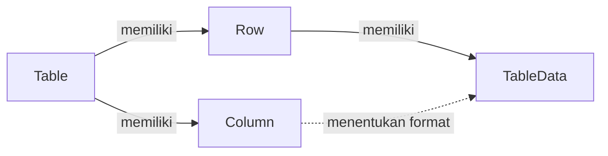

# Cara Kerja Table

Table menyimpan data dalam struktur Column, Row, dan TableData: Column menentukan kolom beserta formatnya, Row menjadi baris data, dan TableData menjadi isi setiap sel.

```mermaid
flowchart LR
  T["Table"] -->|&nbsp;memiliki&nbsp;| C["Column<br/>"]
  T -->|&nbsp;memiliki&nbsp;| R["Row"]
  R -->|&nbsp;memiliki&nbsp;| D["TableData"]
  C -.->|&nbsp;menentukan format&nbsp;| D
```