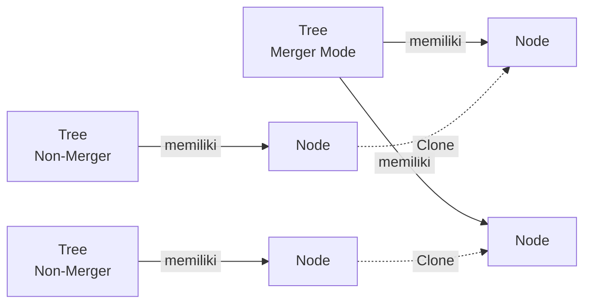
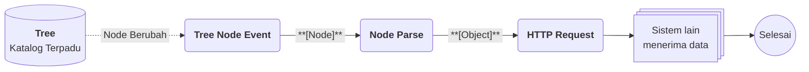

# Apa itu Tree?

>**note** Tree merupakan salah satu komponen dalam modul [[Docs/Modul Data/Pengenalan|Data]] di Phoenix.

Tree adalah komponen yang dapat menyimpan data secara hierarki atau berbentuk pohon. Sifat data ini cocok untuk menyimpan data relasional yang bercabang, seperti kategori dan subkategori atau struktur bertingkat lainnya. Satu Tree dapat memiliki banyak [[Docs/Tipe Data/Node]]. Salah satu atribut penting dalam Tree adalah [[Docs/Modul Data/Tree/Konfigurasi Merger Mode|Merger Mode]].

Tree juga dapat dijadikan bersifat Merger. Dengan Merger Mode, satu Tree dapat memanggil Node dari beberapa Tree lain, lalu menambahkannya sebagai *clone* tanpa Anda perlu menyalin Node satu per satu. Anda juga dapat mengatur apakah atribut Node ikut berubah ketika Node asalnya diperbarui lewat [[#External Read Only]].

## Mengapa Menggunakan Tree?

- **Data bercabang tersimpan rapi.** Hubungan induk dan anak antar data tergambar langsung dalam bentuk pohon.
- **Satu Tree, banyak Node.** Anda dapat menambahkan Node sebanyak yang dibutuhkan dan menyusunnya bertingkat.
- **Menggabungkan Node dari banyak Tree.** Tree dengan [[Docs/Modul Data/Tree/Konfigurasi Merger Mode|Merger Mode]] menghimpun Node dari Tree lain dalam satu tempat.
- **Perubahan terkendali.** [[#External Read Only]] menentukan atribut Node mana yang boleh ikut berubah dari Tree lain.
- **Tampilan mudah disesuaikan.** Pohon dapat ditampilkan secara horizontal atau vertikal, dan cabangnya dapat dilipat atau dibuka.
- **Terhubung dengan komponen lain.** Tree dapat dipublikasikan dan dihubungkan ke Event untuk otomasi di [[Docs/Modul Logic/Flow/Apa itu Flow|Flow]].

## Konsep Utama

| Istilah | Penjelasan |
| --- | --- |
| [[Docs/Tipe Data/Node]] | Satu simpul data di dalam Tree. Node memiliki atribut [[^field|Order]] dan [[^field|Name]], serta dapat memiliki anak. |
| [[#Membuat Tree|Origin]] | Node pertama yang otomatis dibuat ketika Tree baru dibuat. |
| [[Docs/Modul Data/Tree/Konfigurasi Merger Mode]] | Atribut yang menentukan apakah Tree dapat menambahkan (*clone*) Node dari Tree lain. |
| [[#External Read Only]] | Pengaturan yang menentukan apakah [[^field|Order]], [[^field|Name]], dan [[^field|Children]] Node ikut berubah ketika Node di Tree lain diperbarui. |
| [[#Default Configuration|Mode]] | Arah tampilan pohon, yaitu horizontal (kiri ke kanan) atau vertikal (atas ke bawah). |
| [[#Default Configuration|Context]] | Status yang berlaku ketika Anda membuka menu konteks Node. |
| [[#Menu Konteks Node]] | Menu yang muncul ketika Anda klik kanan pada Node, berisi aksi untuk Node tersebut dan pengaturan tampilan cabangnya. |

## Cara Kerja Tree

Tree menyimpan Node secara bertingkat, dan hanya Tree dengan Merger Mode yang dapat menambahkan Node dari Tree lain.

Tree yang tidak bersifat merger tidak dapat menambahkan Node dari Tree lain. Node *clone* di Tree penggabung dapat dibuat dengan atau tanpa mengikuti perubahan Node asalnya, dan pilihan ini berkaitan dengan [[#External Read Only]]. Selengkapnya lihat [[Docs/Modul Data/Tree/Konfigurasi Merger Mode]].

## Membuat Tree

![[Docs/Modul Data/Tree/add-tree.png]]
1. Buka folder tempat Tree akan ditempatkan di [[Docs/Antarmuka#Area Manajemen Folder]]
2. Klik kanan > [[^field/add|Add]] > [[^field|Data]] > [[^field/tree|Tree]]
3. Isi [[^field|Name]] dan [[^field|Description]], lalu atur pilihan lain sesuai kebutuhan (lihat [[#Atribut Tree]])
4. Klik [[^button|Create]]

>**success** Tree berhasil dibuat
> Tree yang baru dibuat otomatis memiliki satu [[Docs/Tipe Data/Node]] bernama [[^field|Origin]]. Tambahkan Node lain di [[#Mengelola Node]].

### Atribut Tree

| Isian | Fungsi |
| --- | --- |
| [[^field|Directory]] | Folder tempat Tree berada. Terisi otomatis sesuai folder yang Anda klik kanan. Jika dikosongkan, Tree berada di root. |
| [[^field|Name]] | Nama Tree. |
| [[^field|Description]] | Keterangan singkat tentang Tree. |
| [[Docs/Modul Data/Tree/Konfigurasi Merger Mode]] | Jika aktif, Tree dapat menambahkan (*clone*) Node dari Tree lain. Bawaan: [[^value/boolean/Non-Active]]. Tidak dapat diubah setelah Tree dibuat. |
| [[#External Read Only]] | Tiga pilihan, yaitu [[^field|Order]], [[^field|Name]], dan [[^field|Children]]. Bawaan masing-masing: [[^value/boolean/Non-Active]]. |
| [[#Default Configuration]] | Pengaturan tampilan awal, yaitu [[^field|Horizontal Mode]] dan [[^field|Context]]. |

### External Read Only

External Read Only mengatur atribut Node yang bersumber dari Tree lain, yaitu Node *clone* dan Node asalnya (*origin*). Pengaturan ini berlaku pada Tree dengan maupun tanpa Merger Mode, karena perubahan Node di Tree merger juga dapat mengubah Node di Tree non-merger. Setiap atribut memiliki pilihan sendiri:

| Atribut | Jika [[^value/boolean/Non-Active]] | Jika [[^value/boolean/Active]] |
| --- | --- | --- |
| [[^field|Order]] | [[^field|Order]] Node di Tree ini ikut berubah ketika Node di Tree lain diperbarui. | [[^field|Order]] Node tidak ikut berubah. |
| [[^field|Name]] | [[^field|Name]] Node di Tree ini ikut berubah ketika Node di Tree lain diperbarui. | [[^field|Name]] Node tidak ikut berubah. |
| [[^field|Children]] | [[^field|Children]] Node di Tree ini ikut berubah ketika Node di Tree lain diperbarui. | [[^field|Children]] Node tidak ikut berubah. |

Selengkapnya lihat [[Docs/Modul Data/Tree/Konfigurasi External Read Only]].

<!--
  * [TODO] Usulan halaman baru Docs/Modul Data/Tree/Konfigurasi External Read Only (pendamping Konfigurasi Merger Mode), berisi keterkaitan External Read Only dengan Merger Mode, contoh perubahan Node yang merambat dari Tree merger ke Tree non-merger, dan contoh kapan memilih Active. Halaman ini menyimpan tabel ringkas saja. Mohon konfirmasi apakah halaman ini perlu dibuat. Jika tidak, hapus kalimat "Selengkapnya lihat" di atas dan satu tautannya di bagian Mengatur Tree.
-->

### Default Configuration

| Isian | Fungsi |
| --- | --- |
| [[^field|Horizontal Mode]] | Menentukan arah tampilan pohon. Jika aktif, pohon berakar dari kiri ke kanan (horizontal). Jika tidak aktif, pohon berakar dari atas ke bawah (vertikal). |
| [[^field|Context]] | Menentukan status ketika Anda membuka menu konteks Node. Pilihannya: [[^field|Menu]], [[^field|Edit]], dan [[^field|Detail]]. Bawaan: [[^field|Menu]]. |

Untuk pilihan [[^field|Context]]:

| Pilihan | Hasil ketika menu konteks Node dibuka |
| --- | --- |
| [[^field|Menu]] | Menampilkan [[#Menu Konteks Node]]. |
| [[^field|Edit]] | Membuka pengelolaan ubah Node. |
| [[^field|Detail]] | Membuka detail Node. |

Kedua isian ini hanya nilai awal. Di halaman kerja, Anda dapat mengganti mode dan context secara sementara (lihat [[#Interaksi Antarmuka Tree]]). Untuk mengubah nilai awalnya, gunakan [[^button/edit|Edit]].

## Mengubah Tree

1. Buka halaman kerja Tree
2. Klik [[^button/edit|Edit]]
3. Perbarui isian yang diperlukan
4. Klik [[^button|Update]]

>**note** Merger Mode tidak dapat diubah
> [[Docs/Modul Data/Tree/Konfigurasi Merger Mode|Merger Mode]] ditentukan saat Tree dibuat dan tidak dapat diubah setelahnya. Tentukan pilihan ini sebelum Anda klik [[^button|Create]].

## Menyegarkan Tree

Klik [[^button/refresh|Refresh]] untuk memuat ulang tampilan.

## Menghapus Tree

1. Buka folder yang berisi Tree
2. Klik kanan Tree, pilih [[^button/delete|Delete]]
3. Konfirmasi dengan [[^button|Delete]]

>**warning** Dampak penghapusan Tree
> Seluruh [[Docs/Tipe Data/Node]] di dalam Tree ikut terhapus. Relasi dari komponen lain yang memakai Tree ini akan terputus, misalnya [[Docs/Tipe Data/Column]] pada Table yang memakai [[Docs/Tipe Data/Node]] dari Tree ini dan [[Docs/Modul Logic/Flow/Flow Block/Pengenalan|Flow Block]] seperti [[Docs/Modul Logic/Flow/Flow Block/Event/Tree Node Event|Tree Node Event]]. Jika Tree ini menjadi sumber *clone* bagi Tree dengan [[Docs/Modul Data/Tree/Konfigurasi Merger Mode|Merger Mode]], Node hasil *clone* di Tree tersebut dapat terdampak.

## Antarmuka Tree

![[Docs/Modul Data/Tree/antarmuka-tree.png]]
Halaman kerja Tree terdiri dari bilah navigasi di bagian atas dan area kerja di bagian bawah yang menampilkan pohon beserta Node-nya. Di sudut bawah area kerja terdapat informasi [[^field|context _]], [[^field|mode _]], koordinat [[^field|x _ y _]], dan [[^field|scale _]].

### Bilah navigasi Tree terdiri dari:

| Elemen | Fungsi |
| --- | --- |
| Judul Tree | Menampilkan ikon Tree dan nama Tree. |
| [[^button/edit|Edit]] | Mengubah atribut Tree. Lihat [[#Mengubah Tree]]. |
| [[^button/publish|Publish]] | Mengatur publikasi Tree. Lihat [[Docs/Modul Data/Tree/Publish]]. |
| [[^button/event|Event]] | Menghubungkan Tree dengan Event. Lihat [[Docs/Modul Data/Tree/Event]]. |
| [[^button/refresh|Refresh]] | Memuat ulang tampilan. Lihat [[#Menyegarkan Tree]]. |
| [[^field|Search Tree Data...]] | Mencari Node berdasarkan [[^field|Name]]. Pencarian tidak mencakup atribut Node yang lain. |

### Informasi Area Kerja

| Informasi | Penjelasan |
| --- | --- |
| [[^field|context _]] | Nilai [[#Default Configuration|Context]] yang sedang berlaku. Klik untuk menggantinya. |
| [[^field|mode _]] | Arah tampilan pohon, yaitu Horizontal atau Vertical. Klik untuk menggantinya. Lihat [[#Default Configuration|Mode]]. |
| [[^field|x _ y _]] | Koordinat posisi tampilan pada area kerja. |
| [[^field|scale _]] | Skala tampilan pada area kerja. |

### Interaksi Antarmuka Tree

| Fungsi | Aksi |
| --- | --- |
| Menggeser tampilan (*pan*) | Tekan dan tahan pada bagian yang kosong dalam halaman kerja, lalu gerakkan kursor. Lepas untuk selesai. |
| Mengubah skala tampilan (*zoom*) | Gulir pada bagian halaman kerja. |
| Memusatkan tampilan | Klik informasi koordinat [[^field|x _ y _]]. Tampilan kembali ke tengah. |
| Mengembalikan skala | Klik informasi [[^field|scale _]]. Tampilan kembali berskala 1. |
| Mengganti mode | Klik informasi [[^field|mode _]]. Perubahan bersifat sementara. |
| Mengganti context | Klik informasi [[^field|context _]]. Perubahan bersifat sementara. |
| Membuka menu konteks Node | Klik kanan pada Node. Hasilnya mengikuti nilai [[^field|context _]]. |

### Menu Konteks Node

![[Docs/Modul Data/Tree/node-menu.png]]
Klik kanan pada Node untuk membuka menu konteks berikut.

| Menu | Fungsi |
| --- | --- |
| [[^field/edit|Edit]] | Mengubah Node. Lihat [[Docs/Modul Data/Tree/Mengelola Node#Mengubah Node]]. |
| [[^field/eye|Detail]] | Melihat detail Node. Lihat [[Docs/Modul Data/Tree/Mengelola Node#Melihat Detail Node]]. |
| [[^field/collapse|Collapse]] atau [[^field/expand|Expand]] | Melipat atau memperluas keturunan selanjutnya dari Node. |
| [[^field|View]] | Membuka submenu pengaturan tampilan keturunan Node (lihat tabel di bawah). |
| [[^field/import|Import]] | Memasukkan data ke Node. Lihat [[Docs/Modul Data/Tree/Mengelola Node#Import Node]]. |
| [[^field/export|Export]] | Mengeluarkan data dari Node. Lihat [[Docs/Modul Data/Tree/Mengelola Node#Export Node]]. |

Submenu [[^field|View]]:

| Menu | Fungsi |
| --- | --- |
| [[^field/collapse|Collapse Below Level]] | Melipat keturunan pada level Node ini (semua Node). |
| [[^field/expand|Expand Children Only]] | Memperluas hanya satu keturunan di bawahnya. |
| [[^field/collapse|Collapse Descendant]] | Melipat semua keturunan secara *recursive*. |
| [[^field/expand|Expand Descendant]] | Membuka semua keturunan secara *recursive*. |
| [[^field|Hide Collapsed]] | Menyembunyikan anak yang dilipat. |
| [[^field|Show Collapsed]] | Memunculkan anak yang dilipat. |
| [[^field/collapse|Collapse and Hide]] | Melipat sekaligus menyembunyikan anak yang dilipat. |

>**note** Node tanpa anak
> Jika Node tidak memiliki anak, pilihan [[^field|Expand]] atau [[^field|Collapse]] dan [[^field|Expand Children Only]] berubah menjadi [[^field|No children...]].

## Mengelola Node

Halaman kerja Tree adalah untuk mengelola [[Docs/Tipe Data/Node]], mulai dari menambahkan, mengubah atribut, melihat detail, menghapus, hingga mengimpor dan mengekspor. Sebagian aksi tersedia di [[#Menu Konteks Node]]. Langkah rinci ada di [[Docs/Modul Data/Tree/Mengelola Node]].

## Mengatur Tree

Pelajari fitur pendukung Tree di halaman berikut:

- [[Docs/Modul Data/Tree/Konfigurasi Merger Mode]]: menggabungkan Node dari beberapa Tree.
- [[Docs/Modul Data/Tree/Konfigurasi External Read Only]]: mengatur atribut Node yang ikut berubah dari Tree lain.
- [[Docs/Modul Data/Tree/Publish]]: mengatur publikasi Tree.
- [[Docs/Modul Data/Tree/Event]]: menghubungkan Tree dengan Event.

## Contoh Penggunaan

**Katalog Kategori Terpadu dari Beberapa Divisi**

Setiap divisi menyusun kategori produknya sendiri dalam bentuk pohon, tetapi tim pusat membutuhkan satu katalog terpadu untuk dipakai laporan dan sistem lain. Dengan Tree, setiap divisi tetap mengelola [[Docs/Tipe Data/Node]]-nya sendiri, sementara satu Tree penggabung menghimpun semuanya tanpa menyalin ulang secara manual. Ketika katalog terpadu berubah, sistem lain langsung menerima perubahannya.

**Komponen yang terlibat**

| Komponen | Peran |
| --- | --- |
| [[^field/tree|Tree Divisi A]] | Tree non-merger yang menyimpan kategori milik divisi pertama. |
| [[^field/tree|Tree Divisi B]] | Tree non-merger yang menyimpan kategori milik divisi kedua. |
| [[^field/tree|Katalog Terpadu]] | Tree dengan [[Docs/Modul Data/Tree/Konfigurasi Merger Mode|Merger Mode]] yang menambahkan (*clone*) Node dari kedua Tree divisi. |
| [[^field/flow|Sinkronisasi Katalog]] | [[Docs/Modul Logic/Flow/Apa itu Flow|Flow]] yang meneruskan perubahan katalog ke sistem lain. |

**Alur di Flow**

| Langkah | Flow Block | Peran dalam alur | Hasil |
| --- | --- | --- | --- |
| 1 | [[Docs/Modul Logic/Flow/Flow Block/Event/Tree Node Event|Tree Node Event]] | Memicu alur ketika Node pada Tree terpadu berubah. | Node yang berubah. |
| 2 | [[Docs/Modul Logic/Flow/Flow Block/Operator/Node Parse|Node Parse]] | Mengurai Node menjadi data yang dapat dikirim. | Data Node yang siap dikirim. |
| 3 | [[Docs/Modul Logic/Flow/Flow Block/Modular/HTTP Request|HTTP Request]] | Mengirim data ke sistem lain. | Sistem lain menerima katalog terbaru. |

**Hasil yang dirasakan**

- Setiap divisi tetap bebas mengelola kategorinya sendiri, tanpa mengubah Tree divisi lain.
- Tim pusat memiliki satu katalog terpadu yang tidak perlu disusun ulang secara manual.
- Sistem lain selalu menerima kategori terbaru tanpa proses kirim manual.

**Ide skenario lain**

| Jenis nilai | Contoh integrasi |
| --- | --- |
| Struktur organisasi lintas cabang | Tree penggabung menghimpun struktur tiap cabang, lalu [[Docs/Modul Data/Tree/Publish|Publish]] membagikannya ke pihak yang membutuhkan. |
| Hierarki kategori produk | [[Docs/Modul Data/Table/Apa itu Table|Table]] memakai Node dari Tree sebagai pilihan kategori pada setiap baris produk. |
| Menu atau navigasi bertingkat | Tree menyimpan susunan menu, lalu Flow memperbarui sistem lain setiap kali susunannya berubah. |

Dengan memisahkan Tree sumber dan Tree penggabung, data tetap dikelola oleh pemiliknya masing-masing, tetapi dapat dipakai bersama oleh seluruh tim.

## Praktik Terbaik

- **Pisahkan Tree sumber dan Tree penggabung.** Simpan Node di Tree non-merger per kebutuhan, dan gunakan Tree dengan [[Docs/Modul Data/Tree/Konfigurasi Merger Mode|Merger Mode]] hanya untuk menghimpun Node dari Tree lain.
- **Tentukan kebutuhan Merger Mode sejak awal.** [[Docs/Modul Data/Tree/Konfigurasi Merger Mode|Merger Mode]] tidak dapat diubah setelah Tree dibuat, dan Tree non-merger tidak dapat menambahkan Node dari Tree lain.
- **Kunci atribut yang harus stabil.** Aktifkan [[^field|Order]], [[^field|Name]], atau [[^field|Children]] pada [[#External Read Only]] jika atribut tersebut tidak boleh ikut berubah dari Tree lain, baik pada Tree merger maupun non-merger.
- **Beri [[^field|Name]] Node yang jelas.** [[^field|Search Tree Data...]] hanya mencari berdasarkan [[^field|Name]], sehingga nama yang deskriptif mempermudah pencarian.
- **Rapikan pohon besar dengan [[^field|View]].** Gunakan [[^field|Collapse Descendant]] atau [[^field|Collapse and Hide]] di [[#Menu Konteks Node]] agar tampilan tetap ringkas.
- **Pilih [[^field|Context]] sesuai kebiasaan kerja.** Atur [[#Default Configuration|Context]] agar membuka [[^field|Menu]], [[^field|Edit]], atau [[^field|Detail]] sesuai aksi yang paling sering Anda lakukan.

## Batasan dan Catatan

- Tree yang tidak bersifat merger tidak dapat menambahkan [[Docs/Tipe Data/Node]] dari Tree lain.
- [[Docs/Modul Data/Tree/Konfigurasi Merger Mode|Merger Mode]] ditentukan saat Tree dibuat dan tidak dapat diubah setelahnya.
- [[^field|Search Tree Data...]] hanya mencari berdasarkan [[^field|Name]] Node.
- Pengaturan [[#External Read Only]] menentukan apakah [[^field|Order]], [[^field|Name]], dan [[^field|Children]] ikut berubah ketika Node di Tree lain diperbarui, baik pada Tree merger maupun non-merger.
- [[^field|Expand]], [[^field|Collapse]], dan [[^field|Expand Children Only]] berubah menjadi [[^field|No children...]] pada Node tanpa anak.
- [[^field|Horizontal Mode]] dan [[^field|Context]] pada [[#Default Configuration]] adalah nilai awal. Perubahan [[^field|mode _]] dan [[^field|context _]] di halaman kerja hanya bersifat sementara, dan untuk mengubah nilai awalnya gunakan [[^button/edit|Edit]].
- Menghapus Tree menghapus seluruh Node dan memutus relasi dari komponen lain (lihat [[#Menghapus Tree]]).
- Penggunaan [[^button/publish|Publish]] dan [[^button/event|Event]] dibatasi oleh Function Access di [[Docs/Modul Developer/Workspace/Apa itu Workspace|Workspace]].

## TL:DR

- Tree adalah komponen modul [[Docs/Modul Data/Pengenalan|Data]] untuk menyimpan data berhierarki berbentuk pohon yang terdiri dari banyak [[Docs/Tipe Data/Node]].
- Tree baru otomatis memiliki satu Node bernama [[^field|Origin]]. Buat Tree lewat [[^field/add|Add]] > [[^field|Data]] > [[^field/tree|Tree]] (lihat [[#Membuat Tree]]).
- [[Docs/Modul Data/Tree/Konfigurasi Merger Mode|Merger Mode]] membuat Tree dapat menambahkan (*clone*) Node dari Tree lain dan tidak dapat diubah setelah Tree dibuat, sedangkan [[#External Read Only]] mengatur atribut Node yang ikut berubah.
- Halaman kerja menampilkan pohon dengan [[#Default Configuration|Mode]] horizontal atau vertikal, dilengkapi [[^field|Search Tree Data...]] yang hanya mencari [[^field|Name]] (lihat [[#Antarmuka Tree]]).
- Klik kanan pada Node untuk membuka [[#Menu Konteks Node]] guna mengelola Node dan mengatur tampilan cabang.
- Hati-hati saat menghapus Tree karena seluruh Node hilang dan relasi dari komponen lain terputus.

## FAQ : Pertanyaan yang Sering Diajukan

> **faq**
> **Apa bedanya Tree biasa dengan Tree yang memakai Merger Mode?**
> Tree biasa hanya menyimpan Node miliknya sendiri. Tree dengan [[Docs/Modul Data/Tree/Konfigurasi Merger Mode|Merger Mode]] dapat menambahkan (*clone*) Node dari Tree lain, sedangkan Tree biasa tidak dapat melakukannya.
> **Apakah [[Docs/Modul Data/Tree/Konfigurasi Merger Mode|Merger Mode]] dapat diubah setelah Tree dibuat?**
> Tidak. Pilihan ini ditentukan saat Tree dibuat. Lihat [[#Mengubah Tree]].
> **Apakah perubahan pada Node asal otomatis muncul di Node *clone*?**
> Hal ini bergantung pada [[#External Read Only]]. Jika [[^field|Order]], [[^field|Name]], atau [[^field|Children]] berstatus [[^value/boolean/Non-Active]], atribut tersebut ikut berubah ketika Node di Tree lain diperbarui.
> **Apa yang dicari oleh [[^field|Search Tree Data...]]?**
> Kolom ini hanya mencari berdasarkan [[^field|Name]] Node.
> **Apakah perubahan [[^field|mode _]] dan [[^field|context _]] di halaman kerja bersifat permanen?**
> Tidak. Perubahan di halaman kerja hanya sementara. Untuk mengubah nilai awalnya, gunakan [[^button/edit|Edit]] (lihat [[#Default Configuration]]).
> **Mengapa menu [[^field|Collapse]] berubah menjadi [[^field|No children...]]?**
> Node tersebut tidak memiliki anak, sehingga tidak ada yang dapat dilipat atau diperluas. Lihat [[#Menu Konteks Node]].
> **Apa yang ada di Tree yang baru dibuat?**
> Tree baru otomatis memiliki satu Node bernama [[^field|Origin]]. Anda dapat menambahkan Node lain di [[#Mengelola Node]].