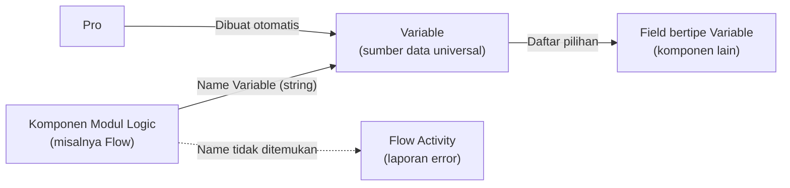
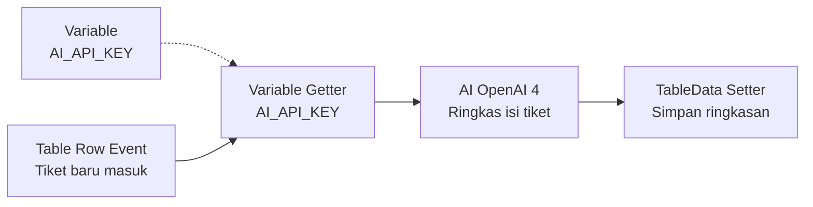

# Apa itu Variable?

>**note** _Variable_ merupakan salah satu komponen dalam modul [[Docs/Modul Data/Pengenalan|Data]] di Phoenix.

Variable adalah komponen yang dapat digunakan untuk mengelola Data Variable di dalam [[Inisialisasi/Apa itu Pro?|Pro]]. Variable Data bersifat unik sehingga data yang Anda simpan dapat menjadi sumber kebenaran dan dipakai di mana saja.

Komponen ini sudah tersedia sejak Pro dimulai. 

Lihat selengkapnya tentang [[Docs/Tipe Data/Variable|Variable Data]].

## Mengapa Menggunakan Variable?
- **Satu-satunya tempat mengelola Variable Data.** Variable adalah tipe data khusus didalam Phoenix dan semua komponen mengenalnya, namun hanya ada satu tempat untuk mengelolanya yaitu komponen ini.
- **Satu sumber kebenaran.** Komponen Variable hanya ada satu untuk seluruh ekosistem dalam Pro, tidak dapat diduplikasi dan dihapus, sehingga menjadi *source of truth* yang dirujuk semua komponen.
- **Sifat Variable Data yang unik** Anda membuat data sekali, lalu komponen lain cukup merujuk ke namanya. Tidak ada lagi salinan nilai yang tersebar dan berisiko tidak sinkron.
- **Konstanta untuk tim.** Variable menjadi konstanta di lingkungan Pro, misalnya alamat server atau parameter yang dipakai banyak Flow.
- **Nilainya bisa disamarkan.** Tim cukup memakai nama Variable, sehingga isi nilainya (misalnya alamat IP server *hub* atau API Key penyedia AI) tidak perlu diketahui, tetapi tetap dapat dipakai untuk integrasi.
- **Dikenali semua komponen.** Field bertipe Variable di komponen mana pun menampilkan daftar dari komponen Variable, dan komponen di modul Logic seperti Flow dapat memanggilnya hanya lewat namanya.

## Konsep Utama
| Istilah | Penjelasan |
| --- | --- |
| [[#Halaman Kerja]] | Halaman berbentuk tabel tempat Anda mengelola isi Variable. |
| [[#Membaca Data]] | Satu data dalam Variable, terdiri dari Name, Type, Value, dan Description. |
| [[#Membaca Data|Name]] | Nama unik yang dipakai komponen lain untuk memanggil sebuah Variable. |
| [[#Membaca Data|Type]] | Tipe data dari nilai yang disimpan. |
| [[#Membaca Data|Value]] | Nilai yang disimpan, menyesuaikan Type. |
| [[#Cara Kerja Variable|Alias]] | Pemanggilan nilai lewat Name sehingga isi Value tidak perlu diketahui pemakainya. |
| [[Docs/Tipe Data/Variable|Tipe Data Variable]] | Tipe field yang menampilkan daftar Variable sebagai pilihan. |

Untuk memahami komponen secara umum, lihat [[Docs/Apa itu Komponen?]]. Untuk memahami penempatan di folder, lihat [[Docs/Folder/Apa itu Folder]].

## Cara Kerja Variable
Variable adalah satu sumber data yang dikenali semua komponen di dalam ruang lingkup Pro. Komponen lain memilih atau memanggil Variable lewat Name-nya, dan nilainya diambil dari tabel Variable.

Ada dua cara komponen merujuk ke Variable:

- **Field bertipe Variable.** Pada komponen yang memiliki field dengan [[Docs/Tipe Data/Variable|tipe data Variable]], pilihannya adalah daftar baris pada tabel Variable.
- **Komponen di modul Logic.** Komponen seperti [[Docs/Modul Logic/Flow/Apa itu Flow|Flow]] dapat mengisi field Variable cukup dengan Name-nya dalam bentuk *string*. Jika Name tidak ditemukan di tabel Variable, laporan error akan tampil di [[Docs/Modul Logic/Flow/Flow Activity]].

Selain sebagai konstanta, Variable berfungsi sebagai *alias*: pemakai memanggil nilai lewat [[^field|Name]], sehingga isi [[^field|Value]] tidak harus diketahui oleh tim, tetapi tetap dapat dipakai untuk kebutuhan integrasi.

<!--
  * [TODO] Mekanisme "tim tidak dapat mengetahui isi nilai" belum saya jelaskan lebih jauh karena tabel Variable pada gambar menampilkan Value apa adanya. Apakah tersamarnya Value bergantung pada hak akses (misalnya anggota yang tidak punya akses melihat halaman kerja Variable di [[Docs/Modul Developer/Workspace/Data Access|Data Access]] Workspace), atau ada mekanisme lain seperti masking? Mohon dijelaskan agar bagian ini dan Batasan dan Catatan dapat dipertegas.
    Jawaban : Ya hanya di workspace. Pembatasan akses saat ini hanya berlaku melalui workspace.
-->

## Membuat Variable
Anda tidak perlu membuat komponen Variable. Komponen ini dibuat otomatis ketika Pro dimulai dan ditempatkan di folder *root* Pro. Karena itu, pada Area Manajemen Folder tidak tersedia pilihan untuk menambahkan komponen Variable baru.

Beberapa hal yang perlu Anda ketahui tentang komponen Variable:

- Hanya ada satu komponen Variable di dalam Pro.
- Nama header komponen adalah "Variables" dan tidak dapat diganti.
- Komponen Variable tidak dapat dihapus.
- Komponen Variable dapat dipindahkan ke folder lain.

>**note** Tombol Edit tidak tersedia
>Karena nama header tidak dapat diganti, komponen Variable tidak memiliki langkah mengubah atribut komponen. Yang dapat Anda ubah adalah isi data di dalam halaman kerjanya (lihat [[#Mengelola Data Variable]]).

<!--
  * [TODO] Mohon konfirmasi: (1) "folder root" yang dimaksud sama dengan folder Origin pada Pro; (2) cara memindahkan Variable (saya asumsikan *drag and drop* di Area Manajemen Folder, mirip komponen lain) dan apakah ada batasan folder tujuan; (3) apakah klik kanan pada Variable memunculkan menu, dan apa saja isinya.
-->

## Menyegarkan Variable
Klik [[^button/refresh|Refresh]] untuk memuat ulang data pada tabel Variable.

## Halaman Kerja

Halaman kerja Variable terdiri dari bilah navigasi di bagian atas dan tabel Variable di bagian bawah. Tombol untuk menambahkan baris berada di bawah tabel.

![[Docs/Modul Data/Variable/halaman-kerja.png]]
Halaman kerja Variable berbentuk tabel. Isi tabel dimulai dengan kosong, dan Anda perlu membuka halaman kerja ini untuk menambahkan data. Setiap baris pada tabel mewakili satu Variable.

Kolom pada tabel Variable adalah:

| Kolom | Penjelasan | Pengisian |
| --- | --- | --- |
| [[^field\|Name]] | Nama Variable. Tidak boleh sama dengan baris lain. | Diisi oleh Anda |
| [[^field\|Type]] | Tipe data dari nilai yang disimpan, misalnya [[Docs/Tipe Data/String\|String]]. | Diisi oleh Anda |
| [[^field\|Value]] | Nilai yang disimpan, menyesuaikan Type. | Diisi oleh Anda |
| [[^field\|Description]] | Keterangan tentang kegunaan Variable. | Diisi oleh Anda |
| [[^field\|Created At]] | Waktu baris dibuat. | Terisi otomatis |
| [[^field\|Updated At]] | Waktu baris terakhir diperbarui. | Terisi otomatis |

## Menambahkan Variable

1. Buka halaman kerja Variable dengan mengklik [[^field/variable|Variables]] di [[Docs/Antarmuka#Area Manajemen Folder]]
2. Klik [[^button/add|Add Row]]
3. Isi [[^field|Name]], [[^field|Type]], [[^field|Value]], dan [[^field|Description]]
4. Klik [[^button/save|Save]]

Anda dapat klik [[^button/delete|Cancel]] untuk membatalkan penambahan Data Variable

## Mengubah Variable
1. Buka halaman kerja Variable
2. Ubah isian pada baris yang ingin diperbarui
3. Klik [[^button/save|Save]]

Kolom [[^field|Updated At]] terisi otomatis setelah baris disimpan.

### Menghapus Variable
1. Buka halaman kerja Variable
2. Pada kolom [[^field|Action]], klik [[^button/delete|Delete]] pada baris yang ingin dihapus
3. Konfirmasi dengan [[^button|Delete]]

>**warning** Pastikan Variable tidak lagi dipakai
>Variable yang dihapus tidak lagi tersedia sebagai pilihan pada field bertipe Variable. Flow atau komponen lain yang masih memanggil Name tersebut tidak akan menemukan nilainya, dan laporan error tampil di [[Docs/Modul Logic/Flow/Flow Activity]]. Periksa dulu komponen yang memakai Variable sebelum menghapusnya.

## Antarmuka Variable
![[Docs/Modul Data/Variable/halaman-kerja-variable.png]]

Bilah navigasi Variable terdiri dari:

| Tombol | Fungsi |
| --- | --- |
| [[^field\|Variable]] | Judul komponen, menampilkan ikon Variable dan nama komponen. |
| [[^button/refresh\|Refresh]] | Memuat ulang data pada tabel Variable. |
| [[^field\|Search Variable Data...]] | Mencari data Variable pada tabel. |

Pada area tabel terdapat:

| Tombol | Fungsi |
| --- | --- |
| [[^button/add\|Add Row]] | Menambahkan baris Variable baru. |
| [[^button/save\|Save]] | Menyimpan isian baris pada kolom [[^field\|Action]]. |
| [[^button/delete\|Delete]] | Menghapus baris pada kolom [[^field\|Action]]. |

<!--
  * [TODO] Penempatan gambar: gunakan screenshot halaman kerja Variable dengan nama folder dan komponen pribadi diganti contoh generik, serta isi contoh baris diganti (misalnya Name `HUB_SERVER_IP`). Anotasi yang disarankan: (1) bilah navigasi dengan judul, Refresh, dan pencarian; (2) kepala kolom tabel; (3) baris data; (4) kolom Action; (5) Add Row.
-->

<!--
  * [TODO] Beberapa hal yang perlu dikonfirmasi pada Antarmuka: (1) pada screenshot, judul halaman dan tab tertulis "Variable" sedangkan nama header di Area Manajemen Folder "Variables". Apakah memang berbeda, atau ingin diseragamkan; (2) cakupan pencarian (Name saja atau semua kolom); (3) perbedaan tampilan mobile dan desktop, bila ada.
-->

## Interaksi Antarmuka Variable
| Fungsi | Aksi |
| --- | --- |
| Melihat kolom di sisi kanan tabel | Geser tabel secara horizontal menggunakan *scroll* di bagian bawah tabel. |
| Mencari Variable | Ketik kata kunci pada kolom [[^field\|Search Variable Data...]]. |

<!--
  * [TODO] Interaksi tabel saya tebak dari adanya *scroll* horizontal pada screenshot. Mohon koreksi bila ada gestur lain (misalnya mengubah lebar kolom atau mengurutkan baris).
-->

## Menggunakan Variable
Setelah Anda mengisi tabel, Variable dapat dipakai oleh komponen lain:

- Memilih Variable pada field bertipe Variable, lihat [[Docs/Tipe Data/Variable]]
- Memanggil Variable dengan Name di Flow, lihat [[Docs/Modul Logic/Flow/Flow Block/Data/Pengenalan|Flow Block kategori Data]]
- Memantau error saat Name tidak ditemukan, lihat [[Docs/Modul Logic/Flow/Flow Activity]]

<!--
  * [TODO] Halaman yang diusulkan (path berupa tebakan): (1) `Docs/Modul Data/Variable/Mengelola Data Variable` bila langkah Menambahkan, Mengubah, dan Menghapus perlu dipindah dari halaman ini; (2) `Docs/Modul Data/Variable/Menggunakan Variable` berisi cara memilih Variable di field dan memanggilnya di Flow; (3) `Docs/Tipe Data/Variable` menjelaskan tipe data Variable; (4) `Docs/Modul Logic/Flow/Flow Block/Data/Pengenalan` memuat Flow Block Variable (Add Variable, Delete Variable, Variable, Variable Getter, Variable Setter, Variable Value) dan Variable Event; (5) `Docs/Modul Logic/Flow/Flow Activity`; (6) `Docs/Modul Data/Pengenalan`.
-->

## Contoh Penggunaan
**Menjaga API Key Penyedia AI Tetap Aman dalam Otomasi Flow**

Sebuah tim ingin setiap tiket baru yang masuk ke tabel diringkas otomatis oleh AI. Layanan AI membutuhkan API Key, tetapi kunci tersebut tidak boleh diketahui seluruh anggota tim. Dengan Variable, kunci disimpan sekali, dan Flow memanggilnya lewat nama untuk kebutuhan integrasi.

**Komponen yang terlibat**

| Komponen | Peran |
| --- | --- |
| [[^field/variable\|Variables]] | Menyimpan API Key penyedia AI dengan Name `AI_API_KEY`. |
| [[^field/table\|Daftar Tiket]] | Menyimpan tiket yang masuk dan hasil ringkasannya. |
| [[^field/flow\|Ringkas Tiket Otomatis]] | Menjalankan proses dari tiket baru sampai ringkasan tersimpan. |

<!--
  * [TODO] Nama komponen Daftar Tiket dan Ringkas Tiket Otomatis adalah nama generik, sesuaikan dengan gambar. Mohon juga cek nama dan fungsi block yang dipakai pada alur di bawah, terutama cara block AI menerima API Key dari Variable Getter.
-->

**Alur di Flow**

| Langkah | Flow Block | Peran dalam alur | Hasil |
| --- | --- | --- | --- |
| 1 | [[Docs/Modul Logic/Flow/Flow Block/Event/Pengenalan\|Table Row Event]] | Berjalan saat baris tiket baru ditambahkan. | Flow dimulai otomatis. |
| 2 | [[Docs/Modul Logic/Flow/Flow Block/Data/Pengenalan\|Variable Getter]] | Mengambil nilai Variable dengan mengisi Name `AI_API_KEY`. | API Key tersedia untuk Flow tanpa perlu diketahui tim. |
| 3 | [[Docs/Modul Logic/Flow/Flow Block/Modular/Pengenalan\|AI (OpenAI 4)]] | Mengirim isi tiket ke penyedia AI memakai API Key tersebut. | Ringkasan tiket diterima. |
| 4 | [[Docs/Modul Logic/Flow/Flow Block/Data/Pengenalan\|TableData Setter]] | Menulis ringkasan ke baris tiket yang sama. | Ringkasan tampil di tabel. |

**Hasil yang dirasakan**
- Tiket baru langsung memiliki ringkasan tanpa pekerjaan manual.
- API Key hanya disimpan di satu tempat dan tidak perlu dibagikan ke anggota tim.
- Jika API Key diganti, Anda cukup memperbarui satu baris di Variable dan semua Flow yang memanggilnya ikut memakai nilai baru.

**Ide skenario lain**

| Jenis nilai | Contoh integrasi |
| --- | --- |
| Alamat IP server *hub* | Beberapa Flow mengirim data ke perangkat atau layanan yang sama tanpa menuliskan alamatnya berulang kali. |
| Alamat layanan atau URL dasar | Flow yang memanggil layanan eksternal merujuk satu Name, sehingga perpindahan alamat cukup diubah sekali. |
| Parameter bisnis | Ambang batas atau batas waktu dipakai bersama oleh beberapa Flow dan tetap konsisten. |
| Konfigurasi notifikasi | Satu Name berisi tujuan notifikasi yang dipakai banyak proses. |

Dengan Variable, nilai konfigurasi dan nilai sensitif di Pro tersimpan di satu sumber yang terhubung ke semua komponen, tanpa mengorbankan keamanan maupun konsistensi data.

## Praktik Terbaik
- **Beri Name yang deskriptif dan konsisten**, misalnya `AI_API_KEY` atau `HUB_SERVER_IP`, agar mudah dikenali saat dipilih atau dipanggil.
- **Isi Description** untuk menjelaskan kegunaan Variable agar pengelola lain memahami fungsinya.
- **Pilih Type yang sesuai** dengan Value agar nilai dapat dipakai dengan benar oleh komponen yang memanggilnya.
- **Simpan satu nilai di satu Variable** dan hindari menyalin nilai yang sama ke komponen lain.
- **Periksa pemakaian sebelum menghapus** Variable, terutama yang dipanggil oleh Flow.
- **Batasi pihak yang dapat melihat halaman kerja Variable** bila Value berisi nilai sensitif.

<!--
  * [TODO] Poin terakhir mengikuti asumsi bahwa kerahasiaan Value dikendalikan lewat hak akses. Hapus bila mekanismenya berbeda.
-->

## Batasan dan Catatan
- Hanya ada satu komponen Variable di dalam Pro, dan tidak dapat ditambah lewat Area Manajemen Folder.
- Komponen Variable tidak dapat dihapus, tetapi dapat dipindahkan ke folder lain.
- Nama header "Variables" tidak dapat diganti.
- Name tidak boleh sama antar baris.
- [[^field|Created At]] dan [[^field|Updated At]] terisi otomatis dan tidak perlu Anda isi.
- Menghapus baris Variable dapat membuat Flow atau komponen yang memanggil Name tersebut menghasilkan error, yang dilaporkan di [[Docs/Modul Logic/Flow/Flow Activity]].
- Isi Value ditampilkan pada halaman kerja Variable, sehingga pihak yang dapat membukanya dapat melihat nilainya.

<!--
  * [TODO] Poin terakhir di Batasan dan Catatan adalah dugaan saya berdasarkan screenshot. Mohon konfirmasi sesuai mekanisme sebenarnya.
-->

## TL:DR
- Variable adalah komponen bawaan Pro yang menjadi satu sumber data universal, dibuat otomatis di folder root dan tidak dapat dihapus.
- Isi Variable dikelola di halaman kerja berbentuk tabel dengan kolom Name, Type, Value, Description, Created At, dan Updated At.
- Name harus unik, sedangkan Created At dan Updated At terisi otomatis.
- Field bertipe Variable menampilkan daftar dari tabel ini, dan Flow dapat memanggil Variable cukup dengan Name.
- Variable menjadi konstanta dan *alias* sehingga nilai sensitif dapat dipakai untuk integrasi tanpa perlu diketahui tim.
- Hati-hati saat menghapus baris, karena komponen yang memanggilnya akan menghasilkan error di Flow Activity.

## FAQ : Pertanyaan yang Sering Diajukan

>**faq**
>**Apakah saya dapat membuat komponen Variable baru?**
>Tidak. Variable dibuat otomatis ketika Pro dimulai, dan Area Manajemen Folder tidak menyediakan pilihan untuk menambahkannya.
>**Apakah komponen Variable dapat dihapus atau diganti namanya?**
>Tidak. Komponen Variable tidak dapat dihapus dan nama header "Variables" tidak dapat diganti, tetapi Anda dapat memindahkannya ke folder lain.
>**Apakah dua Variable boleh memiliki Name yang sama?**
>Tidak. Setiap baris harus memiliki Name yang unik.
>**Apa yang terjadi jika Flow memanggil Name yang tidak ada?**
>Flow tidak menemukan Variable tersebut, dan laporan error tampil di Flow Activity.
>**Apakah saya dapat menghapus Variable yang sudah ditambahkan?**
>Ya. Baris pada tabel dapat dihapus, tetapi pastikan tidak ada komponen yang masih memanggilnya.
>**Apakah tim dapat melihat isi Value?**
>Tim cukup memakai Name untuk memanggil nilai sehingga tidak perlu mengetahui isinya. Siapa saja yang dapat membuka halaman kerja Variable tetap dapat melihat nilainya.