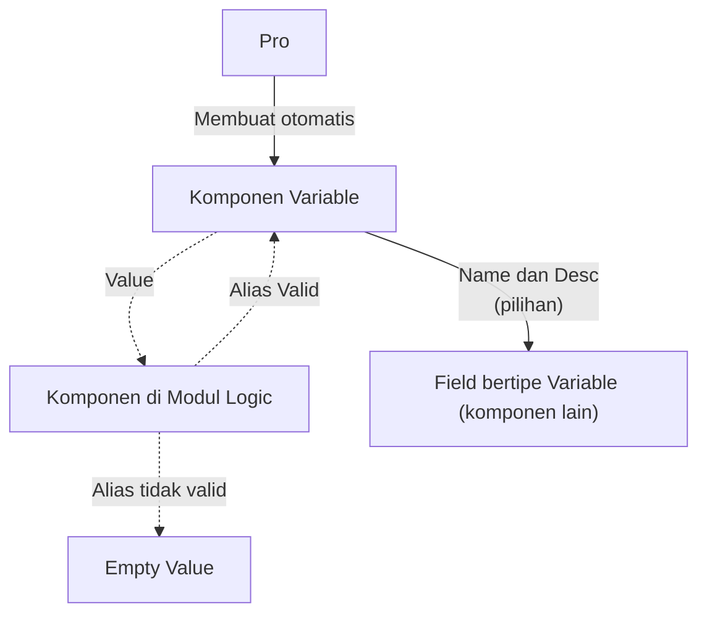
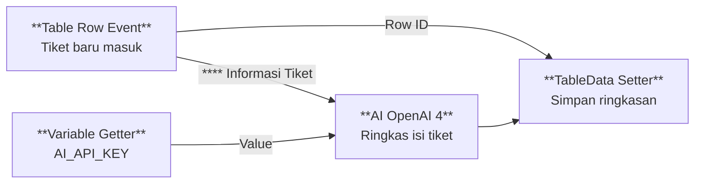

# Apa itu Variable?

>**note** _Variable_ merupakan salah satu komponen dalam modul [[Docs/Modul Data/Pengenalan|Data]] di Phoenix.

Variable adalah komponen yang digunakan untuk mengelola Data Variable di dalam [[Inisialisasi/Apa itu Pro?|Pro]]. [[Docs/Tipe Data/Variable|Variable Data]] bersifat unik sehingga data yang Anda simpan dapat menjadi sumber kebenaran dan dipakai di mana saja.

Komponen ini sudah tersedia sejak [[Inisialisasi/Apa itu Pro?|Pro]] dimulai. 

## Mengapa Menggunakan Komponen Variable?

- **Pintu untuk mengelola Variable Data.** Variable adalah tipe data khusus didalam Phoenix dan semua komponen mengenalnya, namun hanya ada satu tempat untuk mengelolanya yaitu komponen ini.
- **Satu dan selalu ada.** Komponen Variable hanya ada satu untuk seluruh ekosistem dalam Pro, tidak dapat diduplikasi dan dihapus, sehingga menjadi *source of truth* yang dirujuk semua komponen.
- **Konstanta untuk tim.** Anda membuat data sekali, lalu komponen lain cukup merujuk ke namanya. Tidak ada lagi salinan nilai yang tersebar dan berisiko tidak sinkron.
- **Nilainya bisa tersamarkan.** Jika ada anggota yang tidak memiliki akses komponen ini, maka anggota tersebut tidak akan dapat mengetahui nilai yang disimpan pada Variable Data walaupun tetap dapat digunakan untuk otomasi.

## Konsep Utama

| Istilah | Penjelasan |
| --- | --- |
| [[Docs/Tipe Data/Variable|Variable Data]] | Data dalam komponen Variable. |
| [[#Cara Kerja Variable|Alias]] | Istilah untuk atribut [[^field|Name]] dari Variable Data yang berfungsi untuk dipanggil agar isi [[^field|Value]]-nya dapat diakses. |

## Cara Kerja Variable

Variable adalah satu sumber data yang dikenali oleh semua komponen di dalam ruang lingkup Pro.

Ada dua cara komponen merujuk ke Variable:

- **Field bertipe Variable.** Pada komponen yang memiliki field dengan [[Docs/Tipe Data/Variable|tipe data Variable]], pilihannya adalah daftar [[^field|Name]] dan [[^field|Description]] dari Variable Data.
- **Komponen di modul Logic.** Komponen dalam [[Docs/Modul Logic]] dapat mengisi field Variable cukup dengan [[^field|Alias]]. Jika [[^field|Alias]] tidak valid di Variable (tidak ada [[^field|Nama]] yang cocok), maka tidak ada nilai yang diterima.

## Menambahkan Komponen Variable
>**danger** Komponen Variable tidak bisa dibuat[[Docs/Antarmuka#Area Manajemen Folder]].

## Duplikasi Komponen Variable
>**danger** Komponen Variable tidak bisa diduplikasi  [[Docs/Antarmuka#Area Manajemen Folder]].

## Menghapus Komponen Variable
>**danger** Komponen Variable tidak bisa dihapus dalam  [[Docs/Antarmuka#Area Manajemen Folder]].

## Mengganti Nama Variable
>**note** Tombol Edit tidak tersedia
>Karena nama header tidak dapat diganti, komponen Variable tidak memiliki langkah mengubah atribut komponen. Yang dapat Anda ubah adalah isi data di dalam halaman kerjanya (lihat [[#Mengelola Variable Data]]).

## Membuka Halaman Kerja Variable

Klik [[^field/variable|Variables]] di [[Docs/Antarmuka#Area Manajemen Folder]] untuk membuka halaman kerja Variable.

## Antarmuka Variable

![[Docs/Modul Data/Variable/interface-variable.png]]
Halaman kerja Variable terdiri dari bilah navigasi di bagian atas dan tabel Variable di bagian bawah.

Bilah navigasi Variable terdiri dari:

| Tombol | Fungsi |
| --- | --- |
| [[^field/variable|Variable]] | Judul komponen, menampilkan ikon Variable dan nama komponen. |
| [[^button/refresh|Refresh]] | Memuat ulang data pada tabel Variable. |
| [[^field\|Search Variable Data...]] | Mencari data Variable pada tabel. |

Kolom pada tabel Variable adalah:

| Kolom | Penjelasan | Pengisian |
| --- | --- | --- |
| [[^field\|Name]] | Nama Variable. Tidak boleh sama dengan baris lain. | Diisi oleh Anda |
| [[^field\|Type]] | Tipe data dari nilai yang disimpan, misalnya [[Docs/Tipe Data/String\|String]]. | Diisi oleh Anda |
| [[^field\|Value]] | Nilai yang disimpan, menyesuaikan Type. | Diisi oleh Anda |
| [[^field\|Description]] | Keterangan tentang kegunaan Variable. | Diisi oleh Anda |
| [[^field\|Created At]] | Waktu baris dibuat. | Terisi otomatis |
| [[^field\|Updated At]] | Waktu baris terakhir diperbarui. | Terisi otomatis |

Pada area tabel terdapat:

| Tombol | Fungsi |
| --- | --- |
| [[^button/add|Add Row]] | Menambahkan baris [[Docs/Tipe Data/Variable|Variable Data]] baru. |
| [[^button/save|Save]] | Menyimpan perubahan data. |
| [[^button/delete|Delete]] | Menghapus data. |

## Interaksi Antarmuka Variable

| Fungsi | Aksi |
| --- | --- |
| Melihat kolom di sisi kanan tabel | Geser tabel secara horizontal menggunakan *scroll* di bagian bawah tabel. |

## Mengelola Variable Data

Anda dapat mengelola Variable Data, harap pastikan Anda memiliki akses dan dapat [[#Membuka Halaman Kerja Variable]].

### Menambahkan Variable Data

1. [[#Membuka Halaman Kerja Variable|Buka]] Halaman Kerja Variable
2. Klik [[^button/add|Add Row]]
3. Isi [[^field|Name]], [[^field|Type]], [[^field|Value]], dan [[^field|Description]]
4. Klik [[^button/save|Save]]

Anda dapat klik [[^button/delete|Cancel]] untuk membatalkan penambahan Data Variable

### Mengubah Variable Data

1. [[#Membuka Halaman Kerja Variable|Buka]] Halaman Kerja Variable
2. Ubah isian pada baris yang ingin diperbarui
3. Klik [[^button/save|Save]]

Kolom [[^field|Updated At]] terisi otomatis setelah baris disimpan.

### Menghapus Variable Data

1. [[#Membuka Halaman Kerja Variable|Buka]] Halaman Kerja Variable
2. Pada kolom [[^field|Action]], klik [[^button/delete|Delete]] pada baris yang ingin dihapus
3. Konfirmasi dengan [[^button|Delete]]

>**warning** Pastikan Variable tidak lagi dipakai
>Variable yang dihapus tidak lagi tersedia sebagai pilihan pada field bertipe Variable. Flow atau komponen lain yang masih memanggil Name tersebut tidak akan menemukan nilainya, dan laporan error tampil di [[Docs/Modul Logic/Flow/Flow Activity]]. Periksa dulu komponen yang memakai Variable sebelum menghapusnya.

>**danger** Pertimbangkan Resiko
>Variable Data yang sudah dihapus tidak dapat dikembalikan.

## Menyegarkan Daftar Variable Data

Klik [[^button/refresh|Refresh]] untuk memuat ulang data pada tabel Variable.

## Contoh Penggunaan

**Menjaga API Key Penyedia AI Tetap Aman dalam Otomasi Flow**

Sebuah tim ingin setiap tiket baru yang masuk ke tabel diringkas otomatis oleh AI. Layanan AI membutuhkan API Key, tetapi kunci tersebut tidak boleh diketahui seluruh anggota tim. Dengan Variable, kunci disimpan sekali, dan Flow memanggilnya lewat nama untuk kebutuhan integrasi.

**Komponen yang terlibat**

| Komponen | Peran |
| --- | --- |
| [[^field/variable|Variables]] | Menyimpan API Key penyedia AI dengan Name `AI_API_KEY`. |
| [[^field/table|Daftar Tiket]] | Menyimpan tiket yang masuk dan hasil ringkasannya. |
| [[^field/flow|Ringkas Tiket Otomatis]] | Menjalankan proses dari tiket baru sampai ringkasan tersimpan. |

**Alur di Flow**

| Langkah | Flow Block | Peran dalam alur | Hasil |
| --- | --- | --- | --- |
| 1 | [[Docs/Modul Logic/Flow/Flow Block/Event/Pengenalan\|Table Row Event]] | Berjalan saat baris tiket baru ditambahkan. | Flow dimulai otomatis. |
| 2 | [[Docs/Modul Logic/Flow/Flow Block/Data/Pengenalan\|Variable Getter]] | Mengambil nilai Variable dengan mengisi Name `AI_API_KEY`. | API Key tersedia untuk Flow tanpa perlu diketahui tim. |
| 3 | [[Docs/Modul Logic/Flow/Flow Block/Modular/Pengenalan\|AI (OpenAI 4)]] | Mengirim isi tiket ke penyedia AI memakai API Key tersebut. | Ringkasan tiket diterima. |
| 4 | [[Docs/Modul Logic/Flow/Flow Block/Data/Pengenalan\|TableData Setter]] | Menulis ringkasan ke baris tiket yang sama. | Ringkasan tampil di tabel. |

**Hasil yang dirasakan**
- Tiket baru langsung memiliki ringkasan tanpa pekerjaan manual.
- API Key hanya disimpan di satu tempat dan tidak perlu dibagikan ke anggota tim.
- Jika API Key diganti, Anda cukup memperbarui satu baris di Variable dan semua Flow yang memanggilnya ikut memakai nilai baru.

**Ide skenario lain**

| Jenis nilai | Contoh integrasi |
| --- | --- |
| Alamat IP server *hub* | Beberapa Flow mengirim data ke perangkat atau layanan yang sama tanpa menuliskan alamatnya berulang kali. |
| Alamat layanan atau URL dasar | Flow yang memanggil layanan eksternal merujuk satu Name, sehingga perpindahan alamat cukup diubah sekali. |
| Parameter bisnis | Ambang batas atau batas waktu dipakai bersama oleh beberapa Flow dan tetap konsisten. |
| Konfigurasi notifikasi | Satu Name berisi tujuan notifikasi yang dipakai banyak proses. |

## Praktik Terbaik
- **Beri Name yang deskriptif dan konsisten**, misalnya `AI_API_KEY` atau `HUB_SERVER_IP`, agar mudah dikenali saat dipilih atau dipanggil.
- **Isi Description** untuk menjelaskan kegunaan Variable agar pengelola lain memahami fungsinya.
- **Pilih Type yang sesuai** dengan Value agar nilai dapat dipakai dengan benar oleh komponen yang memanggilnya.
- **Simpan satu nilai di satu Variable** dan hindari menyalin nilai yang sama ke komponen lain.
- **Periksa pemakaian sebelum menghapus** Variable, terutama yang dipanggil oleh komponen di [[Docs/Modul Logic/Pengenalan|Modul Logic]].
- **Batasi pihak yang dapat melihat komponen Variable** bila Value berisi nilai sensitif.

## Batasan dan Catatan
- Hanya ada satu komponen Variable di dalam Pro, dan tidak dapat ditambah lewat [[Docs/Antarmuka#Area Manajemen Folder]].
- Komponen Variable tidak dapat dihapus, tetapi dapat dipindahkan ke folder lain.
- Header [[^field|Name]] "Variables" tidak dapat diganti.
- Atribut [[^field|Name]] dari Variable Data harus unik.
- [[^field|Created At]] dan [[^field|Updated At]] terisi otomatis dan tidak perlu Anda isi.
- Menghapus baris Variable dapat membuat Flow atau komponen yang memanggil Name tersebut menghasilkan error.
- Isi [[^field|Value]] ditampilkan secara terbuka pada halaman kerja komponen Variable, sehingga hanya anggota yang memiliki akses komponen Variable yang dapat melihatnya.

## TL:DR
- Variable adalah komponen bawaan Pro yang menjadi satu sumber data universal, dibuat otomatis di folder root dan tidak dapat dihapus.
- Isi Variable dikelola di halaman kerja berbentuk tabel dengan kolom Name, Type, Value, Description, Created At, dan Updated At.
- Name harus unik, sedangkan Created At dan Updated At terisi otomatis.
- Field bertipe Variable menampilkan daftar dari tabel ini, dan Flow dapat memanggil Variable cukup dengan Name.
- Variable menjadi konstanta dan *alias* sehingga nilai sensitif dapat dipakai untuk integrasi tanpa perlu diketahui tim.
- Hati-hati saat menghapus baris, karena komponen yang memanggilnya akan menghasilkan error di Flow Activity.

## FAQ : Pertanyaan yang Sering Diajukan

>**faq**
>**Apakah saya dapat membuat komponen Variable baru?**
>Tidak. Variable dibuat otomatis ketika Pro dimulai, dan Area Manajemen Folder tidak menyediakan pilihan untuk menambahkannya.
>**Apakah komponen Variable dapat dihapus atau diganti namanya?**
>Tidak. Komponen Variable tidak dapat dihapus dan nama header "Variables" tidak dapat diganti, tetapi Anda dapat memindahkannya ke folder lain.
>**Apakah dua Variable boleh memiliki Name yang sama?**
>Tidak. Setiap baris harus memiliki Name yang unik.
>**Apa yang terjadi jika Flow memanggil Name yang tidak ada?**
>Flow tidak menemukan Variable tersebut, dan laporan error tampil di Flow Activity.
>**Apakah saya dapat menghapus Variable yang sudah ditambahkan?**
>Ya. Baris pada tabel dapat dihapus, tetapi pastikan tidak ada komponen yang masih memanggilnya.
>**Apakah tim dapat melihat isi Value?**
>Tim cukup memakai Name untuk memanggil nilai sehingga tidak perlu mengetahui isinya. Siapa saja yang dapat membuka halaman kerja Variable tetap dapat melihat nilainya.