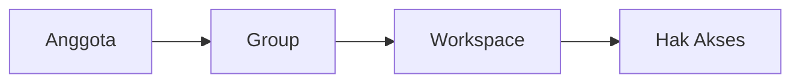

# # Apa itu Group?

>**note** _Group_ merupakan salah satu komponen dalam modul [[Docs/Modul Developer/Pengenalan|Developer]] di Phoenix.

_Group_ merupakan komponen yang dapat digunakan untuk mengatur komposisi tim Anda serta akses [[Docs/Modul Developer/Workspace/Apa itu Workspace|Workspace]] yang diberikan kepada setiap anggota.

Alih-alih mengatur akses satu per satu untuk setiap orang, Anda cukup mengelompokkan anggota ke dalam Group, lalu menentukan Workspace apa saja yang dapat diakses oleh Group tersebut.

## Mengapa Menggunakan Group?

- **Pengaturan akses lebih cepat.** Cukup atur sekali untuk satu Group, dan seluruh anggotanya otomatis mengikuti.
- **Konsisten.** Anggota dengan peran yang sama memiliki hak akses yang sama, sehingga mengurangi kesalahan konfigurasi.
- **Mudah dikelola saat tim berubah.** Anggota baru tinggal dimasukkan ke Group yang sesuai, dan anggota yang keluar cukup dikeluarkan dari Group.
- **Lebih aman.** Setiap anggota hanya mendapatkan akses sesuai kebutuhan kerjanya.

## Konsep Utama

| Istilah | Penjelasan |
| --- | --- |
| **Group** | Kumpulan anggota tim yang berbagi hak akses yang sama. |
| **Anggota** | Pengguna yang tergabung di dalam satu Group. |
| **Workspace** | Ruang kerja yang aksesnya diatur melalui komponen [[Docs/Modul Developer/Workspace/Apa itu Workspace|Workspace]]. |

## Cara Kerja Group

Akses seorang anggota ke sebuah Workspace ditentukan oleh Group tempat ia bergabung.

Anggota hanya boleh tergabung dalam satu Group, akses yang dimilikinya merupakan gabungan dari seluruh Workspace dalam Group tersebut.

## Membuat Group
<!--  
  * [TODO] sesuaikan nama menu, tombol, dan urutan langkah dengan antarmuka Phoenix yang sebenarnya. [assignee: @ginalne]
-->
1. Klik kanan pada [[Docs/Antar Muka#Area Manajemen Folder]].
2. Pilih [[field|Add]] > [[field|Developer]] > [[field/form| Group]]
4. Klik tombol **Buat Group**.
5. Isi **nama** dan **deskripsi** Group.
6. Tambahkan anggota ke dalam Group.
7. Tentukan Workspace dan hak akses yang diberikan.
8. Simpan Group.

## Mengelola Anggota

Anda dapat mengatur komposisi tim di dalam Group dengan cara memindahkan anggota dari satu Group ke Group lain.

## Mengatur Akses Workspace

Setiap Group dapat diberikan akses ke satu atau beberapa Workspace.

## Contoh Penggunaan

**Tim pengembang, desainer, dan analis**

| Group | Anggota | Akses |
| --- | --- | --- |
| Admin | Administrator | Workspace pengembangan, antarmuka dan data
| Engineering | Para pengembang | Workspace pengembangan |
| Design | Para desainer | Workspace antarmuka |
| Analytics | Para analis | Workspace data |

Dengan pembagian ini, setiap tim hanya bekerja di Workspace yang relevan, dan penambahan anggota baru cukup dilakukan dengan memasukkannya ke Group yang sesuai.

## Praktik Terbaik

- Buat Group berdasarkan **peran atau fungsi tim**, bukan berdasarkan nama individu.
- Berikan akses **seminimal yang dibutuhkan** (prinsip *least privilege*).
- Gunakan **nama Group yang jelas dan konsisten**, misalnya “Engineering” atau “Analytics”.
- **Tinjau keanggotaan secara berkala**, terutama saat ada perubahan tim.

## Batasan dan Catatan

- Perubahan pada Group berlaku untuk seluruh anggotanya.
- Menghapus Group akan mencabut akses yang diberikan melalui Group tersebut, namun setiap anggota harus dipindahkan ke Group lain terlebih dahulu.
- Group hanya mengatur akses anggota ke Workspace.

## FAQ : Pertanyaan yang Sering Diajukan

>**faq**
>**Apakah satu anggota dapat tergabung di lebih dari satu Group?**
>Tidak. Akses yang dimiliki anggota akan sesuai dengan Group-nya.
>**Apa yang terjadi jika anggota dikeluarkan dari Group?**
>Anggota tersebut kehilangan akses Workspace yang diberikan melalui Group itu.
>**Apakah sebuah Workspace dapat diakses oleh banyak Group?**
>Ya. Satu Workspace dapat diberikan kepada beberapa Group.
>**Siapa yang dapat membuat dan mengelola Group?**
>Pengguna dengan kewenangan pengelolaan di modul Developer.

