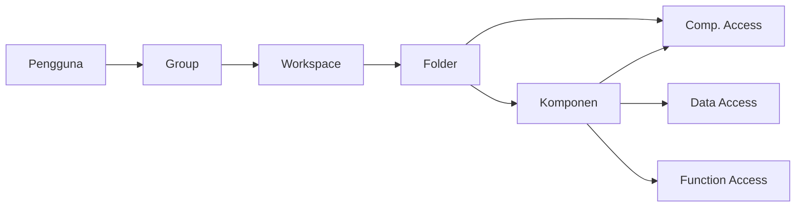

# Apa itu Workspace

>**note** _Workspace_ merupakan salah satu komponen dalam modul [[Docs/Modul Developer/Pengenalan|Developer]] di Phoenix.

_Workspace_ adalah komponen yang dapat digunakan untuk mengatur ruang kerja pengembangan Anda, termasuk komponen apa saja yang dapat dilihat, dikelola, dan diubah, serta integrasi yang digunakan.

Dengan _Workspace_, Anda tidak perlu mengatur hak akses komponen satu per satu di tempat yang tersebar. Seluruh aturan akses folder dan komponen terkumpul dalam satu tabel yang mudah dibaca, sehingga Anda bisa langsung melihat siapa boleh melakukan apa. Akses _Workspace_ ke setiap anggota dikelola melalui [[Docs/Modul Developer/Group/Apa itu Group|Group]].

## Mengapa Menggunakan Workspace?
- **Akses terpusat.** Aturan akses folder dan komponen diatur di satu halaman, bukan tersebar di tiap komponen.
- **Ruang kerja sesuai peran.** Setiap tim hanya melihat folder dan komponen yang relevan dengan pekerjaannya.
- **Kontrol berlapis.** Akses diatur terpisah pada tingkat komponen, data, dan fungsi, sehingga Anda bisa menerapkan prinsip *least privilege*.
- **Struktur folder siap pakai.** Pengguna langsung bekerja di dalam struktur folder yang sudah disiapkan saat membuka Phoenix.

## Konsep Utama

| Istilah | Penjelasan |
| --- | --- |
| **Workspace** | Komponen yang mengatur ruang kerja pengembangan, yaitu komponen yang dapat dilihat, dikelola, dan diubah, serta integrasi yang digunakan. |
| **Group** | Komponen yang memetakan pengguna ke *Workspace*. Tanpa pemetaan ini, *Workspace* tidak bisa digunakan oleh pengguna. |
| **Origin** | *Workspace* bawaan. Setiap Pro memiliki satu rangkaian folder yang berawal dari Origin. |
| **Folder** | Wadah komponen di dalam *Workspace*. Satu folder dapat berisi banyak komponen dan folder lain. |
| **Hierarki akses** | Aturan akses mengikuti struktur folder. Jika sebuah folder *disallow* pada **Visible**, seluruh isinya tidak dapat diakses meskipun isinya bernilai *allow*. |
| **Root** | Folder awal yang menjadi titik mulai *Workspace*. Jika komponen *Workspace* ditempatkan di folder yang lebih dalam, folder tersebut menjadi *root*. |
| **Comp. Access** | Hak akses pada tingkat komponen (header): Visible, Add, Update, Delete. |
| **Data Access** | Hak akses pada tingkat data di bawah komponen: Add, Update, Delete. Jenis datanya bergantung pada komponen. |
| **Function Access** | Hak akses pada fungsi tertentu: Merge, Modify Event, View Publish, Publish. |
| **allow / disallow** | Nilai izin pada setiap hak akses. *allow* berarti diizinkan, *disallow* berarti tidak diizinkan. |

## Cara Kerja Workspace

Pengguna masuk ke satu *Workspace* melalui *Group*, lalu aturan akses pada *Workspace* menentukan apa yang bisa mereka lihat dan lakukan di setiap folder dan komponen.

<!--
  * [TODO] Konfirmasi diagram Cara Kerja Workspace. Dari gambar, folder hanya memiliki Comp. Access, sedangkan Data Access dan Function Access tampil pada komponen (dan baris Workspace/Group). Mohon pastikan hubungan ini benar.
-->

Aturan penting:
- Pengguna hanya dapat memakai *Workspace* setelah *Group* berhasil memetakan mereka ke *Workspace* tersebut. Lihat [[Docs/Modul Developer/Group/Apa itu Group|Group]].
- Saat Phoenix dibuka, pengguna langsung masuk ke satu *Workspace* yang sudah memiliki struktur folder.
- Jika komponen *Workspace* ditempatkan di folder yang lebih dalam, folder tersebut menjadi *root* dari *Workspace*.
- Akses bersifat berjenjang. Jika folder (*parent*) diatur **Visible = disallow**, komponen di dalamnya (*child*) tetap tidak dapat diakses meskipun bernilai *allow*.

## Membuat Workspace

Setiap Pro sudah memiliki satu rangkaian folder yang berawal dari Origin, sehingga Anda dapat langsung memakai *Workspace* bawaan. Untuk membuat *Workspace* baru pada folder tertentu:

1. Buka folder tempat *Workspace* akan ditempatkan
2. Klik [[field/add|Add]] pada [[#Area Manajemen Folder]]
3. Pilih komponen **Workspace**
4. Isi [[field|Name]] dan [[field|Description]]
5. Klik [[button/save|Save]]

Selesai

<!--
  * [TODO] Langkah membuat Workspace hanya tebakan. Mohon konfirmasi alur sebenarnya (menu, nama field, apakah ada pilihan root) dan tambahkan gambar tiap langkah. Link [[#Area Manajemen Folder]] juga perlu dicek, sebaiknya mengarah ke [[Docs/Antarmuka#Area Manajemen Folder]].
-->

## Mengubah Workspace

1. Buka halaman kerja *Workspace*
2. Klik [[button/edit|Edit]] pada navbar
3. Ubah nilai akses (*allow* atau *disallow*) sesuai kebutuhan
4. Klik [[button/save|Save]]

Selesai

<!--
  * [TODO] Konfirmasi alur Edit: apakah tabel berubah menjadi mode edit lalu ada tombol Save, atau perubahan langsung tersimpan? Tambahkan gambar tampilan mode Edit.
-->

## Menghapus Workspace

1. Buka folder tempat *Workspace* berada
2. Klik kanan pada komponen *Workspace*
3. Pilih [[field/delete|Delete]]
4. Konfirmasi penghapusan

Selesai

<!--
  * [TODO] Konfirmasi aturan penghapusan Workspace. Apakah Workspace bawaan Origin bisa dihapus? Apa dampaknya terhadap Group yang terhubung dan pengguna yang sedang aktif di dalamnya?
-->

## Halaman Kerja Workspace

Halaman kerja *Workspace* menampilkan tabel hak akses. Setiap baris adalah *Workspace*, *Group*, folder, atau komponen, dan setiap kolom adalah jenis hak akses yang dapat diatur.

<!--
  * [TODO] Sisipkan gambar contoh halaman kerja Workspace (lampiran Origin). Beri penanda pada navbar (Edit dan Refresh), kelompok kolom Comp. Access, Data Access, dan Function Access, serta baris Origin, Administrator, dan folder Raven.
-->

Pada navbar hanya tersedia dua tombol:

| Tombol | Fungsi |
| --- | --- |
| [[button/edit\|Edit]] | Mengubah pengaturan akses pada tabel. |
| [[button/refresh\|Refresh]] | Memuat ulang data tabel agar menampilkan kondisi terbaru. |

### Membaca Baris pada Tabel

Pada contoh *Workspace* Origin, tabel disusun berjenjang seperti berikut:

| Baris | Jenis | Penjelasan |
| --- | --- | --- |
| **Origin** | *Workspace* | Baris paling atas, yaitu *Workspace* itu sendiri. |
| **Administrator** | *Group* | Group yang terhubung ke *Workspace*. Angka di sampingnya menunjukkan jumlah anggota. Lihat [[Docs/Modul Developer/Group/Apa itu Group\|Group]]. |
| **Agenda Team**, **Raven**, **Phoenix** | Folder | Baris dengan tanda panah di kirinya dapat diperluas untuk melihat komponen di dalamnya. |
| **Resource**, **Kanban Raven**, **Catatan Raven**, dan seterusnya | Komponen | Komponen yang berada di dalam folder, dengan ikon sesuai jenisnya (misalnya Table, Kanban, Data Tree). |

<!--
  * [TODO] Konfirmasi arti angka di samping komponen (misalnya Resource 4, Kanban Raven 36, Raven Report Notif 206) dan ikon di sebelahnya. Apakah itu jumlah data? Konfirmasi juga jenis komponen "Raven Report Notif..." dan "Title Documentation" (ikon berbeda).
  * [TODO] Konfirmasi mengapa kolom Comp. Access Add hanya terisi pada baris folder. Apakah Add di folder berarti menambah komponen ke dalam folder tersebut?
  * [TODO] Konfirmasi mengapa Function Access kosong pada komponen tertentu (misalnya Kanban dan Raven Report Notif). Apakah fungsi tersebut memang tidak tersedia untuk jenis komponen itu?
-->

## Mengatur Akses

Pengaturan akses dibagi menjadi tiga tingkat. Setiap hak akses memiliki nilai *allow* atau *disallow*.

### Comp. Access

*Comp. Access* adalah akses pada tingkat komponen (header).

| Akses | Penjelasan |
| --- | --- |
| **Visible** | Menentukan apakah komponen terlihat. Jika *disallow*, pengguna tidak dapat melihat komponen tersebut, bahkan saat ingin memilihnya, misalnya ketika membuat komponen [[Docs/Modul Interface/Pengenalan\|Interface]]. |
| **Add** | Menentukan apakah pengguna boleh menambahkan komponen. |
| **Update** | Menentukan apakah pengguna boleh mengubah komponen. |
| **Delete** | Menentukan apakah pengguna boleh menghapus komponen. |

### Data Access

*Data Access* adalah akses pada tingkat data, yaitu di bawah header komponen. Jenis datanya bergantung pada komponennya. Contohnya, pada [[Docs/Modul Data/Table/Apa itu Table|Table]] datanya adalah [[Docs/Tipe Data/Row|Row]], sedangkan pada [[Docs/Modul Interface/Timeline/Apa itu Timeline|Timeline]] datanya adalah *Timeline Data*. Sama seperti *Workspace*, setiap komponen memiliki konfigurasi *allow* atau *disallow* untuk datanya masing-masing.

| Akses | Penjelasan |
| --- | --- |
| **Add** | Menentukan apakah pengguna boleh menambahkan data. |
| **Update** | Menentukan apakah pengguna boleh mengubah data. |
| **Delete** | Menentukan apakah pengguna boleh menghapus data. |

### Function Access

*Function Access* mengatur akses ke fungsi tertentu.

| Akses | Penjelasan |
| --- | --- |
| **Merge** | Menentukan apakah pengguna boleh melakukan *merge*. |
| **Modify Event** | Menentukan apakah pengguna boleh mengubah [[Docs/Event/Pengenalan\|Event]]. |
| **View Publish** | Hanya melihat konfigurasi publish, misalnya menyalin alamat *share*. |
| **Publish** | Memperbarui konfigurasi publish. |

<!--
  * [TODO] Konfirmasi arti Merge dan Modify Event (apa yang di-merge, event apa yang diubah) serta tautan ke halaman Event. Cek juga bahwa Function Access terlihat di halaman kerja sebagai kelompok kolom ketiga (pada gambar terpotong).
-->

## Contoh Penggunaan

**Menyembunyikan folder dan melindungi komponen penting**

| Baris | Jenis | Pengaturan | Hasil |
| --- | --- | --- | --- |
| Raven | Folder | **Visible** = *disallow* | Folder dan seluruh isinya tidak dapat diakses, meskipun komponen di dalamnya bernilai *allow*. |
| Phoenix | *Workspace* di dalam folder | **Update**, **Delete**, dan seluruh **Data Access** = *disallow* | *Workspace* tetap terlihat, tetapi tidak dapat diubah, dihapus, atau diubah datanya. |
| Phoenix Query Logic | [[Docs/Modul Data/Tree/Apa itu Tree\|Data Tree]] | Semua akses = *disallow* kecuali **Visible** | Komponen tetap terlihat, tetapi tidak dapat diubah, dihapus, dikelola datanya, maupun dipakai pada fungsi *Merge*, *Modify Event*, *View Publish*, dan *Publish*. |

Dengan pengaturan ini, tim hanya bekerja pada bagian yang memang menjadi tanggung jawabnya, sementara komponen penting tetap terlindungi.

<!--
  * [TODO] Konfirmasi link Data Tree: [[Docs/Modul Data/Tree/Apa itu Tree]] (di skill tertulis komponen Tree). Pada gambar, komponen Phoenix Query Logic disebut Data Tree, mohon pastikan namanya.
-->

## Praktik Terbaik
- Terapkan prinsip ***least privilege***, yaitu beri hanya akses yang benar-benar dibutuhkan setiap tim.
- Pakai **Visible = disallow** pada folder untuk menyembunyikan seluruh isinya sekaligus. Anda tidak perlu mengatur komponen di dalamnya satu per satu.
- Periksa **parent** terlebih dahulu saat komponen tidak dapat diakses. Folder yang *disallow* menutup akses ke semua turunannya.
- Pisahkan **Data Access** dan **Comp. Access**. Pengguna bisa mengubah data tanpa boleh mengubah struktur komponen.
- Batasi akses **Publish** hanya untuk orang yang bertanggung jawab atas konfigurasi publish, dan beri **View Publish** untuk yang hanya perlu menyalin alamat *share*.
- Klik [[button/refresh|Refresh]] setelah mengubah pengaturan untuk memastikan tabel menampilkan kondisi terbaru.

## Batasan dan Catatan
- *Workspace* tidak dapat digunakan sebelum [[Docs/Modul Developer/Group/Apa itu Group|Group]] memetakan pengguna ke *Workspace* tersebut.
- Jika folder (*parent*) bernilai *disallow* pada **Visible**, komponen di dalamnya tidak dapat diakses meskipun bernilai *allow*.
- Navbar *Workspace* hanya memiliki tombol [[button/edit|Edit]] dan [[button/refresh|Refresh]].
- Jenis *Data Access* bergantung pada komponennya, sehingga tidak semua komponen memiliki data yang sama.

## TL:DR

- *Workspace* mengatur ruang kerja: komponen yang dapat dilihat, dikelola, diubah, serta integrasi yang digunakan.
- Pengguna masuk ke *Workspace* lewat [[Docs/Modul Developer/Group/Apa itu Group|Group]].
- Akses diatur di tiga tingkat: **Comp. Access**, **Data Access**, dan **Function Access**.
- Setiap akses bernilai *allow* atau *disallow*.
- Akses berjenjang: folder *disallow* menutup akses ke seluruh isinya.
- Navbar hanya punya [[button/edit|Edit]] dan [[button/refresh|Refresh]].

## FAQ : Pertanyaan yang Sering Diajukan

>**faq**
>**Mengapa pengguna tidak bisa menggunakan Workspace?**
>Pastikan pengguna sudah dipetakan ke *Workspace* melalui [[Docs/Modul Developer/Group/Apa itu Group|Group]]. *Workspace* hanya bisa digunakan setelah pemetaan berhasil.
>**Apa yang terjadi jika Visible diatur ke disallow?**
>Pengguna tidak dapat melihat komponen tersebut, bahkan saat ingin memilihnya, misalnya ketika membuat komponen Interface.
>**Mengapa komponen tidak bisa diakses padahal bernilai allow?**
>Periksa folder di atasnya. Jika folder (*parent*) bernilai *disallow* pada **Visible**, komponen di dalamnya tetap tidak dapat diakses.
>**Apa bedanya Comp. Access dan Data Access?**
>*Comp. Access* mengatur komponen itu sendiri (header), sedangkan *Data Access* mengatur data di dalam komponen, misalnya *Row* pada Table atau *Timeline Data* pada Timeline.
>**Apa bedanya View Publish dan Publish?**
>*View Publish* hanya melihat konfigurasi, misalnya menyalin alamat *share*. *Publish* dapat memperbarui konfigurasi publish.
>**Apa itu root pada Workspace?**
>Folder awal *Workspace*. Jika komponen *Workspace* ditempatkan di folder yang lebih dalam, folder itu menjadi *root*.