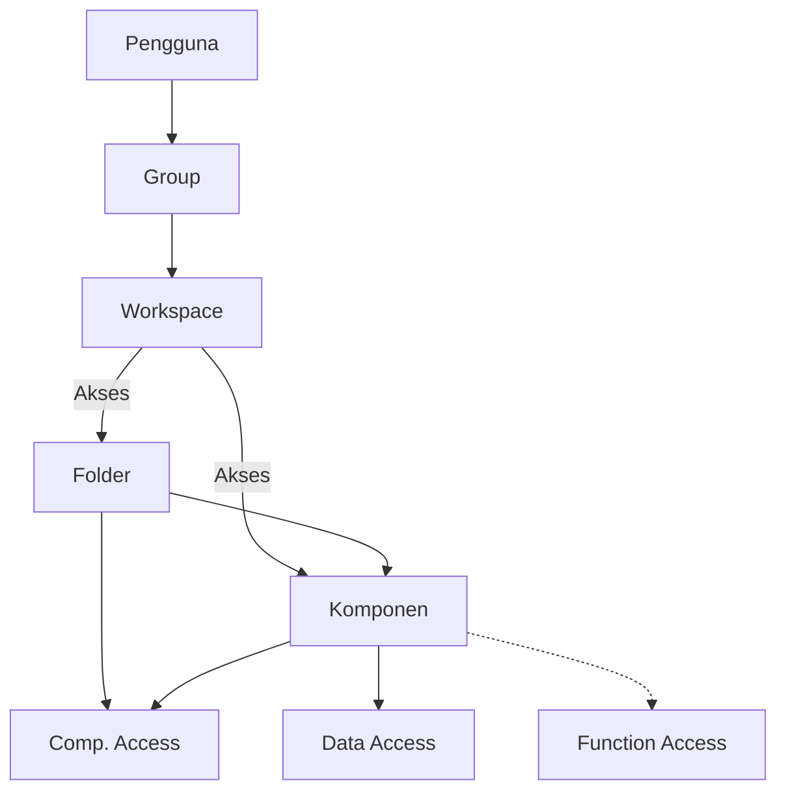

# Apa itu Workspace

>**note** _Workspace_ merupakan salah satu komponen dalam modul [[Docs/Modul Developer/Pengenalan|Developer]] di Phoenix.

_Workspace_ adalah komponen yang dapat digunakan untuk mengatur ruang kerja pengembangan Anda, termasuk komponen apa saja yang dapat dilihat, dikelola, dan diubah, serta fungsi didalamnya. Akses Workspace ke setiap anggota dikelola melalui [[Docs/Modul Developer/Group/Apa itu Group|Group]].

Dengan Workspace, Anda tidak perlu mengatur hak akses di banyak tempat. Seluruh folder dan komponen tersaji dalam satu halaman kerja berbentuk pohon, dan setiap hak akses cukup ditentukan dengan memilih **allow** atau **disallow**. Pengaturan ini berlaku sampai ke level data, sehingga Anda dapat menerapkan prinsip *least privilege* tanpa harus membuat komponen baru.

## Mengapa Menggunakan Workspace?

- **Akses terpusat.** Seluruh hak akses folder dan komponen diatur dalam satu halaman kerja.
- **Kontrol sampai level data.** Anda dapat menentukan siapa yang boleh menambah, mengubah, atau menghapus data, bukan hanya siapa yang boleh melihat komponen.
- **Mengikuti struktur folder.** Pengaturan pada folder otomatis memengaruhi seluruh isi di dalamnya.
- **Aman untuk tim.** Anggota hanya melihat dan mengelola bagian yang memang menjadi tanggung jawabnya.
- **Terhubung dengan Group.** Cukup petakan pengguna ke Group, maka akses Workspace mengikuti.

## Konsep Utama

| Istilah | Penjelasan |
| --- | --- |
| **Workspace** | Komponen untuk mengatur ruang kerja pengembangan, yaitu komponen yang dapat dilihat, dikelola, dan diubah, serta integrasi yang digunakan. |
| **Origin** | Workspace utama sekaligus folder paling atas yang dimiliki setiap [[Inisialisasi/Apa itu Pro?|Pro]]. |
| **Root** | Folder paling atas pada halaman kerja Workspace. Jika komponen Workspace ditempatkan di folder yang lebih dalam, folder itulah yang menjadi root. |
| **Group** | Kumpulan pengguna yang dipetakan ke Workspace. Pada halaman kerja, Group tampil sebagai baris dengan angka jumlah anggotanya. |
| **Folder** | Wadah yang berisi banyak komponen dan dapat diperluas atau dilipat. |
| **Komponen** | Selengkapnya lihat  [[Docs/Apa itu Komponen?]]
| **Comp. Access** | Hak akses pada level komponen (header): **Visible**, **Add**, **Update**, **Delete**. |
| **Data Access** | Hak akses pada level data : **Add**, **Update**, **Delete**. |
| **Function Access** | Hak akses pada fungsi komponen: **Merge**, **Modify Event**, **View Publish**, **Publish**. |
| **allow / disallow** | Nilai pengaturan akses. **allow** berarti diizinkan, **disallow** berarti tidak diizinkan. |

## Cara Kerja Workspace

Ketika komponen Group berhasil memetakan pengguna dengan Workspace, maka Workspace dapat digunakan. Saat pengguna membuka Phoenix, mereka akan masuk ke dalam satu Workspace yang sudah memiliki struktur folder.

Aturan penting:
- Pengguna hanya dapat memakai Workspace setelah dipetakan melalui [[Docs/Modul Developer/Group/Apa itu Group|Group]].
- Setiap Pro memiliki satu rangkaian folder yang berawal dari **Origin**.
- Jika komponen Workspace ditempatkan di folder yang lebih dalam, folder itu menjadi **root** dari Workspace tersebut.
- Hak akses bersifat **berjenjang**: jika sebuah folder (induk) diatur **disallow** pada **Visible**, seluruh isinya tidak dapat diakses meskipun pengaturannya **allow**.

## Membuat Workspace

1. Buka folder tempat Workspace akan ditempatkan di [[Docs/Antarmuka#Area Manajemen Folder]]
2. Klik kanan > [[field/add|Add]] > [[field|Developer]] > [[field/workspace| Workspace]]
4. Isi [[field|Name]] dan [[field|Description]]
5. Klik [[button|Create]]

Folder tempat Workspace ditempatkan akan menjadi root dari Workspace tersebut.

## Mengubah Workspace

1. Buka halaman kerja Workspace
2. Klik [[button/edit|Edit]]
4. Perbarui isian [[field|Name]] dan [[field|Description]]
5. Klik [[button|Update]]

## Menyegarkan

Klik [[button/refresh|Refresh]] untuk memuat ulang tampilan.

## Menghapus Workspace

1. Buka folder yang berisi Workspace
2. Klik kanan Workspace, lalu pilih [[button/delete|Delete]]
3. Konfirmasi penghapusan dengan klik [[button|Delete]]

>**warning** Harap pastikan
>Sebelum menghapus pastikan setiap [[Docs/Modul Developer/Group/Apa itu Group|Group]] tetap memiliki Workspace selain daripada yang akan dihapus. Sehingga pengalaman pengguna tetap lancar menggunakan Phoenix. 

## Halaman Kerja Workspace

![[Docs/Modul Developer/Workspace/antarmuka-workspace.png]]
Halaman kerja Workspace menampilkan seluruh struktur ruang kerja dalam satu tabel. Kolom paling kiri berisi daftar **Folder/ Component**, sedangkan kolom di sebelah kanannya berisi hak akses yang dikelompokkan menjadi **Comp. Access**, **Data Access**, dan **Function Access**.

Navbar Workspace hanya memiliki dua tombol:

| Tombol | Fungsi |
| --- | --- |
| [[button/edit|Edit]] | Mengubah pengaturan hak akses. |
| [[button/refresh|Refresh]] | Memuat ulang halaman kerja. |

### Membaca Baris
| Baris | Penjelasan |
| --- | --- |
| **Origin** | Workspace. Menjadi baris paling atas. |
| **Group** (misalnya **Administrator**) | Group yang terhubung ke Workspace. Angka di samping nama menunjukkan jumlah anggota. |
| **Folder** | Dapat dibuka dengan ikon panah untuk melihat komponen di dalamnya. |
| **Komponen** | Berada di dalam folder. Setiap komponen memiliki ikon sesuai jenisnya dan angka di samping nama. |

<!--
  * [TODO] Tambahkan gambar halaman kerja Workspace di sini dan beri anotasi: (1) Origin sebagai workspace, (2) Group, (3) Folder, (4) Komponen, (5) contoh disallow pada folder, (6) contoh disallow pada komponen Workspace dan Tree. Gunakan penamaan contoh dari penulis, bukan nama kasus pribadi.
  * [TODO] Konfirmasi arti angka dan ikon di samping nama komponen (jumlah data? jumlah isi?).
  * [TODO] Konfirmasi apakah baris Group menampilkan akses untuk anggota Group tersebut, dan bagaimana jika ada lebih dari satu Group.
  * [TODO] Sel kosong pada tabel (misalnya Add pada komponen, atau Function Access pada komponen tertentu) diasumsikan berarti tidak berlaku untuk jenis komponen tersebut. Mohon konfirmasi.
-->

## Mengatur Hak Akses
Hak akses diatur per baris dan per kolom pada halaman kerja. Setiap sel memiliki nilai **allow** atau **disallow**.

### Comp. Access
Comp. Access berlaku pada level komponen (header).

| Hak Akses | Penjelasan |
| --- | --- |
| **Visible** | Jika **disallow**, pengguna tidak dapat melihat komponen tersebut, bahkan ketika ingin memilihnya, misalnya saat membuat komponen Interface. |
| **Add** | Mengizinkan penambahan folder atau komponen baru. |
| **Update** | Mengizinkan perubahan pada komponen. |
| **Delete** | Mengizinkan penghapusan komponen. |

<!--
  * [TODO] Penjelasan Add, Update, dan Delete pada Comp. Access adalah tebakan. Mohon sesuaikan, terutama apakah Add hanya berlaku pada folder.
-->

### Data Access
Data Access berlaku pada level data, yaitu di bawah header komponen. Jenis datanya bergantung pada komponen: pada [[Docs/Modul Interface/Table View/Apa itu Table View|Table View]] datanya adalah **Row**, sedangkan pada [[Docs/Modul Interface/Timeline/Apa itu Timeline|Timeline]] datanya adalah **Timeline Data**.

| Hak Akses | Penjelasan |
| --- | --- |
| **Add** | Mengizinkan penambahan data. |
| **Update** | Mengizinkan perubahan data. |
| **Delete** | Mengizinkan penghapusan data. |

Seperti halnya Workspace, setiap komponen memiliki konfigurasi **allow** atau **disallow** masing-masing.

### Function Access
Function Access mengatur fungsi tambahan pada komponen.

| Hak Akses | Penjelasan |
| --- | --- |
| **Merge** | Mengizinkan penggabungan perubahan. |
| **Modify Event** | Mengizinkan perubahan *event* pada komponen. |
| **View Publish** | Hanya dapat melihat konfigurasi publikasi, misalnya menyalin alamat *share*. |
| **Publish** | Dapat memperbarui konfigurasi publikasi. |

<!--
  * [TODO] Penjelasan Merge dan Modify Event adalah tebakan. Mohon sesuaikan dan tautkan ke halaman Event jika ada, misalnya [[Docs/Event/Pengenalan|Event]].
-->

### Aturan Pewarisan Akses
Hak akses folder memengaruhi seluruh isinya. Jika **Visible** pada folder diatur **disallow**, komponen di dalamnya tidak dapat diakses meskipun komponen tersebut diatur **allow**. Hal ini karena folder induknya tidak dapat dilihat.

Pengaturan **disallow** juga dapat diterapkan pada komponen selain folder, misalnya komponen Workspace dan komponen Tree.

## Contoh Penggunaan
**Menyembunyikan folder Keuangan dari Group tertentu**

| Folder/Komponen | Visible | Hasil |
| --- | --- | --- |
| Keuangan (folder) | disallow | Folder tidak dapat dilihat. |
| Laporan Bulanan (Table View) | allow | Tetap tidak dapat diakses karena folder induknya **disallow**. |
| Penjualan (folder) | allow | Folder dapat dilihat. |
| Daftar Pelanggan (Table View) | allow | Komponen dapat dilihat dan dibuka. |

Dengan satu pengaturan pada folder, seluruh komponen keuangan otomatis tersembunyi tanpa perlu mengatur satu per satu.

**Komponen hanya boleh dilihat**

| Komponen | Visible | Update | Delete | Data Access (Add, Update, Delete) | Function Access |
| --- | --- | --- | --- | --- | --- |
| Pohon Kategori Produk (Tree) | allow | disallow | disallow | disallow | disallow |

Anggota Group tetap dapat membuka komponen untuk dibaca, tetapi tidak dapat mengubah struktur, data, maupun konfigurasi publikasinya.

<!--
  * [TODO] Penamaan contoh (Keuangan, Penjualan, Laporan Bulanan, Daftar Pelanggan, Pohon Kategori Produk) hanya usulan. Silakan ganti sesuai gambar yang akan Anda buat.
-->

## Praktik Terbaik
- **Atur akses di level folder terlebih dahulu**, baru sesuaikan komponen tertentu bila diperlukan.
- **Berikan akses seminimal mungkin** (*least privilege*) sesuai kebutuhan kerja setiap Group.
- **Gunakan Visible = disallow** untuk menyembunyikan komponen yang tidak relevan agar tidak muncul saat memilih komponen.
- **Pisahkan Function Access** untuk Publish dan View Publish, sehingga tidak semua anggota dapat mengubah konfigurasi publikasi.
- **Cek hasilnya dengan Refresh** setelah mengubah pengaturan akses.

## Batasan dan Catatan
- Akses Workspace untuk setiap anggota dikelola melalui [[Docs/Modul Developer/Group/Apa itu Group|Group]], bukan langsung pada pengguna.
- Folder yang **disallow** pada **Visible** membuat seluruh isinya tidak dapat diakses, meskipun isinya **allow**.
- Navbar Workspace hanya memiliki tombol [[button/edit|Edit]] dan [[button/refresh|Refresh]].
- Data Access bergantung pada jenis komponen, misalnya Row pada Table View dan Timeline Data pada Timeline.

## TL:DR
- **Workspace** mengatur komponen yang dapat dilihat, dikelola, dan diubah, serta integrasi yang digunakan.
- Akses anggota dikelola lewat **Group**.
- Hak akses terbagi tiga: **Comp. Access**, **Data Access**, dan **Function Access**, masing-masing bernilai **allow** atau **disallow**.
- Pengaturan **berjenjang**: folder **disallow** menutup akses ke seluruh isinya.
- Halaman kerja memiliki dua tombol: **Edit** dan **Refresh**.

## FAQ : Pertanyaan yang Sering Diajukan

>**faq**
>**Bagaimana pengguna dapat memakai Workspace?**
>Pengguna harus dipetakan ke Workspace melalui komponen Group. Setelah itu, saat membuka Phoenix mereka akan masuk ke Workspace tersebut.
>**Apa yang terjadi jika folder diatur disallow tetapi komponen di dalamnya allow?**
>Komponen tetap tidak dapat diakses karena folder induknya tidak dapat dilihat.
>**Apa bedanya Comp. Access dan Data Access?**
>Comp. Access mengatur komponen secara keseluruhan (header), sedangkan Data Access mengatur data di dalam komponen, misalnya Row pada Table View.
>**Apa arti Visible = disallow?**
>Pengguna tidak dapat melihat komponen tersebut, termasuk ketika memilihnya saat membuat komponen Interface.
>**Apa bedanya View Publish dan Publish?**
>View Publish hanya untuk melihat konfigurasi publikasi, misalnya menyalin alamat *share*. Publish dapat memperbarui konfigurasi publikasi.
>**Tombol apa saja yang tersedia pada navbar Workspace?**
>Hanya Edit dan Refresh.