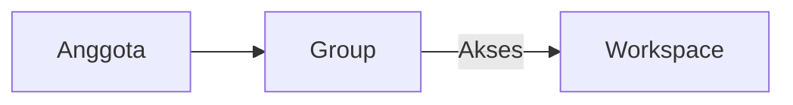

# # Apa itu Workspace?

>**note** _Workspace_ merupakan salah satu komponen dalam modul [[Docs/Modul Developer/Pengenalan|Developer]] di Phoenix.

_Workspace_ merupakan komponen yang dapat digunakan untuk menyediakan ruang kerja terpisah bagi tim, tempat Anda mengelola seluruh sumber daya dan pekerjaan dalam satu lingkup yang jelas.

<!--
* [TODO] Pastikan definisi Workspace sesuai: apa saja yang dapat dikelompokkan di dalamnya
-->

Alih-alih mencampur semua pekerjaan dalam satu tempat, Anda cukup membuat Workspace untuk setiap tim atau proyek, lalu mengatur siapa saja yang dapat mengaksesnya melalui [[Docs/Modul Developer/Group/Apa itu Group|Group]].

## Mengapa Menggunakan Workspace?
- **Pekerjaan lebih tertata.** Setiap tim atau proyek memiliki ruang kerjanya sendiri sehingga tidak saling tercampur.
- **Akses lebih terkontrol.** Hanya anggota Group yang diberi akses yang dapat masuk ke Workspace tertentu.
- **Kolaborasi lebih mudah.** Anggota tim bekerja pada ruang yang sama dan melihat data yang sama.
- **Pengelolaan lebih sederhana.** Anda dapat mengubah akses satu tim sekaligus tanpa mengatur anggota satu per satu.

## Konsep Utama
| Istilah | Penjelasan |
| --- | --- |
| **Workspace** | Ruang kerja yang membatasi lingkup pekerjaan dan sumber daya untuk tim atau proyek tertentu. |
| **Group** | Kumpulan anggota tim yang aksesnya terhadap Workspace diatur secara bersama. |
| **Anggota** | Pengguna Phoenix yang tergabung dalam sebuah Group dan bekerja di Workspace sesuai akses Group-nya. |
| **Akses** | Izin yang menentukan apakah sebuah Group dapat masuk dan apa yang dapat dilakukan di dalam Workspace. <!-- * [TODO] Sebutkan tingkat akses yang tersedia, misalnya hanya lihat atau dapat mengubah --> |

## Cara Kerja Workspace
Workspace menjadi tempat kerja, sedangkan Group menentukan siapa saja yang dapat masuk ke dalamnya.

Setiap anggota hanya tergabung di satu Group, sehingga akses anggota ke Workspace mengikuti Group tempat ia berada. Satu Workspace dapat diakses oleh beberapa Group, dan satu Group dapat memiliki akses ke beberapa Workspace. <!-- * [TODO] Konfirmasi relasi Group dan Workspace: apakah banyak ke banyak -->

## Membuat Workspace
1. Klik kanan pada [[Docs/Antarmuka#Area Manajemen Folder]].
2. Pilih [[field/add|Add]] > [[field|Developer]] > [[field/workspace|Workspace]]
<!--
 * [TODO] Cek path menu dan nama menu sesuai aplikasi
-->
5. Isi [[field|Name]] dan [[field|Description]].
6. Pilih Group yang akan diberi akses ke Workspace.
<!--
* [TODO] Cek apakah akses diatur saat pembuatan atau setelahnya
-->
8. Selesai

## Mengelola Anggota dan Akses
Akses Workspace diatur melalui Group. Untuk memberi akses kepada seorang anggota, pindahkan anggota tersebut ke Group yang sudah memiliki akses ke Workspace yang dituju.

<!--
* [TODO] Jelaskan menu untuk menambah atau mencabut akses Group pada Workspace
 -->

## Mengatur Workspace
Anda dapat mengubah [[field|Name]] dan [[field|Description]] Workspace kapan saja agar tetap sesuai dengan fungsinya.

<!-- 
* [TODO] Tambahkan pengaturan lain bila ada, misalnya mengarsipkan atau menghapus Workspace
-->

## Contoh Penggunaan
**Memisahkan pekerjaan antar tim**

| Workspace | Group dengan akses | Fungsi |
| --- | --- | --- |
| “Engineering” | Tim Engineering | Mengelola pekerjaan pengembangan produk. |
| “Analytics” | Tim Analytics | Mengelola data dan laporan analisis. |
| “Operations” | Tim Operations | Mengelola pekerjaan operasional harian. |

Dengan pemisahan ini, setiap tim hanya melihat dan mengelola pekerjaan yang menjadi tanggung jawabnya.

## Praktik Terbaik
- Buat Workspace berdasarkan **tim atau proyek**, bukan berdasarkan individu.
- Terapkan prinsip *least privilege*: beri Group **akses seperlunya saja** ke setiap Workspace.
- Gunakan [[field|Name]] yang **jelas dan konsisten** agar mudah dikenali oleh seluruh tim.
- Tulis [[field|Description]] yang **menjelaskan tujuan** Workspace agar anggota baru cepat memahami fungsinya.
- **Tinjau akses secara berkala** terutama saat komposisi tim berubah.

## Batasan dan Catatan
- Setiap anggota hanya dapat tergabung di satu Group, sehingga akses ke Workspace selalu mengikuti Group anggota tersebut.
- Akses Workspace diatur melalui Group, bukan langsung per anggota.

<!-- 

* [TODO] Konfirmasi apakah ada pengecualian akses per anggota 
* [TODO] Tambahkan batasan lain, misalnya jumlah maksimum Workspace atau aturan saat Workspace dihapus

-->

## FAQ : Pertanyaan yang Sering Diajukan

>**faq**
>**Apa perbedaan Workspace dan Group?**
>Workspace adalah ruang kerja tempat pekerjaan dilakukan, sedangkan Group adalah kumpulan anggota tim yang menentukan siapa saja yang dapat mengakses Workspace.
>**Siapa yang dapat mengakses sebuah Workspace?**
>Hanya anggota dari Group yang telah diberi akses ke Workspace tersebut.
>**Bagaimana cara memberi akses Workspace kepada anggota baru?**
>Masukkan anggota tersebut ke Group yang sudah memiliki akses ke Workspace yang dituju.
>**Bisakah satu anggota mengakses Workspace dari beberapa Group?**
>Tidak. Setiap anggota hanya dapat tergabung di satu Group, sehingga aksesnya mengikuti Group tersebut.
>**Apakah Workspace sama dengan Space?**
>Tidak. Workspace adalah komponen modul Developer untuk mengatur ruang kerja dan akses tim, sedangkan Space adalah komponen modul Interface yang mengorganisasi data dalam bentuk 3D. 

<!--
* [TODO] Konfirmasi perbandingan ini
-->
