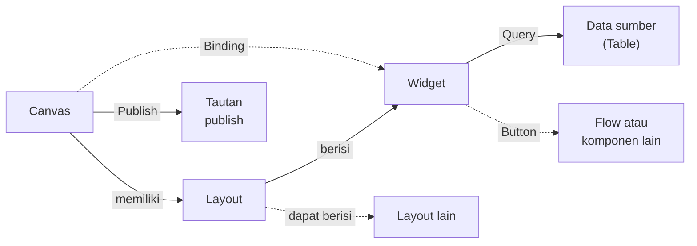

# Cara Kerja Canvas

Canvas menyusun widget di dalam Layout, setiap widget mengambil data sumber melalui Query, dan seluruh Canvas dapat dibagikan melalui Publish.

```mermaid
flowchart LR
  Canvas["Canvas"] -->|&nbsp;memiliki&nbsp;| Layout["Layout"]
  Layout -->|&nbsp;berisi&nbsp;| Widget["Widget"]
  Layout -.->|&nbsp;dapat berisi&nbsp;| LayoutLain["Layout lain"]
  Widget -->|&nbsp;Query&nbsp;| Data["Data sumber<br/>(Table)"]
  Canvas -.->|&nbsp;Binding&nbsp;| Widget
  Widget -.->|&nbsp;Button&nbsp;| Tujuan["Flow atau<br/>komponen lain"]
  Canvas -->|&nbsp;Publish&nbsp;| Link["Tautan<br/>publish"]
```