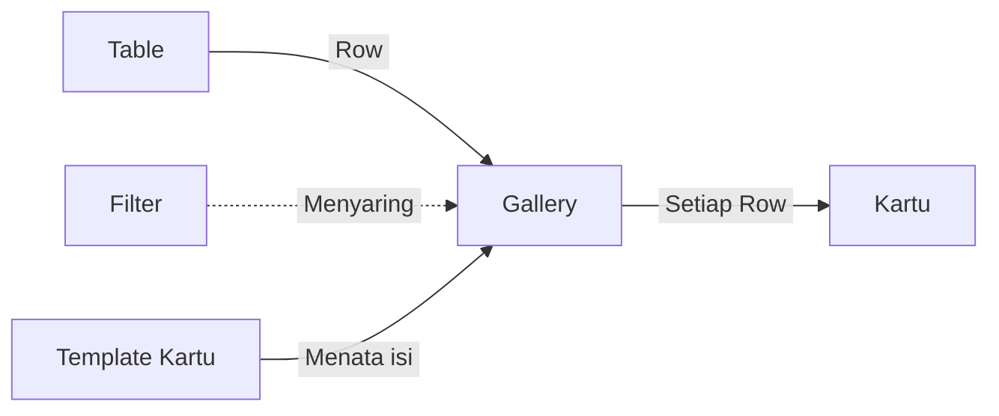

# Cara Kerja Gallery

Gallery mengambil Row dari satu Table, lalu menampilkan setiap Row sebagai satu kartu yang isinya ditata oleh template.

```mermaid
flowchart LR
    A["Table"] -->|&nbsp;Row&nbsp;| B["Gallery"]
    C["Filter"] -.->|&nbsp;Menyaring&nbsp;| B
    D["Template Kartu"] -->|&nbsp;Menata isi&nbsp;| B
    B -->|&nbsp;Setiap Row&nbsp;| E["Kartu"]
```