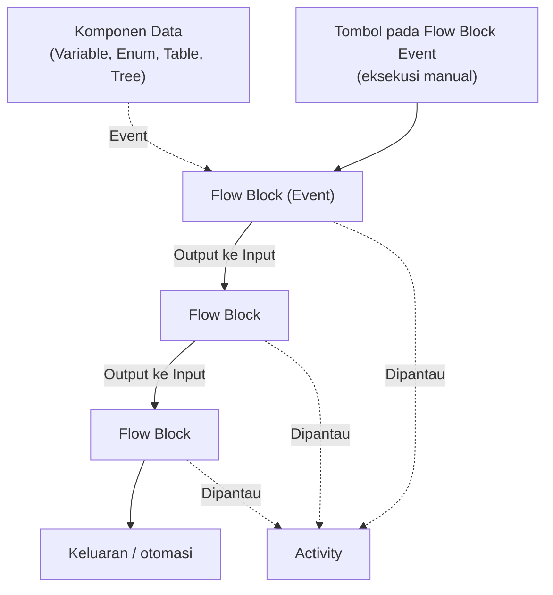
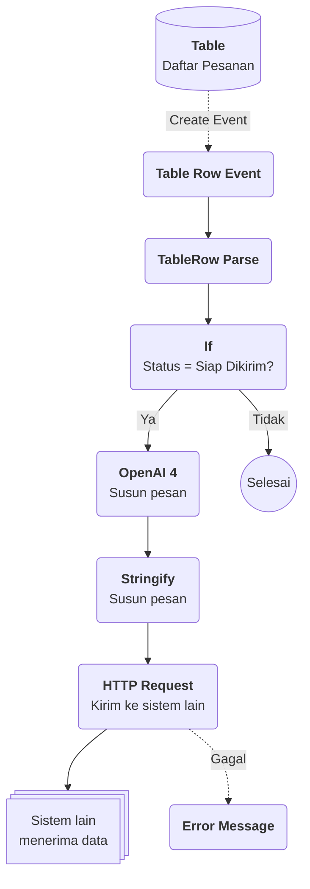

# Apa itu Flow?

>**note** _Flow_ merupakan salah satu komponen dalam modul [[Docs/Modul Logic/Pengenalan|Logic]] di Phoenix.

_Flow_ adalah komponen yang dapat digunakan untuk mengatur logika dan proses pengelolaan data dengan pendekatan alur komposit, yaitu menyusun logika dengan menghubungkan blok demi blok. Setiap blok yang Anda bangun dapat dihubungkan dan dimonitor, sehingga setiap [[Docs/Event/Apa itu Event|Event]] yang terikat dapat menghasilkan keluaran dan otomasi yang tepat.

## Mengapa Menggunakan Flow?

* **Logika tersusun secara visual.** Anda merangkai Flow Block pada blueprint sehingga alur proses mudah dibaca dan dipahami.
* **Otomasi berbasis Event.** Flow Block Event memicu proses, lalu hasilnya mengalir ke block berikutnya melalui koneksi.
* **Mudah diuji.** Anda dapat menjalankan proses secara manual dari antarmuka Flow tanpa menunggu pemicu yang sebenarnya.
* **Proses dapat dipantau.** Setiap proses yang berjalan tercatat dan dapat dilihat melalui [[Docs/Modul Logic/Flow/Flow Activity|Activity]].
* **Terhubung dengan data Phoenix.** Flow Block tersedia untuk terhubung dengan [[Docs/Modul Data/Variable/Apa itu Variable|Variable]], [[Docs/Modul Data/Enum/Apa itu Enum|Enum]], [[Docs/Modul Data/Table/Apa itu Table|Table]], dan [[Docs/Modul Data/Tree/Apa itu Tree|Tree]].
* **Terhubung dengan sistem lain.** Flow Block [[Docs/Modul Logic/Flow/Flow Block/Modular/Pengenalan|Modular]] seperti HTTP Request dan OpenAI 4 memungkinkan data Phoenix dikirim ke aplikasi lain atau diolah oleh AI.

## Konsep Utama

| Istilah | Penjelasan |
| --- | --- |
| [[Docs/Modul Logic/Flow/Flow Block/Pengenalan|Flow Block]] | Unit terkecil penyusun Flow. Setiap block memiliki fungsi tertentu dan dapat dihubungkan dengan block lain. |
| [[#Antarmuka Flow|Blueprint]] | Area kerja tempat Anda menambahkan, menata, dan menghubungkan Flow Block. Posisi kursor (x, y) dan *scale* tampil di sudut kiri bawah halaman. |
| [[Docs/Modul Logic/Flow/Flow Block/Pengenalan#Antarmuka Flow Block|Input dan Output]] | Titik penghubung pada Flow Block. Output berada di sisi kanan block, input berada di sisi kiri block. |
| [[Docs/Modul Logic/Flow/Flow Block/Pengenalan#Antarmuka Flow Block|Koneksi]] | Garis penghubung dari output sebuah block ke input block lain. Koneksi menentukan arah aliran proses. |
| [[Docs/Modul Logic/Flow/Flow Block/Event/Pengenalan|Flow Block Event]] | Flow Block pemicu proses, misalnya Pulser dan Variable Event. Block ini juga memiliki tombol untuk eksekusi manual. Selengkapnya lihat [[Docs/Event/Apa itu Event\|Event]]. |
| [[Docs/Modul Logic/Flow/Flow Activity]] | Tampilan pemantauan proses yang sedang atau sudah berjalan di dalam Flow. |

## Cara Kerja Flow
Flow Block Event memicu proses, lalu hasilnya mengalir lewat koneksi dari satu Flow Block ke Flow Block berikutnya hingga menghasilkan keluaran.

Flow Block hanya terhubung dari output ke input. Garis putus-putus menandakan relasi yang tidak selalu dipakai, misalnya Flow Block Event yang dipicu dari komponen data atau dijalankan manual.

## Membuat Flow
1. Buka folder tempat Flow akan ditempatkan di [[Docs/Antarmuka#Area Manajemen Folder]]
2. Klik kanan > [[^field/add|Add]] > [[^field|Logic]] > [[^field/flow|Flow]]
3. Isi [[^field|Name]] dan [[^field|Description]]
4. Klik [[^button|Create]]

## Mengubah Flow
1. Buka halaman kerja Flow
2. Klik [[^button/edit|Edit]]
3. Perbarui isian [[^field|Name]] dan [[^field|Description]]
4. Klik [[^button|Update]]

## Menyegarkan Flow
Klik [[^button/refresh|Refresh]] untuk memuat ulang tampilan.

## Menghapus Flow
1. Buka folder yang berisi Flow
2. Klik kanan Flow
3. Pilih [[^button/delete|Delete]]
4. Konfirmasi dengan [[^button|Delete]]

>**warning** Harap hati-hati
>Menghapus Flow dapat menghilangkan Flow Block dan riwayat Activity. Flow Block Action yang sudah digunakan oleh komponen akan terputus.

## Antarmuka Flow

![[Docs/Modul Logic/Flow/blueprint-flow.png]]
Antarmuka Flow menampilkan seluruh struktur ruang kerja, yaitu bilah navigasi di bagian atas, dan kolom blueprint di bagian bawah.

Bilah navigasi Flow terdiri dari:

| Tombol | Fungsi |
| --- | --- |
| [[^field/flow|Judul Flow]] | Ikon Flow dalam Phoenix serta [[^field|Header Name]] Flow. |
| [[^button/edit|Edit]] | Mengubah atribut Flow seperti [[^field|Directory]], [[^field|Name]] dan [[^field|Description]]. |
| [[^button/refresh|Refresh]] | Memuat ulang halaman kerja. |
| [[^button/submission|Submission]] | Tombol yang berfungsi untuk membuka bilik submission. |
| [[^field|Search]] | Kolom pencarian untuk mencari Flow Block. |

>**note** Perbedaan Icon
>Dalam mode desktop, tombol [[^button/submission|Submission]] sedikit berbeda. Tombol terlihat dengan susunan informasi submission, yaitu total activity, done, waiting, dan failure.

## Interaksi Antarmuka Flow

Anda bisa berinteraksi pada blueprint Flow untuk memudahkan proses pengembangan logika dan alur komposit dengan aksi seperti berikut:

| Fungsi | Aksi |
| --- | --- |
| Menggeser tampilan (_pan_) | Tekan dan tahan pada bagian yang kosong dalam blueprint lalu gerakkan kursor. Lepas untuk selesai. |
| Mengubah skala tampilan (_zoom_) | gulir pada bagian blueprint. |
| Mengembalikan tampilan ke tengah | Klik pada informasi koordinat [[^field|x _ y _]]. |
| Mengembalikan skala tampilan | Klik pada informasi skala [[^field|scale _]]. |
| Membuka menu konteks | Klik kanan pada bagian yang kosong dalam blueprint. |

## Membangun Logika Flow

Membangun proses logika Flow dilakukan dengan cara pengelolaan Flow Block dengan aspek sebagai berikut:

* [[Docs/Modul Logic/Flow/Flow Block/Pengenalan#Menambahkan Flow Block|Menambahkan Flow Block]]
* [[Docs/Modul Logic/Flow/Flow Block/Pengenalan#Konfigurasi Flow Block|Mengatur Konfigurasi Flow Block]]
* [[Docs/Modul Logic/Flow/Flow Block/Pengenalan#Menghubungkan Koneksi|Menghubungkan Koneksi]]
* [[#Menjalankan Flow Secara Manual]]
* [[#Memantau Proses]]
* [[#Menghubungkan Block Event dari Komponen]]

## Menjalankan Flow Secara Manual
Anda dapat mengeksekusi proses secara manual melalui antarmuka Flow dengan menekan tombol pada Flow Block Event, misalnya [[^button/empty|Trigger]] pada Pulser.

1. Buka halaman kerja Flow
2. Cari [[Docs/Modul Logic/Flow/Flow Block/Event/Pengenalan|Flow Block Event]] yang akan dijalankan
3. Klik tombol [[^button/empty|Trigger]] pada block tersebut

Setelah dijalankan, Anda dapat melihat prosesnya pada [[#Memantau Proses]].

## Menghubungkan Block Event dari Komponen
Flow Block Event yang sudah dibuat dapat langsung dihubungkan melalui tombol [[^button/event|Event]] pada masing-masing komponen. Selengkapnya lihat [[Docs/Event/Menghubungkan Event]].

## Memantau Proses
1. Pada halaman kerja Flow, klik menu [[^button/activity|Activity]] atau tombol di sebelah kanan [[^button/refresh|Refresh]] (mode desktop)
2. Panel [[Docs/Modul Logic/Flow/Flow Activity]] akan terbuka
3. Klik [[^button/refresh|Refresh List]] untuk memuat ulang daftar, atau gunakan [[^field|Search Activity]] untuk mencari proses

Selengkapnya lihat [[Docs/Modul Logic/Flow/Flow Activity]].

>**note** Info
>Jika belum ada proses yang berjalan, panel menampilkan keterangan [[^field|No Activity]]

## Contoh Penggunaan

**Mengirim informasi ke sistem lain ketika ada perubahan data**

Bayangkan tim operasional Anda mencatat pesanan pelanggan pada sebuah Table. Selama ini, setiap pesanan yang siap dikirim harus disalin manual ke aplikasi logistik, lalu pelanggan dikabari satu per satu. Dengan Flow, perubahan data pada Table tersebut dapat langsung diteruskan ke sistem lain secara otomatis, lengkap dengan pesan pemberitahuan yang disusun oleh AI.

**Komponen yang terlibat**

| Komponen | Peran |
| --- | --- |
| [[^field/table\|Daftar Pesanan]] | Sumber data. Setiap baris adalah satu pesanan beserta nomor pesanan, pelanggan, status, dan total. |
| [[^field/enum\|Status Pesanan]] | Pilihan status yang dipakai pada kolom status, misalnya Baru, Diproses, Siap Dikirim, dan Terkirim. |
| [[^field/flow\|Notifikasi Pesanan]] | Flow yang berisi rangkaian Flow Block untuk meneruskan data pesanan. |
| Sistem lain | Aplikasi logistik atau aplikasi pesan yang menerima data melalui API. |

**Alur di Flow**

| Langkah | Flow Block | Peran dalam alur | Hasil |
| --- | --- | --- | --- |
| 1 | [[Docs/Modul Logic/Flow/Flow Block/Event/Table Row Event\|Table Row Event]] | Dihubungkan ke Daftar Pesanan melalui tombol  [[^button/event\|Event]] pada Table, lalu terpicu ketika baris pesanan berubah. | Data baris pesanan masuk ke Flow. |
| 1 | [[Docs/Modul Logic/Flow/Flow Block/Event/Table Row Event\|Table Row Event]] | Dihubungkan ke Daftar Pesanan melalui tombol pada Table, lalu terpicu ketika baris pesanan berubah. | Data baris pesanan masuk ke Flow. |
| 2 | [[Docs/Modul Logic/Flow/Flow Block/Operator/Table/TableRow Parse\|TableRow Parse]] | Mengurai baris menjadi nilai per kolom: nomor pesanan, pelanggan, status, dan total. | Setiap nilai kolom siap dipakai block berikutnya. |
| 3 | [[Docs/Modul Logic/Flow/Flow Block/Operator/Boolean/If\|If]] | Memeriksa apakah status pesanan adalah Siap Dikirim. | Hanya perubahan yang relevan yang dilanjutkan. |
| 4 | [[Docs/Modul Logic/Flow/Flow Block/Modular/AI/OpenAI 4\|OpenAI 4]] | Menyusun pesan pemberitahuan yang ramah dari data pesanan. | Teks pesan siap kirim. |
| 5 | [[Docs/Modul Logic/Flow/Flow Block/Operator/Object/Stringify\|Stringify]] | Mengubah data pesanan dan pesan menjadi teks yang siap dikirim. | Muatan data (*payload*) siap dikirim. |
| 6 | [[Docs/Modul Logic/Flow/Flow Block/Modular/API/HTTP Request\|HTTP Request]] | Mengirim muatan data ke aplikasi logistik atau aplikasi pesan. | Sistem lain menerima pesanan. |
| 7 | [[Docs/Modul Logic/Flow/Flow Block/Error/Error Message\|Error Message]] | Menampilkan pesan kesalahan bila pengiriman gagal. | Kegagalan terlihat dan dapat ditelusuri di [[Docs/Modul Logic/Flow/Flow Activity\|Flow Activity]]. |

**Hasil yang dirasakan**

* **Tanpa input ulang.** Tim cukup memperbarui status pesanan di Phoenix, sedangkan pengiriman data ke sistem lain berjalan otomatis.
* **Pelanggan lebih cepat terinformasi.** Pesan pemberitahuan terkirim begitu status berubah, tanpa menunggu tim mengabari satu per satu.
* **Mudah ditelusuri.** Setiap proses tercatat sehingga Anda dapat memeriksa pesanan mana yang berhasil dan gagal terkirim.
* **Data tetap satu sumber.** Pesanan tetap dikelola di Phoenix, sistem lain hanya menerima salinan yang dibutuhkan.

**Ide skenario lain**

| Pemicu | Contoh integrasi |
| --- | --- |
| [[Docs/Modul Logic/Flow/Flow Block/Event/Variable Event\|Variable Event]] | **Peringatan stok menipis.** Saat nilai Variable stok turun di bawah batas, kirim peringatan ke tim pengadaan melalui aplikasi pesan. |
| [[Docs/Modul Logic/Flow/Flow Block/Event/Enum Data Event\|Enum Data Event]] | **Kabar status layanan.** Saat status tiket berubah, kabari pelanggan melalui sistem komunikasi yang sudah mereka pakai. |
| [[Docs/Modul Logic/Flow/Flow Block/Event/Tree Node Event\|Tree Node Event]] | **Sinkronisasi struktur.** Saat node pada struktur organisasi atau kategori produk berubah, perbarui sistem kepegawaian atau katalog. |
| [[Docs/Modul Logic/Flow/Flow Block/Event/Pulser\|Pulser]] | **Ringkasan berkala.** Ambil data Table, minta [[Docs/Modul Logic/Flow/Flow Block/Modular/AI/OpenAI 4\|OpenAI 4]] meringkasnya menjadi laporan singkat, lalu kirim ke manajemen. |

Dengan satu Flow, data yang Anda kelola di Phoenix tidak berhenti sebagai catatan, tetapi langsung menjadi tindakan di sistem lain tanpa perlu disalin ulang.

## Praktik Terbaik

- **Mulai dari [[Docs/Modul Logic/Flow/Flow Block/Event/Pengenalan|Flow Block Event]].** Tentukan pemicu terlebih dahulu, baru tambahkan block pemrosesan.
- **Uji secara manual dahulu.** Gunakan tombol pada Flow Block Event sebelum mengandalkan pemicu otomatis (lihat [[#Menjalankan Flow Secara Manual]]).
- **Cek [[Docs/Modul Logic/Flow/Flow Activity|Activity]] setelah menjalankan.** Pastikan proses berjalan sesuai harapan.
- **Tata block dari kiri ke kanan.** Output berada di kanan dan input di kiri, sehingga alur lebih mudah dibaca.
- **Beri nama dan deskripsi Flow yang jelas.** Anggota lain dapat memahami tujuan Flow tanpa membuka isinya.

## Batasan dan Catatan

- Koneksi dibuat dari **output** ke **input** (lihat [[Docs/Modul Logic/Flow/Flow Block/Pengenalan#Menghubungkan Koneksi]]).
- Tombol [[^button/edit|Edit]] hanya mengubah atribut Flow ([[^field|Directory]], [[^field|Name]], dan [[^field|Description]]), bukan Flow Block pada blueprint. Pengaturan Flow Block dijelaskan di [[Docs/Modul Logic/Flow/Flow Block/Pengenalan#Konfigurasi Flow Block|Konfigurasi Flow Block]].
- Kolom [[^field|Search]] pada bilah navigasi hanya mencari Flow Block. Untuk mencari proses, gunakan [[^field|Search Activity]] pada [[Docs/Modul Logic/Flow/Flow Activity|Flow Activity]].
- Mengubah posisi dan skala panning hanya memengaruhi tampilan blueprint, bukan logika Flow.
- Informasi total activity, done, waiting, dan failure pada tombol [[^button/submission|Submission]] hanya terlihat pada mode desktop.
- Menghapus Flow menghilangkan Flow Block dan riwayat Activity, serta memutus Flow Block Action yang sudah digunakan komponen (lihat [[#Menghapus Flow]]).
- Daftar Flow Block yang tersedia mengikuti menu [[^field/add|Add]] pada blueprint (lihat [[Docs/Modul Logic/Flow/Flow Block/Pengenalan]]).
- Akses ke Flow mengikuti hak akses komponen yang diatur melalui [[Docs/Modul Developer/Workspace/Apa itu Workspace|Workspace]].

## TL:DR

- _Flow_ mengatur logika dan proses data dengan menghubungkan [[Docs/Modul Logic/Flow/Flow Block/Pengenalan|Flow Block]] pada blueprint secara visual.
- Antarmuka Flow terdiri dari bilah navigasi dan blueprint yang bisa digeser, diperbesar, dan dibuka konteks menunya (lihat [[#Interaksi Antarmuka Flow]]).
- Bangun logika dengan menambahkan, mengatur, dan menghubungkan Flow Block (lihat [[#Membangun Logika Flow]]).
- Jalankan manual dengan tombol pada [[Docs/Modul Logic/Flow/Flow Block/Event/Pengenalan|Flow Block Event]], atau hubungkan Event dari komponen lewat tombol [[^button/event|Event]].
- Pantau proses lewat [[^button/activity|Activity]] pada [[Docs/Modul Logic/Flow/Flow Activity|Flow Activity]].
- Hati-hati saat menghapus Flow, karena Flow Block, riwayat Activity, dan koneksi ke komponen ikut terdampak.

## FAQ : Pertanyaan yang Sering Diajukan
>**faq**
>**Apa bedanya Flow dengan Event?**
>[[Docs/Event/Apa itu Event|Event]] adalah pemicu proses. Flow adalah tempat Anda menyusun dan menghubungkan Flow Block, agar pemicu tersebut menghasilkan keluaran dan otomasi.
>**Bagaimana menjalankan Flow tanpa menunggu Event?**
>Klik tombol pada Flow Block Event di antarmuka Flow, misalnya [[^button/empty|Trigger]] pada block.
>**Mengapa Activity List kosong?**
>Panel menampilkan [[^field|No Activity]] bila belum ada proses yang berjalan atau tercatat.
>**Bagaimana menambahkan Flow Block?**
>Klik kanan pada blueprint, pilih [[^field/add|Add]], lalu pilih kategori dan Flow Block yang diinginkan. Selengkapnya lihat [[Docs/Modul Logic/Flow/Flow Block/Pengenalan#Menambahkan Flow Block|Menambahkan Flow Block]].
>**Bagaimana menghubungkan dua Flow Block?**
>Klik dan tahan titik output pada block asal, seret ke titik input block tujuan, lalu lepaskan. Selengkapnya lihat [[Docs/Modul Logic/Flow/Flow Block/Pengenalan#Menghubungkan Koneksi|Menghubungkan Koneksi]].
>**Apakah Flow dapat mengirim data ke sistem lain?**
>Bisa. Gunakan Flow Block [[Docs/Modul Logic/Flow/Flow Block/Modular/Pengenalan|Modular]] seperti HTTP Request. Lihat [[#Contoh Penggunaan]] untuk gambaran alurnya.