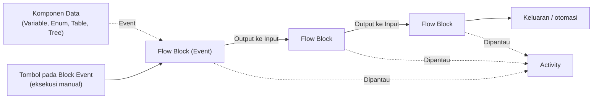

# Apa itu Flow

>**note** _Flow_ merupakan salah satu komponen dalam modul [[Docs/Modul Logic/Pengenalan|Logic]] di Phoenix.

_Flow_ adalah komponen yang dapat digunakan untuk mengatur logika dan proses pengelolaan data dengan pendekatan alur komposit, yaitu menyusun logika dengan menghubungkan blok demi blok. Setiap blok yang Anda bangun dapat dihubungkan dan dimonitor, sehingga setiap [[Docs/Event/Apa itu Event|Event]] yang terikat dapat menghasilkan keluaran dan otomasi yang tepat.

## Mengapa Menggunakan Flow?

* **Logika tersusun secara visual.** Anda merangkai Flow Block pada cetak biru sehingga alur proses mudah dibaca dan dipahami.
* **Otomasi berbasis Event.** Block Event memicu proses, lalu hasilnya mengalir ke block berikutnya melalui koneksi.
* **Mudah diuji.** Anda dapat menjalankan proses secara manual dari antarmuka Flow tanpa menunggu pemicu yang sebenarnya.
* **Proses dapat dipantau.** Setiap proses yang berjalan tercatat dan dapat dilihat melalui Activity.
* **Terhubung dengan data Phoenix.** Flow Block tersedia untuk terhubung dengan [[Docs/Modul Data/Variable/Apa itu Variable|Variable]], [[Docs/Modul Data/Enum/Apa itu Enum|Enum]], [[Docs/Modul Data/Table/Apa itu Table|Table]], dan [[Docs/Modul Data/Tree/Apa itu Tree|Tree]].

## Konsep Utama

| Istilah | Penjelasan |
| --- | --- |
| [[Docs/Modul Logic/Flow/Flow Block/Pengenalan|Flow Block]] | Unit terkecil penyusun Flow. Setiap block memiliki fungsi tertentu dan dapat dihubungkan dengan block lain. |
| [[#Antarmuka Flow| Blueprint]] | Area kerja tempat Anda menambahkan, menata, dan menghubungkan Flow Block. Posisi kursor (x, y) dan *scale* tampil di sudut kiri bawah halaman. |
| [[Docs/Modul Logic/Flow/Flow Block/Pengenalan#Antarmuka Flow Block|Input dan Output]] | Titik penghubung pada Flow Block. Output berada di sisi kanan block, input berada di sisi kiri block. |
| [[Docs/Modul Logic/Flow/Flow Block/Pengenalan#Antarmuka Flow Block|Koneksi]] | Garis penghubung dari output sebuah block ke input block lain. Koneksi menentukan arah aliran proses. |
| [[Docs/Modul Logic/Flow/Flow Block/Event/Pengenalan|Event Flow Block]] | Flow Block pemicu proses, misalnya Pulser dan Variable Event. Block ini juga memiliki tombol untuk eksekusi manual. Selengkapnya lihat [[Docs/Event/Apa itu Event\|Event]]. |
| [[Docs/Modul Logic/Flow/Flow Activity]] | Tampilan pemantauan proses yang sedang atau sudah berjalan di dalam Flow. |

## Cara Kerja Flow
Block Event memicu proses, lalu hasilnya mengalir lewat koneksi dari satu Flow Block ke Flow Block berikutnya hingga menghasilkan keluaran.

Flow Block hanya terhubung dari output ke input. Garis putus-putus menandakan relasi yang tidak selalu dipakai, misalnya Block Event yang dipicu dari komponen data atau dijalankan manual.

## Membuat Flow
1. Buka folder tempat Flow akan ditempatkan di [[Docs/Antarmuka#Area Manajemen Folder]]
2. Klik kanan > [[^field/add|Add]] > [[^field|Logic]] > [[^field/flow|Flow]]
3. Isi [[^field|Name]] dan [[^field|Description]]
4. Klik [[^button|Create]]

## Mengubah Flow
1. Buka halaman kerja Flow
2. Klik [[^button/edit|Edit]]
4. Perbarui isian [[^field|Name]] dan [[^field|Description]]
4. Klik [[^button|Update]]

## Menyegarkan Flow
Klik [[^button/refresh|Refresh]] untuk memuat ulang tampilan.

## Menghapus Flow
1. Buka folder yang berisi Flow
2. Klik kanan Workspace
3. Pilih [[^button/delete|Delete]]
4. Konfirmasi dengan [[^button|Delete]]

>**warning** Harap hati-hati
>Menghapus Flow dapat menghilangkan Flow Block dan riwayat Activity. Flow Block Action yang sudah digunakan oleh komponen akan terputus.

## Antarmuka Flow

![[Docs/Modul Logic/Flow/blueprint-flow.png]]
Antarmuka Flow menampilkan seluruh struktur ruang kerja, yaitu bilah navigasi dibagian atas, dan kolom blueprint dibagian bawah.

Bilah navigasi Flow terdiri dari:

| Tombol | Fungsi |
| --- | --- |
|[[^field/flow|Judul Flow]]| Ikon Flow dalam Phoenix serta [[^field|Header Name]] Flow.  
| [[^button/edit|Edit]] | Mengubah atribut Flow seperti [[^field|Directory]], [[^field|Name]] dan [[^field|Description]]. |
| [[^button/refresh|Refresh]] | Memuat ulang halaman kerja. |
|[[^button/submission|Submission]]| Tombol yang berfungsi untuk membuka bilik submission.
| [[^field|Search]] | Kolom pencarian untuk mencari Flow Block 

>**note** Perbedaan Icon
>Dalam mode dekstop tombol [[^button/submission|Submission]]sedikit berbeda, tombol terlihat dengan susunan informasi submission yaitu total activity, done, waiting dan  failure

## Interaksi Antarmuka Flow

Anda bisa berinteraksi pada blueprint Flow untuk memudahkan proses pengembangan logika dan alur komposit dengan aksi seperti berikut:

| Fungsi | Aksi |
| --- | --- |
| Mengubah posisi panning | Tekan dan tahan pada bagian yang kosong dalam blueprint lalu gerakan kursor. Lepas untuk selesai | 
| Mengubah skala panning (_zoom in/zoom out_) | Scroll pada bagian blueprint |
| Mengembalikan posisi panning ke tengah | Klik pada informasi koordinate [[^field|x _ y _]]
| Mengembalikan skala panning ke awal | Klik pada informasi skala [[^field|scale _]]|
| Membuka konteks menu | Klik kanan pada bagian yang kosong dalam blueprint

## Membangun Logika Flow

Membangun proses logika Flow dilakukan dengan cara pengelolaan Flow Block dengan aspek sebagai berikut:

* [[Docs/Modul Logic/Flow/Flow Block/Pengenalan#Menambahkan Flow Block|Menambahkan Flow Block]]
* [[Docs/Modul Logic/Flow/Flow Block/Pengenalan#Konfigurasi Flow Block|Mengatur Konfigurasi Flow Block]]
* [[Docs/Modul Logic/Flow/Flow Block/Pengenalan#Menghubungkan Koneksi|Menghubungkan Koneksi]]
* [[#Menjalankan Flow Secara Manual]]
* [[#Memantau Proses]]
* [[#Menghubungkan Block Event dari Komponen]]

## Menjalankan Flow Secara Manual
Anda dapat mengeksekusi proses secara manual melalui antarmuka Flow dengan menekan tombol pada Block Event, misalnya [[^button/event|Trigger]] pada Pulser.

1. Buka halaman kerja Flow
2. Cari [[Docs/Modul Logic/Flow/Flow Block/Event/Pengenalan|Flow Block Event]] yang akan dijalankan
3. Klik tombol [[^button/empty|Trigger]]  pada block tersebut

Setelah dijalankan, Anda dapat melihat prosesnya pada [[#Memantau Proses]].

## Menghubungkan Block Event dari Komponen
Block Event yang sudah dibuat dapat langsung dihubungkan melalui tombol [[^button/event|Event]] pada masing-masing komponen. Selengkapnya lihat [[Docs/Event/Menghubungkan Event]].

## Memantau Proses
1. Pada halaman kerja Flow, klik menu [[^button/activity|Activity]] atau tombol di sebelah kanan [[^button/refresh|Refresh]] (mode desktop)
2. Panel [[Docs/Modul Logic/Flow/Flow Activity]] akan terbuka
3. Klik [[^button/refresh|Refresh List]] untuk memuat ulang daftar, atau gunakan [[^field|Search Activity]] untuk mencari proses

Selengkapnya lihat [[Docs/Modul Logic/Flow/Flow Activity]].

>**note** Info
>Jika belum ada proses yang berjalan, panel menampilkan keterangan [[^field|No Activity]]

## Contoh Penggunaan

**Mengirim informasi ke sistem lain ketika ada perubahan data**

| Langkah | Tindakan | Hasil |
| --- | --- | --- |
| 1 | ... | ... |

Dengan alur ini, Anda dapat memastikan rangkaian block bekerja dengan benar sebelum bergantung pada Event yang sebenarnya.

## Praktik Terbaik
- **Mulai dari Flow Block Event.** Tentukan pemicu terlebih dahulu, baru tambahkan block pemrosesan.
- **Uji secara manual dahulu.** Gunakan tombol pada Block Event sebelum mengandalkan pemicu otomatis.
- **Cek Activity setelah menjalankan.** Pastikan proses berjalan sesuai harapan.
- **Tata block dari kiri ke kanan.** Output berada di kanan dan input di kiri, sehingga alur lebih mudah dibaca.
- **Beri nama dan deskripsi Flow yang jelas.** Anggota lain dapat memahami tujuan Flow tanpa membuka isinya.

## Batasan dan Catatan
- Koneksi dibuat dari **output** ke **input**. (lihat [[Docs/Modul Logic/Flow/Flow Block/Pengenalan#Menghubungkan Flow Block]])
- Tombol [[^button/activity|Activity]] berada di sebelah kanan [[^button/refresh|Refresh]] pada mode desktop.
- Daftar Flow Block yang tersedia mengikuti menu [[^field/add|Add]] pada blueprint.

## TL:DR
- _Flow_ mengatur logika dan proses data dengan menghubungkan [[Docs/Modul Logic/Flow/Flow Block/Pengenalan|Flow Block]].
- Jalankan manual dengan tombol pada Block Event, lalu pantau lewat [[^button/activity|Activity]].

## FAQ : Pertanyaan yang Sering Diajukan

>**faq**
>**Apa bedanya Flow dengan Event?**
>[[Docs/Event/Apa itu Event|Event]] adalah pemicu proses. Flow adalah tempat Anda menyusun dan menghubungkan Flow Block, agar pemicu tersebut menghasilkan keluaran dan otomasi.
>**Bagaimana menjalankan Flow tanpa menunggu Event?**
>Klik tombol pada Block Event di antarmuka Flow, misalnya [[^button/empty|Trigger]] pada block.
>**Mengapa Activity List kosong?**
>Panel menampilkan [[^field|No Activity]] bila belum ada proses yang berjalan atau tercatat.
>**Bagaimana menambahkan Flow Block?**
>Klik kanan pada blueprint, pilih [[^field/add|Add]], lalu pilih kategori dan Flow Block yang diinginkan.
>**Bagaimana menghubungkan dua Flow Block?**
>Klik dan tahan titik output pada block asal, seret ke titik input block tujuan, lalu lepaskan.

