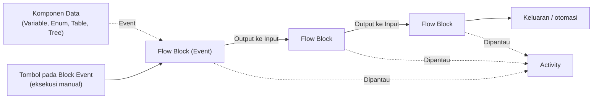

# # Apa itu Flow

>**note** _Flow_ merupakan salah satu komponen dalam modul [[Docs/Modul Logic/Pengenalan|Logic]] di Phoenix.

_Flow_ adalah komponen yang dapat digunakan untuk mengatur logika dan proses pengelolaan data dengan pendekatan aliran komposit, yaitu menyusun logika dengan menghubungkan blok demi blok (*block diagram*). Setiap blok yang Anda bangun dapat dihubungkan dan dimonitor, sehingga setiap [[Docs/Event/Apa itu Event|Event]] yang terikat dapat menghasilkan keluaran dan otomasi yang tepat.

## Mengapa Menggunakan Flow?

* **Logika tersusun secara visual.** Anda merangkai Flow Block pada cetak biru sehingga alur proses mudah dibaca dan dipahami.
* **Otomasi berbasis Event.** Block Event memicu proses, lalu hasilnya mengalir ke block berikutnya melalui koneksi.
* **Mudah diuji.** Anda dapat menjalankan proses secara manual dari antarmuka Flow tanpa menunggu pemicu yang sebenarnya.
* **Proses dapat dipantau.** Setiap proses yang berjalan tercatat dan dapat dilihat melalui Activity.
* **Terhubung dengan data Phoenix.** Flow Block tersedia untuk terhubung dengan [[Docs/Modul Data/Variable/Apa itu Variable|Variable]], [[Docs/Modul Data/Enum/Apa itu Enum|Enum]], [[Docs/Modul Data/Table/Apa itu Table|Table]], dan [[Docs/Modul Data/Tree/Apa itu Tree|Tree]].

## Konsep Utama

| Istilah | Penjelasan |
| --- | --- |
| **Flow Block** | Unit terkecil penyusun Flow. Setiap block memiliki fungsi tertentu dan dapat dihubungkan dengan block lain. |
| **Blueprint** | Area kerja tempat Anda menambahkan, menata, dan menghubungkan Flow Block. Posisi kursor (x, y) dan *scale* tampil di sudut kiri bawah halaman. |
| **Input dan Output** | Titik penghubung pada Flow Block. Output berada di sisi kanan block, input berada di sisi kiri block. |
| **Koneksi** | Garis penghubung dari output sebuah block ke input block lain. Koneksi menentukan arah aliran proses. |
| **Event Flow Block** | Flow Block pemicu proses, misalnya Pulser dan Variable Event. Block ini juga memiliki tombol untuk eksekusi manual. Selengkapnya lihat [[Docs/Event/Apa itu Event\|Event]]. |
| **Activity** | Tampilan pemantauan proses yang sedang atau sudah berjalan di dalam Flow. |

## Cara Kerja Flow
Block Event memicu proses, lalu hasilnya mengalir lewat koneksi dari satu Flow Block ke Flow Block berikutnya hingga menghasilkan keluaran.



Flow Block hanya terhubung dari output ke input. Garis putus-putus menandakan relasi yang tidak selalu dipakai, misalnya Block Event yang dipicu dari komponen data atau dijalankan manual.

## Membuat Flow
1. Buka folder tempat Flow akan ditempatkan di [[Docs/Antarmuka#Area Manajemen Folder]]
2. Klik kanan > [[^field/add|Add]] > [[^field|Logic]] > [[^field/flow|Flow]]
3. Isi [[field|Name]] dan [[field|Description]]
4. Klik [[^button|Create]]

## Mengubah Flow
1. Buka halaman kerja Flow
2. Klik [[^button/edit|Edit]]
4. Perbarui isian [[^field|Name]] dan [[^field|Description]]
4. Klik [[^button|Update]]

## Menyegarkan Flow
Klik [[^button/refresh|Refresh]] untuk memuat ulang tampilan.

## Menghapus Flow
1. Buka folder yang berisi Flow
2. Klik kanan Workspace
3. Pilih [[^button/delete|Delete]]
4. Konfirmasi dengan [[^button|Delete]]

>**warning** Harap hati-hati
>Menghapus Flow dapat menghilangkan Flow Block dan riwayat Activity. Flow Block Action yang sudah digunakan oleh komponen akan terputus.

## Menambahkan Flow Block

![[Docs/Modul Logic/Flow/add-flow-block.png]]
1. Buka halaman kerja Flow
2. Klik kanan pada blueprint > [[^field/add|Add]]
3. Pilih kategori Flow Block, misalnya [[^field/event|Event]]
4. Pilih Flow Block, misalnya [[^field/event|Pulser]]

Flow Block akan muncul pada blueprint dan siap dihubungkan dengan block lain.

### Kategori Flow Block
Menu Add mengelompokkan Flow Block ke dalam kategori berikut.

| Kategori | Isi |
| --- | --- |
| **Event** | Enum Data Event, Pulser, Table Row Event, Tree Node Event, Variable Event |
| **Data** | Variable, Enum, Table, dan Tree beserta block pengelolaan datanya (misalnya Add Variable, Variable Getter, Add Row, Add Node) |
| **I/O** | Branch, Passer |
| **Query** | Condition, Execute |
| **Operator** | Number (Increment), String (Concatenate, Implode, Pad Left, Pad Right), Table (TableRow Parse), Object (Assign, Merge, Parse, Stringify), Boolean (If), Tree (Node Parse) |
| **Modular** | API (HTTP Request), AI (OpenAI 4) |
| **Misc.** | Chrono (Delay), Error (Error Message) |

Penjelasan lengkap setiap Flow Block ada di [[Docs/Modul Logic/Flow/Flow Block]].

## Menghubungkan Flow Block

![[Docs/Modul Logic/Flow/connecting-flow-block.png]]
1. Arahkan kursor ke titik output pada Flow Block asal, misalnya Result pada Pulser
2. Klik dan tahan (*hold press*) titik output tersebut
3. Seret ke titik input pada Flow Block tujuan
4. Lepaskan (*release*) tombol di atas titik input

Garis koneksi akan muncul di antara kedua block.

## Menghapus Hubungan Flow Block
```excalidraw
url:Docs/Modul Logic/Flow/connecting-flow-block.excalidraw
height:500px
```

![[Docs/Modul Logic/Flow/connecting-flow-block.png]]
1. Arahkan kursor ke titik output pada Flow Block asal, misalnya Result pada Pulser
2. Klik dan tahan (*hold press*) titik output tersebut
3. Seret ke titik input pada Flow Block tujuan
4. Lepaskan (*release*) tombol di atas titik input

Garis koneksi akan muncul di antara kedua block.


## Menghubungkan Block Event dari Komponen
Block Event yang sudah dibuat dapat langsung dihubungkan melalui tombol [[^button|Event]] pada masing-masing komponen. Selengkapnya lihat [[Docs/Event/Apa itu Event|Event]].

<!--
  * [TODO] Konfirmasi detail fitur ini: komponen mana saja yang memiliki tombol Event (Variable, Enum, Table, Tree?), letak tombol, dan langkah menghubungkannya ke Block Event. Setelah dikonfirmasi, tulis langkah bernomor di bagian ini.
  * [TODO] Tambahkan gambar tombol Event pada salah satu komponen.
-->

## Menjalankan Flow Secara Manual
Anda dapat mengeksekusi proses secara manual melalui antarmuka Flow dengan menekan tombol pada Block Event, misalnya [[^button|Trigger]] pada Pulser.

1. Buka halaman kerja Flow
2. Cari Block Event yang akan dijalankan
3. Klik tombol pada block tersebut, misalnya [[^button|Trigger]]

Setelah dijalankan, Anda dapat melihat prosesnya pada [[#Memantau Proses]].

<!--
  * [TODO] Konfirmasi apakah semua Block Event memiliki tombol eksekusi manual dengan label yang sama (Trigger), atau labelnya berbeda untuk Variable Event, Enum Data Event, Table Row Event, dan Tree Node Event.
-->

## Memantau Proses
1. Pada halaman kerja Flow, klik [[^button|Activity]] di sebelah kanan [[^button/refresh|Refresh]] (mode desktop)
2. Panel **Activity List** akan terbuka
3. Klik [[^button|Refresh List]] untuk memuat ulang daftar, atau gunakan [[field|Search Activity]] untuk mencari proses

Panel Activity List menampilkan kolom berikut.

| Kolom | Penjelasan |
| --- | --- |
| **ID/Name** | Pengenal atau nama proses. |
| **Status/Type** | Status dan jenis proses. |
| **Start At** | Waktu proses dimulai. |
| **Updated At** | Waktu terakhir proses diperbarui. |

Jika belum ada proses yang berjalan, panel menampilkan keterangan **No Activity**.

<!--
  * [TODO] Tambahkan gambar panel Activity List. Anotasi yang disarankan: (1) tombol Activity, (2) panel Activity List, (3) tombol Refresh List dan Search Activity, (4) header kolom, (5) keterangan No Activity. Saat ini screenshot masih menampilkan daftar kosong. Bila memungkinkan, ganti dengan screenshot yang berisi minimal satu proses.
  * [TODO] Pada tombol Activity terdapat empat penghitung dengan ikon berbeda (angka 0, 0, 0, 0). Mohon jelaskan arti masing-masing ikon (misalnya proses aktif, menunggu, selesai, dibatalkan?) dan tambahkan ke dokumentasi.
  * [TODO] Penjelasan isi kolom Status/Type dan ID/Name masih berdasarkan nama kolom saja. Mohon dilengkapi nilai status yang mungkin muncul.
  * [TODO] Konfirmasi letak tombol Activity pada mode mobile dan cara menutup panel Activity List (ikon di kiri atas panel?).
-->

## Contoh Penggunaan
**Menguji alur secara manual**

| Langkah | Tindakan | Hasil |
| --- | --- | --- |
| 1 | Tambahkan Pulser dari kategori Event | Block Pulser muncul pada kanvas |
| 2 | Tambahkan Flow Block lanjutan, misalnya Passer dari kategori I/O | Block kedua muncul pada kanvas |
| 3 | Hubungkan Result pada Pulser ke input block kedua | Garis koneksi terbentuk |
| 4 | Klik [[^button|Trigger]] pada Pulser | Proses berjalan melalui kedua block |
| 5 | Buka [[^button|Activity]] | Proses terlihat pada Activity List |

Dengan alur ini, Anda dapat memastikan rangkaian block bekerja dengan benar sebelum bergantung pada Event yang sebenarnya.

<!--
  * [TODO] Contoh skenario ini hanya ilustrasi berdasarkan block yang terlihat pada screenshot. Mohon diganti dengan skenario nyata yang lebih relevan (misalnya Variable Event yang memicu pengolahan data).
-->

## Praktik Terbaik
- **Mulai dari Block Event.** Tentukan pemicu terlebih dahulu, baru tambahkan block pemrosesan.
- **Uji secara manual dahulu.** Gunakan tombol pada Block Event sebelum mengandalkan pemicu otomatis.
- **Cek Activity setelah menjalankan.** Pastikan proses berjalan sesuai harapan.
- **Tata block dari kiri ke kanan.** Output berada di kanan dan input di kiri, sehingga alur lebih mudah dibaca.
- **Beri nama dan deskripsi Flow yang jelas.** Anggota lain dapat memahami tujuan Flow tanpa membuka isinya.

## Batasan dan Catatan
- Koneksi dibuat dari **output** ke **input**.
- Panel Activity List kosong bila belum ada proses yang berjalan.
- Tombol [[^button|Activity]] berada di sebelah kanan [[^button/refresh|Refresh]] pada mode desktop.
- Daftar Flow Block yang tersedia mengikuti menu [[^field/add|Add]] pada kanvas.

## TL:DR
- _Flow_ mengatur logika dan proses data dengan menghubungkan Flow Block, mirip *composition* di Blender.
- Tambahkan block lewat klik kanan pada kanvas > [[^field/add|Add]].
- Hubungkan block dengan menahan klik pada output, lalu lepaskan di input.
- Jalankan manual dengan tombol pada Block Event, lalu pantau lewat [[^button|Activity]].

## FAQ : Pertanyaan yang Sering Diajukan

>**faq**
>**Apa bedanya Flow dengan Event?**
>[[Docs/Event/Apa itu Event|Event]] adalah pemicu proses. Flow adalah tempat Anda menyusun dan menghubungkan Flow Block, termasuk Block Event, agar pemicu tersebut menghasilkan keluaran dan otomasi.
>**Bagaimana menjalankan Flow tanpa menunggu Event?**
>Klik tombol pada Block Event di antarmuka Flow, misalnya [[^button|Trigger]] pada Pulser.
>**Mengapa Activity List kosong?**
>Panel menampilkan **No Activity** bila belum ada proses yang berjalan atau tercatat.
>**Bagaimana menambahkan Flow Block?**
>Klik kanan pada kanvas, pilih [[^field/add|Add]], lalu pilih kategori dan Flow Block yang diinginkan.
>**Bagaimana menghubungkan dua Flow Block?**
>Klik dan tahan titik output pada block asal, seret ke titik input block tujuan, lalu lepaskan.

