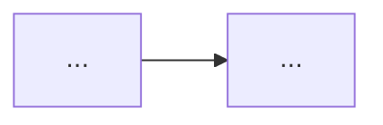

# Dokumentasi Phoenix (format Silverbullet)

Skill ini memastikan setiap halaman dokumentasi Phoenix memakai gaya penulisan, struktur, dan sintaks yang sama dengan halaman yang sudah dibuat penulisnya. Konsistensi penting karena halaman-halaman ini saling terhubung lewat wikilink dan dibaca sebagai satu kesatuan dokumentasi.

## Prinsip umum

- Tulis dalam Bahasa Indonesia baku dan sapa pembaca dengan **"Anda"** (selalu huruf kapital).
- Gunakan kalimat aktif, singkat, dan konkret. Jelaskan manfaat, bukan hanya definisi.
- Istilah asing yang bukan nama fitur ditulis miring dengan `*...*`, misalnya `*drag and drop*`, `*least privilege*`.
- Jangan mengarang perilaku produk. Jika detail fitur belum diketahui (nama menu, batasan, aturan akses), tulis tebakan terbaik dan tandai dengan tambahkan TODO (lihat cara penulisan [[#Penulisan TODO]], Penulis akan memperbaiki isinya sendiri, jadi struktur yang kuat lebih penting daripada detail yang meyakinkan tapi salah.
- Hasilkan file `.md`, bukan teks biasa di chat, kecuali pengguna hanya meminta komentar atau review.

## Konvensi tautan

| Jenis | Format | Contoh |
| --- | --- | --- |
| Halaman pengenalan modul | `[[Docs/Modul <Nama>/Pengenalan\|<Nama>]]` | `[[Docs/Modul Developer/Pengenalan\|Developer]]` |
| Halaman komponen | `[[Docs/Modul <Nama>/<Komponen>/Apa itu <Komponen>]]` | `[[Docs/Modul Logic/Flow/Apa itu Flow]]` |
| Tautan dengan teks lain | tambahkan alias setelah `\|` | `[[Docs/Event/Pengenalan\|Event]]` |
| Anchor di halaman yang sama | `[[#Nama Bagian]]` | `[[#Flow]]` |
| Anchor di halaman lain | `[[Docs/Antar Muka#Area Manajemen Folder]]` | |
| Menu atau tombol antarmuka | `[[field/<nama>\|<Label>]]` | `[[field/add\|Add]]` |
| Kolom isian antarmuka | `[[field\|<Label>]]` | `[[field\|Name]]`, `[[field\|Description]]` |

Tautkan komponen lain pada kemunculan pertamanya di sebuah halaman (misalnya Workspace di halaman Group). Label menu dan field ditulis persis seperti yang tampil di aplikasi (bahasa Inggris), bukan diterjemahkan. Jika path tautan hanya tebakan, tandai dengan `<!-- * [TODO] Deskripsi Task -->`.

## Penjelasan TODO

Penulisan TODO sebagai catatan untuk diperhatikan kepada penulis harus dibuat dalam bentuk comment, dengan format sebagai berikut:

<!--
  * [TODO] Deskripsi Task
-->

Pembuka `<!--` harus dalam 
## Templat halaman komponen ("Apa itu <Komponen>?")

Gunakan urutan berikut. Bagian yang tidak relevan boleh dihilangkan, tetapi jangan mengubah urutan atau nama judulnya.

````markdown
# Apa itu <Komponen>?

>**note** _<Komponen>_ merupakan salah satu komponen dalam modul [[Docs/Modul <Modul>/Pengenalan|<Modul>]] di Phoenix.

_<Komponen>_ merupakan komponen yang dapat digunakan untuk <fungsi utama>.

Alih-alih <cara lama>, Anda cukup <cara dengan komponen ini>.

## Mengapa Menggunakan <Komponen>?
- **<Manfaat singkat>.** <Penjelasan satu kalimat.>

## Konsep Utama
| Istilah | Penjelasan |
| --- | --- |
| **<Istilah>** | <Penjelasan.> |

## Cara Kerja <Komponen>
<Satu kalimat inti.>



<Aturan penting tentang relasi atau batasan alur.>

## Membuat <Komponen>
1. Klik kanan pada [[Docs/Antar Muka#Area Manajemen Folder]].
2. Pilih [[field/add|Add]] > [[field|<Modul>]] > [[field/<komponen>|<Komponen>]]
3. Isi [[field|Name]] dan [[field|Description]].
4. ...
5. Selesai

## Mengelola <objek>
## Mengatur <aspek>

## Contoh Penggunaan
**<Judul skenario>**

| ... | ... | ... |
| --- | --- | --- |

<Satu kalimat penutup tentang manfaat skenario ini.>

## Praktik Terbaik
- <Saran dengan frasa kunci dicetak **tebal**.>

## Batasan dan Catatan
- <Poin singkat.>

## FAQ : Pertanyaan yang Sering Diajukan

>**faq**
>**<Pertanyaan?>**
>Jawaban.
>**<Pertanyaan?>**
>Jawaban.
````

Catatan format:
- Callout pembuka memakai `>**note**` diikuti spasi dan teks, bukan sintaks `> [!info]`.
- Blok FAQ memakai `>**faq**`, lalu setiap pertanyaan dan jawaban berada di baris `>` sendiri. Pertanyaan dicetak tebal, jawaban tidak.
- Judul FAQ ditulis persis: `## FAQ : Pertanyaan yang Sering Diajukan`.
- Langkah bernomor berisi satu tindakan per baris dan selalu ditutup dengan "Selesai". Jangan menambahkan titik atau spasi ekstra setelah nomor.
- Tabel ditulis lengkap dengan pipa di awal dan akhir setiap baris.
- Bagian "Mengelola ..." dan "Mengatur ..." boleh singkat (satu atau dua kalimat) bila fiturnya sederhana.

## Templat halaman modul ("Modul <Nama>")

```markdown
# Modul <Nama>

_<Nama>_ merupakan salah satu modul dalam Phoenix. Modul ini berfungsi sebagai <peran modul>, sehingga <manfaat bagi pengguna>.

Berikut adalah komponen yang tersedia dalam modul ini:
1. [[#<Komponen A>]]
2. [[#<Komponen B>]]

## <Komponen A>
_<Komponen A>_ merupakan komponen yang dapat digunakan untuk <fungsi>.

Lihat selengkapnya [[Docs/Modul <Nama>/<Komponen A>/Apa itu <Komponen A>]].
```

Pengantar modul harus menjelaskan peran modul dibanding modul lain (misalnya Interface mengatur tampilan data, Logic mengatur proses dan otomasi, Developer mengatur ekosistem dan akses tim). Satu paragraf pembanding dengan modul lain boleh ditambahkan bila membantu pembaca membedakan keduanya.

## Cara bekerja dengan permintaan pengguna

1. **Melengkapi atau membuat halaman baru:** isi seluruh templat yang relevan, tandai asumsi dengan `<!-- * [TODO] Deskripsi Task -->`.
2. **Merevisi teks yang diberikan:** pertahankan struktur dan fakta dari penulis, perbaiki ejaan ("pengeolaaan" menjadi "pengelolaan", "antar muka" menjadi "antarmuka"), kejelasan, dan konsistensi sintaks. Jelaskan perubahan secara singkat.
3. **Menilai kekurangan:** sebutkan bagian templat yang belum ada atau masih abstrak, lalu beri usulan revisi.
4. Perlakukan fakta produk dari penulis sebagai kebenaran, termasuk koreksi atas asumsi sebelumnya. Jika penulis mengoreksi aturan (misalnya satu anggota hanya di satu Group), perbarui seluruh bagian yang terdampak: konsep, cara kerja, FAQ, dan batasan.
5. Akhiri balasan dengan daftar singkat hal yang perlu dicek penulis, tanpa mengulang isi file.