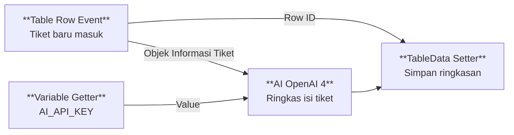

| Istilah | Penjelasan |
| --- | --- |
| **Workspace** | Komponen untuk mengatur ruang kerja pengembangan, yaitu komponen yang dapat dilihat, dikelola, dan diubah, serta integrasi yang digunakan.

```space-style
table {
  border-radius: 15px;
  overflow: hidden;
  border: 1px solid #333;
}
html{
    body table {--editor-wiki-link-page-color: #818181;}
    body thead td {
      border: 1px solid #666;
      background: #2a2a2a;
      padding:6px 12px !important;
      color: #bbb;
    }
    body tbody tr:nth-child(even) {
      background-color: #161616;
    }
    body tbody tr:nth-child(odd) {
      background-color: #141414;
    }
    body tbody td {
      border: 1px solid #333;
      padding:12px !important;
      white-space: wrap !important;
      word-break: normal;
      overflow-wrap: break-word;
    }
}
#sb-main .sb-strong{
  font-weight: 600;
  color: #fdc;
}
#sb-main .sb-wiki-link {
  white-space:nowrap;
}

```


Run ${widgets.commandButton "System: Reload"} to reload.
```space-style
/* Coret teks task dengan status DONE */
#sb-main .cm-editor [data-task-state="DONE"] ~ .sb-task {
  text-decoration: line-through !important;
  opacity: .5 !important;
  color: #AF2 !important;
}
/* Warnai orange terang */
#sb-main .cm-editor [data-task-state="TODO"] ~ .sb-task {
  color: #FF5 !important;
}
/* Warnai kuning terang */
#sb-main .cm-editor [data-task-state="PROGRESS"] ~ .sb-task {
  color: #FA2 !important;
}
/* Buat task yang diceklist menjadi redup */
#sb-main .cm-editor .cm-task-checked .sb-task {
  opacity: .5 !important;
}
#sb-main .cm-editor .cm-line,
#sb-main .cm-editor .sb-nav-content {
  /*font-family:"Segoe UI" !important;*/
  font-family: "Inter", sans-serif !important;
}

#sb-root {
  --ui-font: "Inter", sans-serif;
}
#sb-root .cm-editor .sb-line-fenced-code {
  font-family: monospace !important;
}
#sb-root .sb-nav-primary {
  font-weight:500 !important;
}
```

lihat selengkapnya [[Docs/Modul Interface/Table View/Apa itu Table View]].

Run ${widgets.commandButton "System: Reload"} to reload.

* [[field|Enable to insert externally]] : Tidak ketat, Enum Data bisa ditambahkan oleh pengguna...

[[field|Disabled to insert externally]] : Tidak ketat, Enum Data bisa ditambahkan oleh pengguna...

```space-style
#sb-main .cm-editor a[href^="field"] {
  display:inline-block !important;
  padding: 6px 8px;
  margin: 2px 0px 6px 0px;
  border: 1px solid #555;
  border-radius: 5px;
  background: #333;
  color: #ddd !important;
  font-size: 0.95em;
  font-weight: 400;
  text-decoration: none !important;
  pointer-events: none;
  white-space: nowrap;
  line-height: 1rem;
}

#sb-main .cm-editor i a[href^="field/"] {
  pointer-events: auto !important;
}

#sb-main .cm-editor .sb-line-h1 a[href^="field"],
#sb-main .cm-editor .sb-line-li a[href^="field"],
#sb-main .cm-editor .sb-line-ul a[href^="field"] {
  display:inline !important;
  padding: 1.5px 8px;
}
#sb-main .cm-editor .sb-line-li {
  line-height: 22pt;
}

```

1. Klik kanan pada [[Docs/Antarmuka#Area Manajemen Folder]].
2. Pilih [[field/add|Add]] > [[field|Developer]] > [[field/group| Group]]
3. Isi [[field|Name]] dan [[field|Description]] Group.
4. Tambahkan anggota ke dalam Group dengan cara *drag and drop*.
5. Isi [[field|Search workspace to add...]]  dan pilih Workspace yang ingin ditambahkan.
6. Selesai

```space-style
#sb-main .cm-editor a[href^="mode/"] {
  display:inline-block !important;
  position:relative;
  font-family:"Segoe UI";
  margin: 0.3rem 0.3rem;
  color: #bdbdbd !important;
  padding: 0.1rem 1rem 0.2rem 0.9rem;
  border: 1px solid rgb(63 63 70);
  font-weight: 500;
  font-size: 1.125rem;
  border-radius: 999px;
  background-color: #161616;
  pointer-events: none;
  white-space: nowrap !important;
  text-decoration: none;
}
#sb-main .cm-editor td a[href^="mode/"] {
  display:block !important;
}
#sb-main .cm-editor a[href^="mode/"]::before {
  content: "mode ";
  margin-right:10px;
  font-size: 1rem;
  font-weight: 100;
}
#sb-main .cm-editor a[href^="mode/"]:has(span)::after {
  position:absolute;
  left: 60px;
  top: 1px;
  content: "|";
  font-size: 1rem;
  font-weight: 100;
  opacity:.5;
}
#sb-main .cm-editor a[href^="mode/"] span {
  padding: 0rem .3rem 0rem 0.3rem;
}
#sb-main .cm-editor td:has(a[href^="mode/"]) {
  white-space:nowrap !important;
}
```

|  |  |
|----------|----------|
| [[mode/view|View]] | Saklar dengan mode View agar konten Form dapat di sunting. |

[[mode/edit|Edit]]

Run ${widgets.commandButton "System: Reload"} to reload.

test [[button/edit|Edit]] [[button|Create]]
1. Caranya klik [[button/edit|Edit]]
2. lalu klik [[button|Submit]]
> **warning** Warning
> Harap hati-hati saat [[button/refresh|Refresh]] halaman, pastikan bahwa perubahan Anda saat ini sudah disimpan. Jika tombol [[button/save|Save]]masih aktif, berarti perubahan belum disimpan.

```space-style
/* Style links starting with button: */
#sb-main .cm-editor a[href^="button/"] {
  display:inline-block !important;
  font-family:"Segoe UI";
  padding: 0.1rem 1rem 0.2rem 0.9rem;
  margin: 0.1rem 0.3rem;
  color: #bdbdbd !important;
  border: 1px solid rgb(63 63 70);
  font-weight: 500;
  font-size: 1.125rem;
  border-radius: 9999px !important;
  background-color: #161616;
  pointer-events: none;
  white-space: nowrap !important;
}
#sb-main .cm-editor a[href="button"] {
  font-family:"Segoe UI";
  padding: 0.1rem 1rem 0.2rem 0.9rem;
  margin: 0.1rem 0.3rem;
  color: #fff !important;
  font-weight: 500;
  font-size: 1.125rem;
  border-radius: 9999px !important;
  background-color: #92400e;
  pointer-events: none;
  white-space: nowrap !important;
}
#sb-main .cm-editor .sb-line-h1 a[href^="button/"],
#sb-main .cm-editor .sb-line-li a[href^="button/"],
#sb-main .cm-editor .sb-line-ul a[href^="button/"] {
  display:inline !important;
  padding: 1.5px 8px;
}
#sb-main .cm-editor i a[href^="button/"] {
  pointer-events: auto !important;
}
#sb-main .cm-editor a[href^="button/"] span {
  padding: 0rem 0.3rem 0rem 0rem;
}
#sb-main .cm-editor td:has(a[href^="button/"]) {
  white-space:nowrap !important;
}
```

Run ${widgets.commandButton "System: Reload"} to reload.

>**note**Tips
>Meskipun Enum Data bisa bertambah secara liar, namun atribut Name dalam EnumData tetap tidak dapat terduplikat. Meskipun akan banyak variasi Name yang mirip, Anda dapat menggunakan fitur [[Docs/Modul Data/Enum/EnumData Merge]] agar setiap data yang terelasi dengan EnumData tersebut dapat menjadi satu EnumData.

```space-style
#sb-main .cm-editor .sb-admonition {
  padding: 1rem 1.5rem;
}
#sb-main .cm-editor .sb-admonition-title {
  padding: 0.8rem 1.5rem;
}
#sb-main .cm-editor .sb-quote {
  margin: 0rem 0rem 0rem 0.5rem;
}
#sb-main .sb-admonition[admonition="faq"]:has(.sb-quote){
  padding-top:0rem;
  padding-bottom:0.2rem;
  color:#ff8;
}
#sb-main .sb-admonition[admonition="faq"]:has(.sb-quote.sb-strong){
  padding-top:2.5rem;
  padding-bottom:1rem;
}
#sb-main .sb-admonition-title[admonition="faq"]{
  padding-top:1rem !important;
  display:none;
}
#sb-main .sb-admonition[admonition="faq"] .sb-quote{
  color:#fff;
}
#sb-main .sb-admonition[admonition="faq"] .sb-strong{
  color:#fec;
}
#sb-main .sb-admonition[admonition="faq"]:nth-last-child(1 of .sb-admonition[admonition="faq"]) {
  padding-bottom:2.5rem !important;
}
```

>**FAQ**
>**Apakah satu anggota dapat tergabung di lebih dari satu Group?**
>Tidak. Akses yang dimiliki anggota akan sesuai dengan Group-nya.
>**Apa yang terjadi jika anggota dikeluarkan dari Group?**
>Anggota tersebut kehilangan akses Workspace yang diberikan melalui Group itu.
>**Apakah sebuah Workspace dapat diakses oleh banyak Group?**
>Ya. Satu Workspace dapat diberikan kepada beberapa Group.
>**Siapa yang dapat membuat dan mengelola Group?**
>Pengguna dengan kewenangan pengelolaan di modul Developer.


